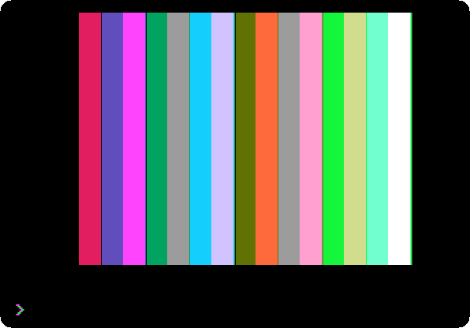
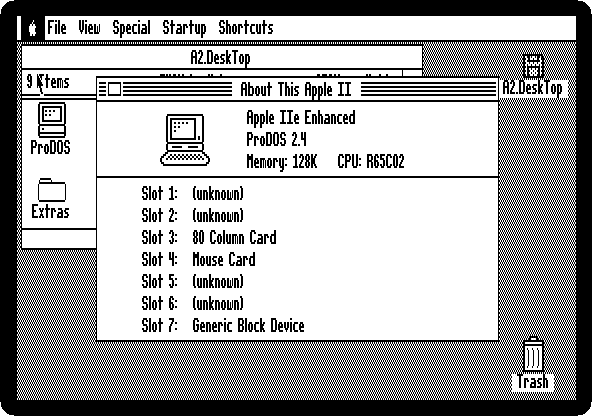
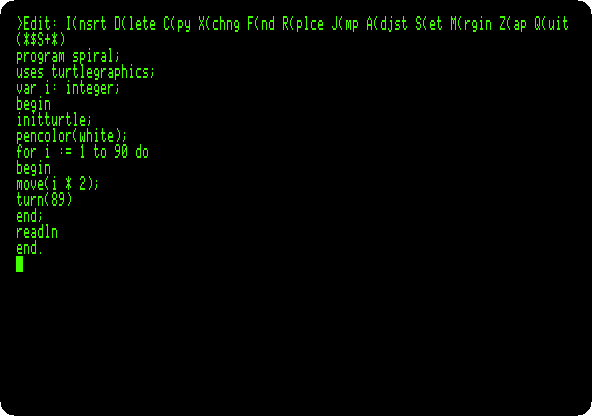
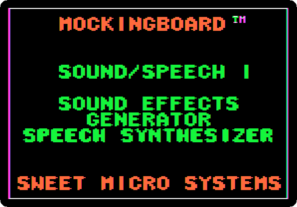
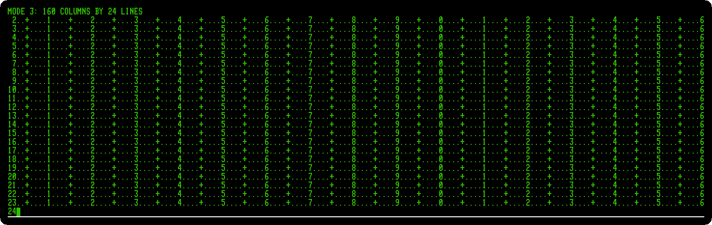
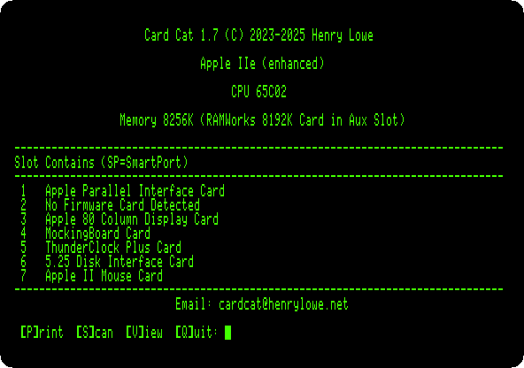
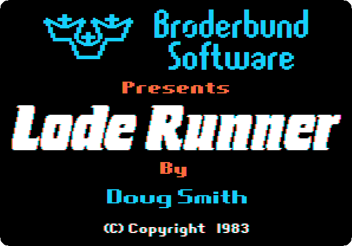

# Things to do with an Apple II

[izapple2](https://github.com/ivanizag/izapple2) emulates the Apple \]\[+ and
the Apple //e and runs their real ROMs and software, so it is a way of finding
out first hand what using one was like. Each page here takes one thing an
Apple II owner did, and walks through it step by step, with the command to
start izapple2 for it and what you will see on the way.

Each page says what it needs and where it comes from. Some need nothing but
izapple2; the rest use disks from public archives, which
[`fetch-disks.sh`](fetch-disks.sh) downloads into the folder `disks`. Each
page gives the whole machine it uses, card by card, as a command line of
izapple2, and after it a shorter one with a model of izapple2 that has that
machine, and often more. The whole command needs the option `-board`, which
izapple2 does not have yet; the shorter one works with izapple2 as it is.

## First steps

### [The Apple \]\[ of 1977](guides/apple-ii.md)

<a href="guides/apple-ii.md"></a>

Wozniak's machine and its ROM: the Monitor, machine code written a line at a
time in the Mini-Assembler, and Integer BASIC, with its whole numbers and its
sixteen colours.

### [Switch on an Apple \]\[+](guides/switch-on.md)

<a href="guides/switch-on.md"></a>

No disk, no operating system: switched on, the Apple \]\[+ is in Applesoft BASIC
and waiting. A few commands, a program typed, listed and run, and a loop that
never ends stopped with Control-C.

### [Switch on an Apple //e](guides/apple-iie.md)

<a href="guides/apple-iie.md"></a>

The Apple II of the rest of the decade: lower case, 80 columns, the MouseText
of the enhanced //e, and the self test in its ROM, run with both Apple keys.

### [Life with DOS 3.3](guides/dos33.md)

<a href="guides/dos33.md"></a>

Two Disk II drives and the System Master: the catalog of a diskette, the
program that greets you, and a blank diskette made into one that starts the
machine with a program of your own.

### [ProDOS](guides/prodos.md)

<a href="guides/prodos.md"></a>

The operating system of the Apple II from 1984 on, in its version of 2023:
the program selector it starts with, BASIC, and a catalog in 80 columns.

### [Apple II DeskTop](guides/desktop.md)

<a href="guides/desktop.md"></a>

The Apple II with a mouse, windows and icons: a disk opened with a double
click, a file read, the machine asked what it has in its slots, and the
Calculator.

## Making things

### [A game in Applesoft](guides/paddle-game.md)

<a href="guides/paddle-game.md"></a>

A bat on a paddle and a ball, in the low resolution colour graphics of the
Apple \]\[+: typed in as the listings of the magazines were, and played with the
mouse as the paddle.

### [Apple Pascal](guides/pascal.md)

<a href="guides/pascal.md"></a>

The UCSD p-System on an Apple //e with four drives: the Filer, the editor, the
compiler, and a program that draws with the turtle.

## Cards

### [The Mockingboard](guides/mockingboard.md)

<a href="guides/mockingboard.md"></a>

The sound card of the Apple II, from its demonstration disk of 1982: its menus,
and its sound effects, recorded to listen to.

### [160 columns: the Videx Ultraterm](guides/ultraterm.md)

<a href="guides/ultraterm.md"></a>

The card that gave the Apple \]\[+ up to 160 columns of text: the
demonstration of its own disk of utilities, and a program that shows each
of its modes, up to 160 by 24 and 80 by 48.

### [What is in the slots: Card Cat](guides/card-cat.md)

<a href="guides/card-cat.md"></a>

A modern program that finds the card in each slot, run on a //e with all seven
full, and the ROM of a card read by it.

## Other systems

### [Forth in ROM](guides/forth.md)

<a href="guides/forth.md"></a>

An Apple \]\[+ that starts in FORTH-79, from a card of Offete Industries:
words used, new ones defined, and the dictionary.


### [CP/M on the Z80 SoftCard](guides/cpm.md)

<a href="guides/cpm.md"></a>

A Z80 on a card turns an Apple \]\[+ into a CP/M computer: its disk, an
assembler source, and Microsoft BASIC-80.

## Play

### [Lode Runner](guides/lode-runner.md)

<a href="guides/lode-runner.md"></a>

Broderbund's game of 1983, from a copy of its original disk: the title, the
demonstration that plays itself, and a game started.

### [Total Replay](guides/total-replay.md)

<a href="guides/total-replay.md"></a>

Hundreds of games on one hard disk, with the box art in Super Hi-Res: the
launcher, its attract mode, and a game found by typing its name.

## The disks

```bash
./fetch-disks.sh
```

downloads every disk the pages use into `disks/`, from the archives
[`disks.tsv`](disks.tsv) lists, and checks each against its SHA-256. It only
downloads what is missing or has changed, so it can be run again at any time.
`./fetch-disks.sh dos33-master.dsk` gets only the disks named.

## How the pictures are made

Every picture is made by running the machine through the steps of its page,
with the same disks, by the Go programs in [`activities`](activities). See
[AGENTS.md](AGENTS.md) for how, and [EDITORIAL.md](EDITORIAL.md) for how the
pages are written.
