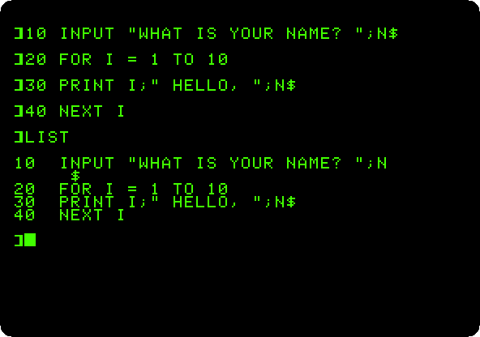
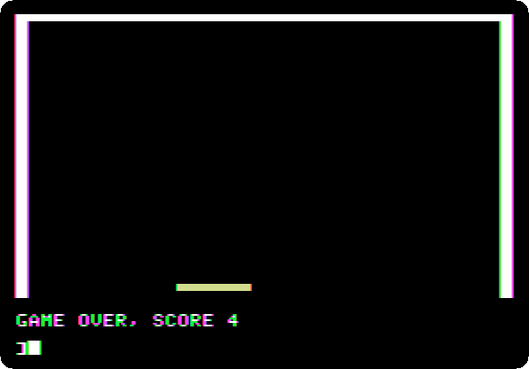

# Things to do with an Apple II

[izapple2](https://github.com/ivanizag/izapple2) emulates the Apple ][+ and
the Apple //e and runs their real ROMs and software, so it is a way of finding
out first hand what using one was like. Each page here takes one thing an
Apple II owner did, and walks through it step by step, with the command to
start izapple2 for it and what you will see on the way.

Each page says what it needs and where it comes from. Some need nothing but
izapple2; the rest use disks from public archives, which
[`fetch-disks.sh`](fetch-disks.sh) downloads into the folder `disks`.

## First steps

### [Switch on an Apple ][+](guides/switch-on.md)

<a href="guides/switch-on.md"></a>

No disk, no operating system: switched on, the Apple ][+ is in Applesoft BASIC
and waiting. A few commands, a program typed, listed and run, and a loop that
never ends stopped with Control-C.

### [Life with DOS 3.3](guides/dos33.md)

<a href="guides/dos33.md"></a>

Two Disk II drives and the System Master: the catalog of a diskette, the
program that greets you, and a blank diskette made into one that starts the
machine with a program of your own.

## Making things

### [A game in Applesoft](guides/paddle-game.md)

<a href="guides/paddle-game.md"></a>

A bat on a paddle and a ball, in the low resolution colour graphics of the
Apple ][+: typed in as the listings of the magazines were, and played with the
mouse as the paddle.

## The disks

```bash
./fetch-disks.sh
```

downloads every disk the pages use into `disks/`, from the archives
[`disks.tsv`](disks.tsv) lists, and checks each against its SHA-256. It only
downloads what is missing or has changed, so it can be run again at any time.
`./fetch-disks.sh dos33-master.dsk` gets only the disks named.

## How the pictures are made

Every picture is made by running the machine through the steps of its page,
with the same disks, by the Go programs in [`activities`](activities). See
[AGENTS.md](AGENTS.md) for how, and [EDITORIAL.md](EDITORIAL.md) for how the
pages are written.
