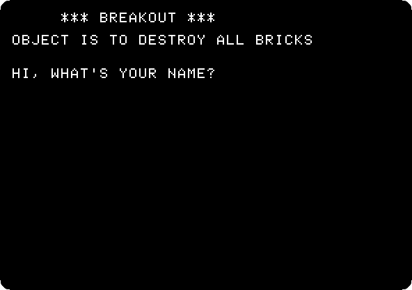
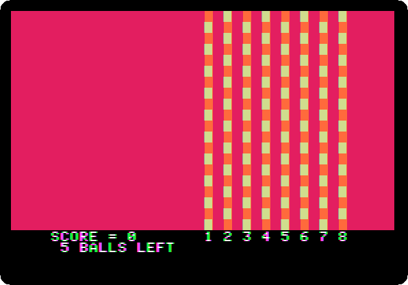
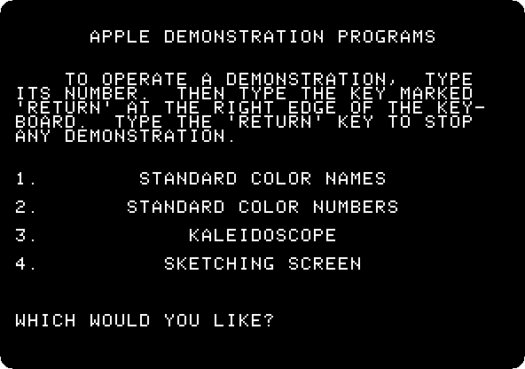
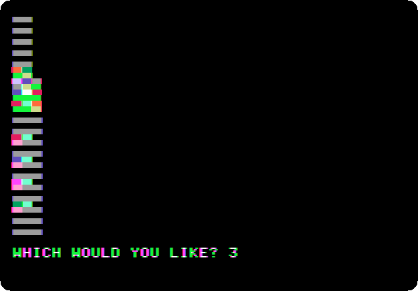
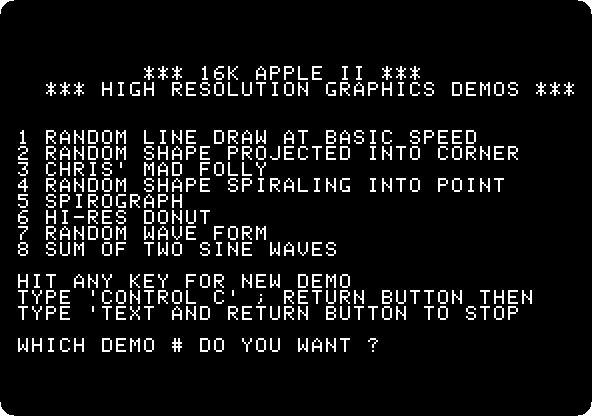
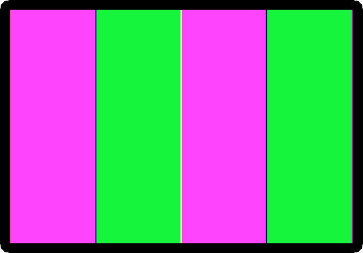
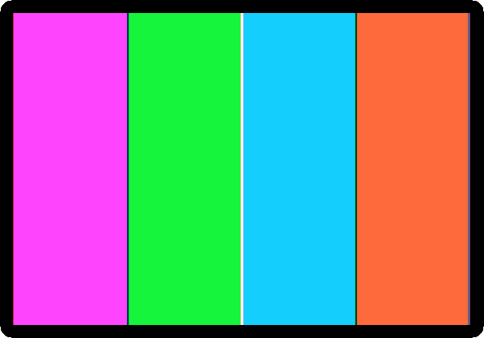

# The Apple \]\[ and its cassettes

[Back to the activities](../README.md)

The first Apple \]\[s went on sale on June 10, 1977: a board of Steve
Wozniak's in a plastic case, with its keyboard, two paddles, 4 KB of memory,
and Integer BASIC in its ROM, ready when switched on. There was no disk
drive. To keep a program, or to buy one, there was the cassette: a jack on
the back of the machine for the earphone of an ordinary tape recorder, and
another for its microphone. The recorder was not in the box, nor was the
television; the programs Apple sold were on cassettes, and the first ones
showed what the machine could do: a game, and its colours.

Getting a program in took a minute and some patience: the volume and the
tone of the recorder had to be right, or the Apple answered `ERR`. And the
colours were not all there yet. The first boards, *Revision 0*, the first
6,000 machines, showed four colours in the high resolution graphics: black,
white, violet and green. In June 1979 Byte printed how to give them two more,
in Wozniak's own words.

This page loads three of Apple's tapes into a first Apple \]\[, plays
Breakout, runs the demonstrations of the colour graphics and of the high
resolution graphics, and shows the colours of the two boards side by side.

## What you need

The recordings of three of Apple's cassettes, from the
[Apple cassettes](https://www.brutaldeluxe.fr/projects/cassettes/apple/index.html)
of the Brutal Deluxe cassette project, which keeps the tapes of the Apple \]\[
as sound files:

- **`k7_apple_002000101_breakout.wav`** and
  **`k7_apple_002000101_colorgraphics.wav`**, the two programs of the tape
  002-0001-01, *Breakout / Color Graphics*;
- **`k7_apple_600201600_highresolutiongraphics.wav`**, the tape 600-2016-00,
  *High-Resolution Graphics*.

Each comes in a `.zip` of the same name. `./fetch-disks.sh` in this repository
downloads them into `disks/`, takes the recordings out and checks them.

## The machine

The first Apple \]\[, as it came:

- the 6502 processor at 1 MHz and 48 KB of memory;
- the ROM with Integer BASIC and the Monitor;
- the board of Revision 0, with four colours in the high resolution graphics,
  and a keyboard of capitals only;
- the cassette input, with a tape in the recorder;
- paddles in the game port, and no cards in its slots.

The machine with the tape of Breakout:

```bash
izapple2 -model none -board 2plus -cpu 6502 -screen color \
    -rom "<internal>/341-000x_integer.rom" \
    -charrom "<internal>/Apple2rev7CharGen.rom" -forceCaps \
    -mods four-colors \
    -tape disks/k7_apple_002000101_breakout.wav
```

With the tape of Color Graphics:

```bash
izapple2 -model none -board 2plus -cpu 6502 -screen color \
    -rom "<internal>/341-000x_integer.rom" \
    -charrom "<internal>/Apple2rev7CharGen.rom" -forceCaps \
    -mods four-colors \
    -tape disks/k7_apple_002000101_colorgraphics.wav
```

With the tape of High-Resolution Graphics:

```bash
izapple2 -model none -board 2plus -cpu 6502 -screen color \
    -rom "<internal>/341-000x_integer.rom" \
    -charrom "<internal>/Apple2rev7CharGen.rom" -forceCaps \
    -mods four-colors \
    -tape disks/k7_apple_600201600_highresolutiongraphics.wav
```

And an Apple \]\[ of a later board, with six colours, and no tape:

```bash
izapple2 -model none -board 2plus -cpu 6502 -screen color \
    -rom "<internal>/341-000x_integer.rom" \
    -charrom "<internal>/Apple2rev7CharGen.rom" -forceCaps
```

izapple2 plays the tape when the Apple starts listening to the cassette
input, and stops it when the Apple stops: there is no Play button to press,
and it runs the machine as fast as it can while the tape plays, so a program
that took half a minute to load comes in a moment.

## Breakout

1. **Start izapple2** with the first command. The Apple \]\[ starts in the
   Monitor, with its prompt, `*`. **Press Control-B and Return** for Integer
   BASIC, with its prompt, `>`.

2. **Type `LOAD`.** The Apple listens to the cassette: a tone first, to set
   the level, then the program, as tones of two pitches, one for each value
   of a bit. When it has all of it, the prompt comes back. **Type `RUN`.**

   

   Breakout was a game of Atari, of 1976, which Wozniak had designed. Here
   it is in Integer BASIC, with the bricks in columns at the right and the
   bat at the left.

3. **Type a name**, and **`Y`** for the standard colours. **Move the mouse
   left and right** over the izapple2 window to move the bat up and down:
   without a joystick, izapple2 makes the mouse paddle 0, from 0 at the left
   of the window to 255 at the right.

   

   The bricks of the column at the right count more than the ones at the
   left. This is the speed of the machine: Integer BASIC works out every
   line of the game, the ball, the bat, the bricks and the score.

## Color Graphics

4. **Quit izapple2 and start it with the second command.** Control-B,
   Return, `LOAD` and `RUN`, as before. The menu of the demonstrations:

   

5. **Type `3` and Return**, the kaleidoscope: the colours of the low
   resolution graphics, drawn in patterns that mirror each other, as in a
   kaleidoscope.

   

   The colour of the Apple \]\[ was the point: the Commodore PET and the
   TRS-80 of the same year had none. The Apple made its colours from the way a colour television decodes
   its signal, with very few chips.

## High-Resolution Graphics

6. **Quit izapple2 and start it with the third command.** This tape has
   two parts: routines in machine code, that draw in the high resolution
   graphics, and a program in Integer BASIC that calls them. The machine
   code comes first, and the Monitor reads it: **type `C00.FFFR`**, *read
   the tape into memory from `C00` to `FFF`*. Then **Control-B and Return**,
   and **`LOAD`** for the BASIC that comes next on the tape, and **`RUN`**.

   

7. **Type `6` and Return**, the donut, rings drawn one after the other: a
   minute of the machine.

   

   Each dot of the high resolution graphics is a bit of memory, 280 across
   and 192 down. All of them are violet and green, as everything on a board
   of Revision 0.

## Six colours

In June 1979 Byte published *More Colors for Your Apple*, by Allen Watson
III, on how the controls of the television, its tint, gave other colours to
the high resolution graphics. Wozniak added a note to it. Only seven bits of each byte
of the high resolution graphics made dots; the eighth did nothing. "A simple
modification allows the high order bit of each to specify one of two color
sets by generating a 90 degree phase shift of displayed information", and
the note went on with the steps, from taking the board out of its case. The
later boards have it: with the eighth bit set, violet and green are blue and
orange.

8. **Press Reset**, Control-F2 in izapple2, **Control-B and Return**, and
   **type this program**, which paints the high resolution graphics in four
   bands, the last two with the eighth bit set:

   ```basic
   10 POKE -16304,0: POKE -16297,0: POKE -16302,0
   20 FOR C=0 TO 119
   30 B=C MOD 40/10:V=85: IF B MOD 2#C MOD 2 THEN V=42
   40 IF B>1 THEN V=V+128
   50 FOR A=8192+C TO 16383 STEP 128: POKE A,V: NEXT A
   60 NEXT C
   70 END
   ```

   The `POKE`s of line 10 switch the screen to the high resolution graphics,
   all of it, with no lines of text. The screen is 8 KB of memory from 8192,
   in blocks of 128 bytes, each with three lines of 40 bytes. `C` goes
   through the 120 bytes of a block and `B` is its band, of 10 bytes. `85`
   and `42` alternate the dots so that the band is of a colour, and `128`
   is the eighth bit. Line 50 puts the byte in its place in each of the 64
   blocks. It is also in this repository,
   [listings/colours.bas](listings/colours.bas).

   **Type `RUN`.** In about half a minute the bands are painted:

   

   Violet, green, violet and green: the eighth bit changes nothing.

9. **Quit izapple2 and start it with the last command**, an Apple \]\[ of a
   later board. Control-B, Return, the same program, and `RUN`:

   

   Violet, green, blue and orange, and black and white: the six colours of
   the high resolution graphics of every Apple \]\[ since.

## What next

[The Apple \]\[ of 1977](apple-ii.md) goes through the Monitor, the
Mini-Assembler and Integer BASIC of the same machine, and
[A game in Applesoft](paddle-game.md) is a game of bat and ball typed in.
