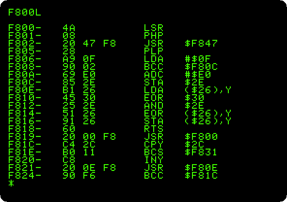
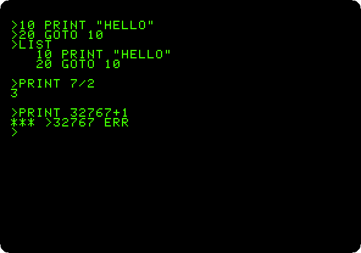

# The Apple \]\[ of 1977

[Back to the activities](../README.md)

The first Apple \]\[ came out in 1977, Steve Wozniak's design from the
board to the ROM. What the ROM had was his too: the **Monitor**, a few
commands to look at the memory, change it and run what is in it, a
disassembler, and a **Mini-Assembler** to write machine code a line at a
time; and **Integer BASIC**, a BASIC that counted only in whole numbers, and
was fast for it, with commands for the colour graphics of the machine.
Applesoft, with floating point, took its place in the ROM of the Apple \]\[+
of 1979.

This page switches that machine on and goes through all three.

## What you need

Only izapple2: the ROM of the Apple \]\[ comes inside it.

## The machine

The first Apple \]\[, as it came:

- the 6502 processor at 1 MHz and 48 KB of memory;
- the ROM with Integer BASIC, the Monitor and the Mini-Assembler;
- the board of the first Apple \]\[s, with four colours in the high
  resolution graphics, and no lower case;
- no cards in its slots.

```bash
izapple2 -model 2
```

## The Monitor

1. **Start izapple2** with the command above. The machine starts in the
   Monitor, with its prompt, `*`, at the bottom of a screen full of `@`: the
   Apple \]\[ does not clear the screen when it starts, and the memory
   izapple2 gives it is all zeros, which the screen shows as inverse `@`. A
   real machine showed whatever its memory happened to hold.

   ![The Apple \]\[ switched on](images/apple-ii/switched-on.png)

2. **Press Escape and then @** to clear the screen, and **type
   `F800.F807`** and Return: the Monitor shows the eight bytes from address
   `F800`, in hexadecimal, the first bytes of the Monitor itself:

   ```
   F800- 4A 08 20 47 F8 28 A9 0F
   ```

3. **Type `F800L`.** The Monitor disassembles twenty instructions from
   `F800`: the address, the bytes, and the instruction of the 6502 they are.

   

## The Mini-Assembler

4. **Clear the screen, type `F666G`**, and then the program below, a line at
   a time. `F666G` runs the Mini-Assembler, which is at that address of the
   ROM, and its prompt is `!`. The first line says where the program goes,
   `300`; the next ones start with a space and go after the one before.
   `$FF69G` goes back to the Monitor, and `300G` runs the program.

   ```
   F666G
   300:LDA #C1
    JSR FDED
    CLC
    ADC #1
    CMP #DB
    BNE 302
    RTS
   $FF69G
   300G
   ```

   

   The program writes the alphabet: it starts with the code of `A`, `C1`,
   calls the routine of the Monitor that writes a character on the screen,
   `FDED`, adds one, and goes back until it gets past `Z`. The
   Mini-Assembler writes each line again as it understands it, with the
   bytes it made.

## Integer BASIC

5. **Press Control-B and Return.** The prompt of Integer BASIC is `>`.
   Type these, each with Return; `CALL -936` clears the screen, by calling
   the routine of the Monitor that does it:

   ```basic
   CALL -936
   10 PRINT "HELLO"
   20 GOTO 10
   LIST
   PRINT 7/2
   PRINT 32767+1
   ```

   

   Seven halves are 3: there are no fractions in Integer BASIC. And there
   is nothing past 32767, the largest number of sixteen bits with a sign.

6. **Draw the sixteen colours** of the low resolution graphics, a bar of
   each:

   ```basic
   NEW
   CALL -936
   10 GR
   20 FOR I=0 TO 15
   30 COLOR=I
   40 VLIN 0,39 AT I*2+4
   50 VLIN 0,39 AT I*2+5
   60 NEXT I
   70 END
   RUN
   ```

   Press F6 in izapple2 until the screen is in colour. The first bar is
   black, colour 0, and can't be seen.

   

## What next

[Switch on an Apple \]\[+](switch-on.md) is the machine two years later,
with Applesoft in place of Integer BASIC.
