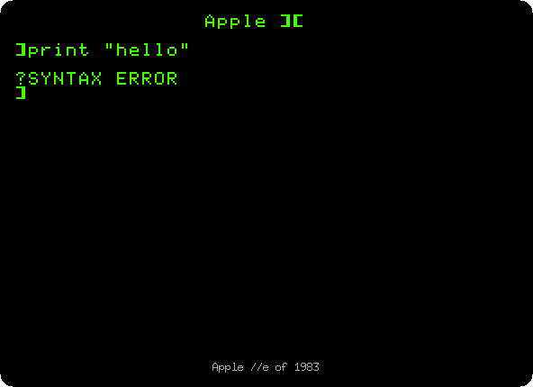
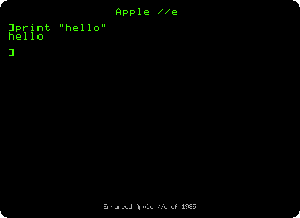
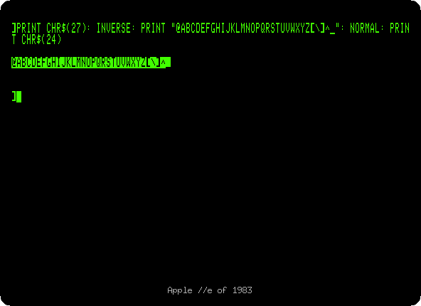
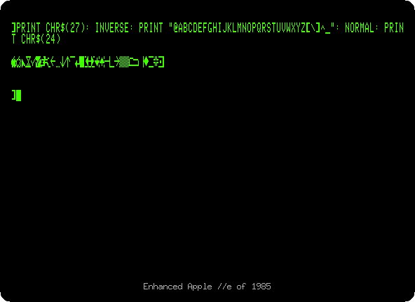
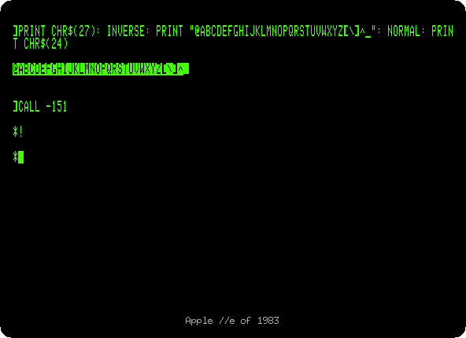
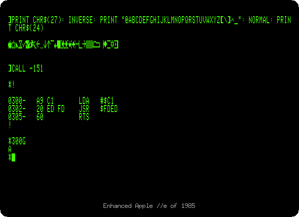

# The Apple //e, original and enhanced

[Back to the activities](../README.md)

The Apple //e lived for ten years, in three models that look alike:

- **The Apple //e**, of January 1983: small letters on its keyboard and its
  screen, 80 columns with a card in its auxiliary slot, the 6502 of the
  Apple \]\[.
- **The enhanced //e**, of March 1985: four chips changed, and an upgrade
  kit with the same four for the owners of a //e. The 65C02 processor, which
  has more instructions; the ROMs of Applesoft and of the Monitor, fixed and
  extended; and the ROM of the characters, with **MouseText**, 32 little
  pictures for the screens of text, which the //c of 1984 had brought. Its
  power light said *Enhanced*.
- **The Platinum //e**, of January 1987: the keyboard of the IIGS, with a
  numeric keypad on it. Apple made it until November
  1993.

This page does the same things on the first two, side by side: switches
them on, gives Applesoft a command in small letters, prints the characters
that became MouseText, and asks the Monitor for its Mini-Assembler. The
pictures of the //e of 1983 are on the left, and say *Apple //e of 1983*
under the screen; those of the enhanced one are on the right, and say
*Enhanced Apple //e of 1985*.

## What you need

Only izapple2: the ROMs of both come inside it.

The manual of the
[Apple IIe Enhancement Kit](https://archive.org/details/a2eekg), and the
[Apple IIe Technical Reference Manual](https://archive.org/details/a2etrm) of
1985, are on the Internet Archive.

## The machine

The Apple //e of 1983:

- the 6502 processor at 1 MHz and 128 KB of memory: 64 KB on the board,
  the top 16 KB of it the memory of a language card, which izapple2 puts in
  slot 0, and 64 KB more on the extended 80 column card, in the auxiliary
  slot;
- its ROM, and its ROM of characters;
- no cards in its slots.

```bash
izapple2 -model none -board 2e -cpu 6502 -screen green \
    -rom "<internal>/Apple2e.rom" \
    -charrom "<internal>/Apple IIe Video Unenhanced.bin" \
    -s0 language
```

The enhanced //e, the same with the 65C02 and the ROMs of 1985:

```bash
izapple2 -model none -board 2e -cpu 65c02 -screen green \
    -rom "<internal>/Apple2e_Enhanced.rom" \
    -charrom "<internal>/Apple IIe Video Enhanced.bin" \
    -s0 language
```

The models `2e` and `2enh` of izapple2 are these two, with a Disk II
controller and DOS 3.3 more, and, `2enh`, more cards. izapple2 has no model
of the Platinum //e.

## Switched on

1. **Start izapple2** with the first command, and **type `print "hello"`**
   in small letters. Then **quit izapple2, start it with the second
   command**, and type the same.

   <table><tr>
   <td></td>
   <td></td>
   </tr></table>

   The first says `Apple ][` when it starts, the second `Apple //e`: the
   way to tell them apart, as the manuals of the time said. The first does
   not know `print`, only `PRINT`; the enhanced one takes the commands of
   Applesoft in small letters too.

## MouseText

2. **Type `PR#3`** for 80 columns, and then this line, on both:

   ```
   PRINT CHR$(27): INVERSE: PRINT "@ABCDEFGHIJKLMNOPQRSTUVWXYZ[\]^_": NORMAL: PRINT CHR$(24)
   ```

   `CHR$(27)`, Control-\[, asks the 80 column firmware for MouseText, and
   `CHR$(24)`, Control-X, ends it; between them the 32 characters from `@`
   to `_`, in inverse.

   <table><tr>
   <td></td>
   <td></td>
   </tr></table>

   On the first, inverse capitals. On the enhanced one, MouseText: an
   apple, a pointer, an hourglass, a check mark, arrows, the pieces of
   windows and scroll bars. MouseText took the place of the flashing
   characters in 80 columns. Some older programs, which printed inverse
   capitals that way, showed MouseText instead until they were updated.

## The Mini-Assembler

3. **Type `CALL -151`** for the Monitor, and **`!`**, on both. On the
   enhanced one, the Mini-Assembler answers with its prompt, `!`. **Type**:

   ```
   300:LDA #$C1
    JSR $FDED
    RTS
   ```

   an empty line to leave it, and **`300G`** to run the program, which
   prints an `A`, as on [the Apple \]\[ of 1977](apple-ii.md).

   <table><tr>
   <td></td>
   <td></td>
   </tr></table>

   The Monitor of the //e of 1983 has no Mini-Assembler, and `!` does
   nothing. It was in the ROM of the first Apple \]\[, with Integer BASIC,
   and left with it in the Apple \]\[+; the enhanced //e brought it back.

## What next

[Switch on an Apple //e](apple-iie.md) goes on with the enhanced //e, its
80 columns and its self test, and [Apple II DeskTop](desktop.md) builds its
windows of MouseText.
