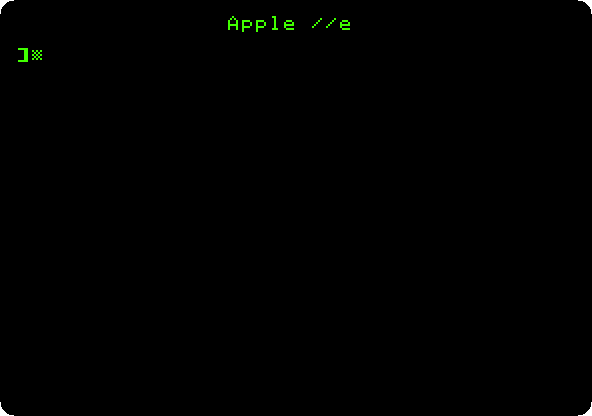
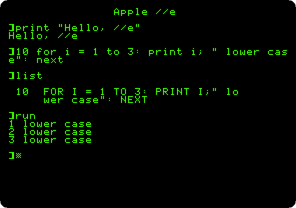
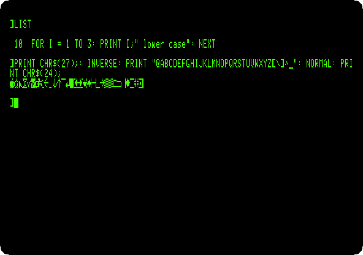
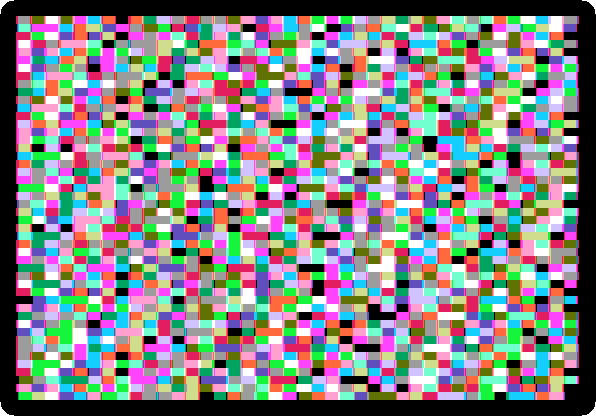
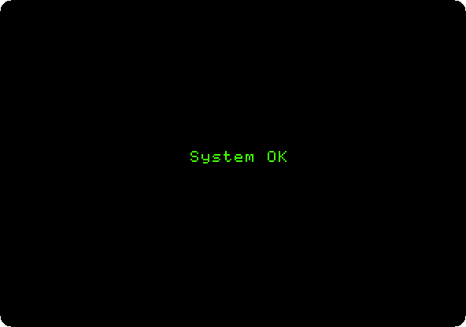

# Switch on an Apple //e

[Back to the activities](../README.md)

The Apple //e of 1983 was the Apple II for the rest of the decade, and the
one that sold the most. It kept the slots and the software of the Apple \]\[+
and fixed what its owners had been adding cards for: lower case on the
keyboard and the screen, 80 columns of text with a small card in a slot of
its own, 64 KB of memory and 128 KB with that card. Two keys with an apple on
them, Open Apple and Closed Apple, are wired to the buttons of the joystick.
In 1985 the *enhanced* //e brought the 65C02 processor and MouseText, small
pictures in the character set to draw windows and menus with.

This page switches on an enhanced //e with no disk drive, types in lower
case, changes to 80 columns, shows MouseText, and runs the self test that is
in its ROM.

## What you need

Only izapple2: the ROM of the enhanced Apple //e comes inside it.

## The machine

An enhanced Apple //e with no disk drive:

- the 65C02 processor at 1 MHz and 128 KB of memory: 64 KB on the board,
  the top 16 KB of it the memory of a language card, which izapple2 puts in
  slot 0, and 64 KB more on the extended 80 column card, in the auxiliary
  slot;
- no cards in its slots.

```bash
izapple2 -model none -board 2e -cpu 65c02 -screen green \
    -rom "<internal>/Apple2e_Enhanced.rom" \
    -charrom "<internal>/Apple IIe Video Enhanced.bin" \
    -s0 language
```

`<internal>/` names a file inside izapple2: the ROMs, of the machine and of
its characters.

The model `2enh` of izapple2 has this machine, with 8 MB more of memory on a
RAMWorks card, a No-Slot Clock, a VidHD card, a FASTChip accelerator and a
Mockingboard more:

```bash
izapple2 -model 2enh -screen green -s6 empty
```

## Switch it on

1. **Start izapple2** with the command above. The //e writes `Apple
   //e` at the top and goes to Applesoft. The cursor is a
   checkerboard.

   

## Lower case

2. **Type in lower case**, each line with Return:

   ```basic
   print "Hello, //e"
   10 for i = 1 to 3: print i; " lower case": next
   list
   run
   ```

   

   The text between quotes stays as typed. Applesoft takes its words in
   lower case too, and keeps them in capitals, as `list` shows.

## 80 columns

3. **Type `PR#3`.** The firmware of the 80 column card, which answers as if
   it were in slot 3, takes over the screen: twice as many characters in a
   line, half as wide. **Type `HOME` and `LIST`**: the program fits in one
   line now.

4. **Show the MouseText characters**: with 80 columns on, Escape,
   `CHR$(27)`, turns them on, and the capitals and symbols printed in inverse
   come out as MouseText; Control-X, `CHR$(24)`, turns them off.

   ```basic
   PRINT CHR$(27);: INVERSE: PRINT "@ABCDEFGHIJKLMNOPQRSTUVWXYZ[\]^_": NORMAL: PRINT CHR$(24);
   ```

   

   These are the pieces [Apple II DeskTop](desktop.md) draws its windows,
   its scroll bars and its check marks with.

## The self test

5. **Hold down both Apple keys and press Reset.** In izapple2, the Open
   Apple is the left Alt or Option key, the Closed Apple the right one, and
   Reset is Control-F2. Let go of them after a moment.

   The //e tests its memory and its chips, filling the screen with patterns
   in the low resolution graphics while it does.

   

6. **Wait.** After about half a minute in izapple2, the result:

   

   A //e with a fault said what had failed instead.

## What next

[Switch on an Apple \]\[+](switch-on.md) is the machine before the //e, all
capitals and 40 columns. [Apple II DeskTop](desktop.md) puts MouseText to
use.
