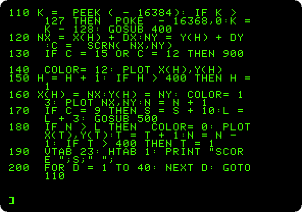
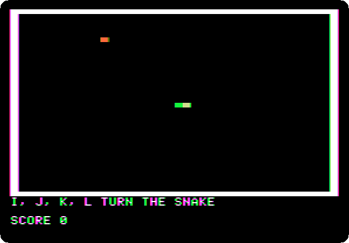
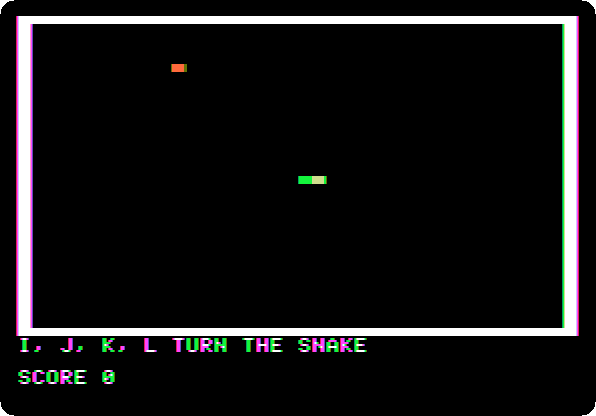
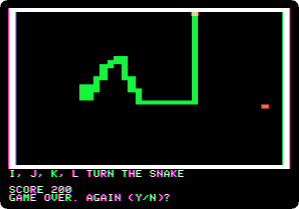

# A game in Applesoft: the snake

[Back to the activities](../README.md)

The magazines of the eighties printed games for their readers to type in,
pages of BASIC, and typing them was how many learnt to program. The snake,
which grows each time it eats and must never run into a wall or into
itself, was one of the simplest worth playing, and fits the low resolution
graphics of the Apple II, 40 blocks by 40 in 16 colours, well.

This page types a snake of 35 lines of Applesoft on an Apple \]\[+, a part
at a time, runs it, and plays it.

## What you need

Only izapple2, as in [Switch on an Apple \]\[+](switch-on.md): nothing
to download. The program is in this repository,
[listings/snake.bas](listings/snake.bas).

[The Applesoft Tutorial](https://archive.org/details/The_Applesoft_Tutorial),
Apple's manual to learn Applesoft, is on the Internet Archive.

## The machine

An Apple \]\[+ with no disk drive:

- the 6502 processor at 1 MHz, 48 KB of memory, and Applesoft BASIC in its ROM;
- the keyboard of the \]\[+, which types only capitals;
- no cards in its slots.

```bash
izapple2 -model none -board 2plus -cpu 6502 -screen color \
    -rom "<internal>/Apple2_Plus.rom" \
    -charrom "<internal>/Apple2rev7CharGen.rom" -forceCaps
```

The model `2plus` of izapple2 has this machine, with a Language Card and a
Videx Videoterm 80 column card more:

```bash
izapple2 -model 2plus -screen color -s6 empty
```

## The program

1. **Start izapple2** with the command above.

2. **Type the program**, each line with Return. Here it is in parts, with
   what each does.

   The start: the arrays that remember where the snake has been, the low
   resolution graphics with four lines of text below, `GR`, and a wall
   around the field, in white, colour 15. The snake starts as its head, in
   yellow, colour 13, going right; `L` is the length it is allowed:

   ```basic
   10 REM SNAKE, IN THE LOW RESOLUTION GRAPHICS
   20 DIM X(400),Y(400)
   30 GR : HOME
   40 COLOR= 15: HLIN 0,39 AT 0: HLIN 0,39 AT 39: VLIN 0,39 AT 0: VLIN 0,39 AT 39
   50 H = 1:T = 1:N = 1:L = 4:S = 0
   60 X(1) = 20:Y(1) = 20:DX = 1:DY = 0
   70 COLOR= 13: PLOT 20,20
   80 GOSUB 500
   90 VTAB 21: PRINT "I, J, K, L TURN THE SNAKE"
   ```

   The game, a step at a time. Line 110 looks at the keyboard without
   waiting: `PEEK(-16384)` is the last key, with the top bit set when it
   is new, and `POKE -16368,0` clears it. Line 120 works out the next
   block, and `SCRN` tells what is there: the wall or the body, green,
   colour 12, ends the game. The head becomes body, the new head is drawn,
   food, orange, colour 9, makes the snake longer and puts new food, and
   when the snake is longer than allowed its tail is rubbed out, in black.
   The empty loop of line 200 sets the speed of the game:

   ```basic
   100 REM THE GAME, A STEP AT A TIME
   110 K = PEEK ( - 16384): IF K > 127 THEN POKE - 16368,0:K = K - 128: GOSUB 400
   120 NX = X(H) + DX:NY = Y(H) + DY:C = SCRN( NX,NY)
   130 IF C = 15 OR C = 12 THEN 900
   140 COLOR= 12: PLOT X(H),Y(H)
   150 H = H + 1: IF H > 400 THEN H = 1
   160 X(H) = NX:Y(H) = NY: COLOR= 13: PLOT NX,NY:N = N + 1
   170 IF C = 9 THEN S = S + 10:L = L + 3: GOSUB 500
   180 IF N > L THEN COLOR= 0: PLOT X(T),Y(T):T = T + 1:N = N - 1: IF T > 400 THEN T = 1
   190 VTAB 23: HTAB 1: PRINT "SCORE ";S;" ";
   200 FOR D = 1 TO 40: NEXT D: GOTO 110
   ```

   The keys change the direction, but never to the opposite one, which
   would run the snake into itself: I, J, K and L, or the arrows, whose
   codes are there for the //e:

   ```basic
   400 REM THE KEYS, AND NO TURNING BACK
   410 IF (K = 73 OR K = 11) AND DY = 0 THEN DX = 0:DY = - 1
   420 IF (K = 75 OR K = 10) AND DY = 0 THEN DX = 0:DY = 1
   430 IF (K = 74 OR K = 8) AND DX = 0 THEN DX = - 1:DY = 0
   440 IF (K = 76 OR K = 21) AND DX = 0 THEN DX = 1:DY = 0
   450 RETURN
   ```

   The food goes in a block chosen by chance with `RND`, tried again until
   it is empty:

   ```basic
   500 REM FOOD, WHERE THERE IS ROOM
   510 FX = INT ( RND (1) * 38) + 1:FY = INT ( RND (1) * 38) + 1
   520 IF SCRN( FX,FY) < > 0 THEN 510
   530 COLOR= 9: PLOT FX,FY
   540 RETURN
   ```

   And the end, with the question of another game, which `RUN` starts:

   ```basic
   900 REM THE END
   910 VTAB 24: HTAB 1: PRINT "GAME OVER. AGAIN (Y/N)? ";
   920 GET A$: IF A$ = "Y" THEN RUN
   930 TEXT : HOME : PRINT "SCORE ";S: END
   ```

3. **Type `HOME` and `LIST 100,200`** to see the heart of the game as
   Applesoft keeps it, with its own spacing:

   

## Play

4. **Type `RUN`.** The field, the snake going right, and the first food.

   

5. **Play**: I up, J left, K down and L right. The recording is of the
   first six meals, at the speed of the machine, played by the generator
   of the pictures, which reads where the head and the food are in the
   memory of the screen and turns towards the food, away from the walls,
   the snake, and any corner too small to get out of.

   

   Each meal is 10 points and three blocks more of snake. After twenty:

   

6. **Run into the wall.** The game ends and asks for another; N ends the
   program.

   

## What next

[A game in Applesoft](paddle-game.md) is the other game typed in on these
pages, played with the paddle.
