# AppleWorks

[Back to the activities](../README.md)

**AppleWorks**, by Rupert Lissner, came out from Apple in 1984 and was the
program of the //e: a word processor, a spreadsheet and a data base in one,
with the same keys in the three, and a *Desktop* that keeps up to a dozen
files in memory at once, with a clipboard between them. For years it was
among the best-selling programs for the Apple II, at home, at school and at
work.

This page uses AppleWorks 3.0, of 1989, to work out the costs of a trip in
the spreadsheet, write a letter in the word processor with that table in
it, keep a list of friends in the data base, and save the three.

## What you need

**`appleworks-3.0.2mg`**, AppleWorks 3.0 on a disk of 800 KB, from the
[Internet Archive](https://archive.org/details/a2_AppleWorks_3.0_8-bit):
download *a2_AppleWorks_3.0_8-bit.2mg* and rename it `appleworks-3.0.2mg`.
`./fetch-disks.sh` in this repository downloads it into `disks/` and checks
it. izapple2 writes the files the page saves into it.

## The machine

An enhanced Apple //e with a disk of 800 KB:

- the 65C02 processor at 1 MHz and 128 KB of memory: 64 KB on the board,
  the top 16 KB of it the memory of a language card, which izapple2 puts in
  slot 0, and 64 KB more on the extended 80 column card, in the auxiliary
  slot; AppleWorks 3.0 needs the 128 KB;
- a hard disk interface, SmartPort, in slot 7, with the disk of AppleWorks,
  as a 3.5 inch drive would have it.

```bash
izapple2 -model _base -board 2e -cpu 65c02 \
    -rom "<internal>/Apple2e_Enhanced.rom" \
    -charrom "<internal>/Apple IIe Video Enhanced.bin" \
    -s0 language \
    -s7 smartport,image1=disks/appleworks-3.0.2mg
```

The enhanced Apple //e izapple2 starts with, its model `2enh`, has this
machine, with 8 MB more of memory on a RAMWorks card, a No-Slot Clock, a
VidHD card, a FASTChip accelerator, a Mockingboard and a Disk II controller
more:

```bash
izapple2 disks/appleworks-3.0.2mg
```

## The main menu

1. **Start izapple2** with the command above. AppleWorks asks for the date;
   **press Return** for the one it offers. Its main menu: AppleWorks is
   used with menus of numbers, Return to choose, and Escape to go back.

   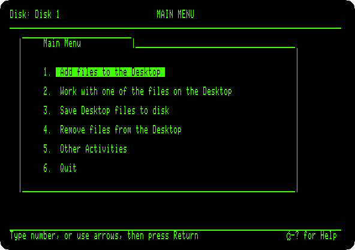

2. **Choose 1**, *Add files to the Desktop*: files from the disk, or a new
   one for each of the three programs.

   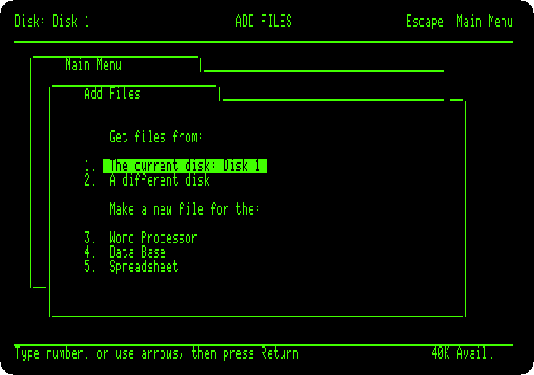

## The spreadsheet

3. **Choose 5**, *Spreadsheet*, and *From scratch*, and **type `Trip`** for
   its name. **Type the cells**: a word, a number or a formula, and Right
   Arrow to enter it and go to the next; at the end of a row, Return, Left
   Arrow back to column A, and Down Arrow.

   | A | B | C | D |
   |---|---|---|---|
   | `Item` | `Days` | `Per day` | `Cost` |
   | `Hotel` | `4` | `85` | `+B2*C2` |
   | `Car` | `4` | `40` | `+B3*C3` |
   | `Food` | `4` | `60` | `+B4*C4` |
   | `Museum` | `1` | `25` | `+B5*C5` |
   | `Total` | | | `@SUM(D2.D5)` |

   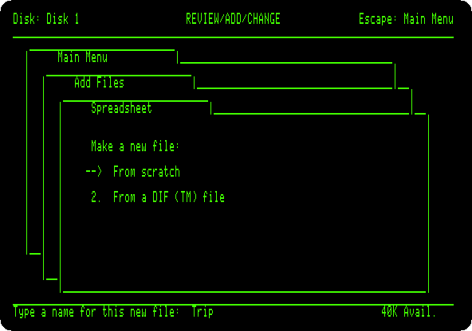

   A formula starts with `+`, or `@` for a function, as in VisiCalc; the
   range `D2.D5` is shown `D2...D5`.

4. **Press Open Apple and P**, *Print*, and Return for all of it. Besides
   the printer and files on disk, there is *the clipboard*, for the word
   processor. **Choose 2**, press Return for no date, and Space.

   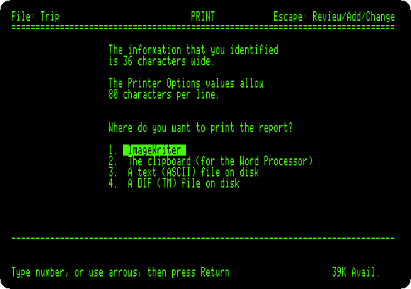

## The word processor

5. **Press Escape** for the main menu, **choose 1, 3**, *Word Processor*,
   *From scratch*, and **type `To.Ada`** for its name. **Type the start of
   the letter**:

   ```
   Dear Ada,

   Here is what the trip to the Computer Faire will cost, worked out in the spreadsheet:

   ```

   The lines break by themselves at the end of the screen; Return ends a
   paragraph.

6. **Press Open Apple and C**, *Copy*, and **F**, *From clipboard*: the
   table comes in, as the spreadsheet printed it, with its heading. **Press
   Open Apple and 9** to go to the end, and **type the end of the letter**:

   ```

   See you there.

   Grace
   ```

   **Open Apple and 1** goes to the start, to see it all:

   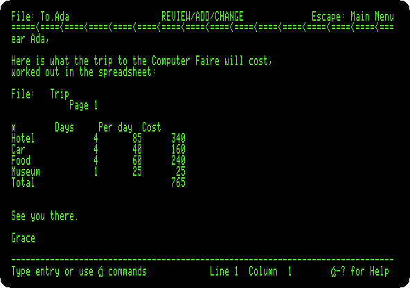

## The data base

7. **Escape, 1, 4**, *Data Base*, *From scratch*, `Friends`. A data base
   has *categories*, the fields of each record: **press Control-Y** to clear
   the first name, and **type `Name`, `City` and `Phone`**, each with Return.

   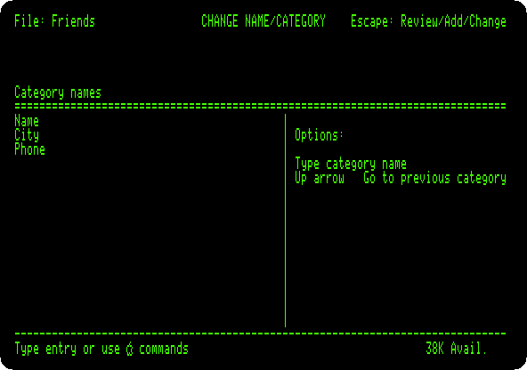

8. **Press Escape**, and Space: AppleWorks asks for the first record. **Type
   four**, a field and Return at a time:

   ```
   Ada Lovelace       London      555-1815
   Grace Hopper       Arlington   555-1906
   Steve Wozniak      Cupertino   555-1950
   Margaret Hamilton  Boston      555-1936
   ```

   **Press Escape** for the list of all of them, a record a line, the
   longer names cut to the width of their column.

   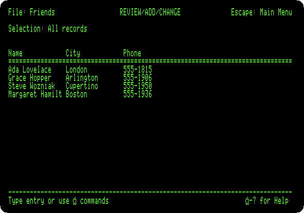

## The Desktop

9. **Press Open Apple and Q**: the Desktop Index, the three files in memory
   at once, and the program of each, `SS`, `WP` and `DB`. Choosing one goes
   to it, where it was left. **Press Escape**.

   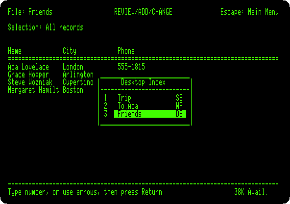

## Saved

10. **Press Escape** for the main menu, and **choose 6**, *Quit*, and Y.
    AppleWorks asks what to do with each new file: **press Return** for
    *Save the file on the current disk*, for each of the three.

    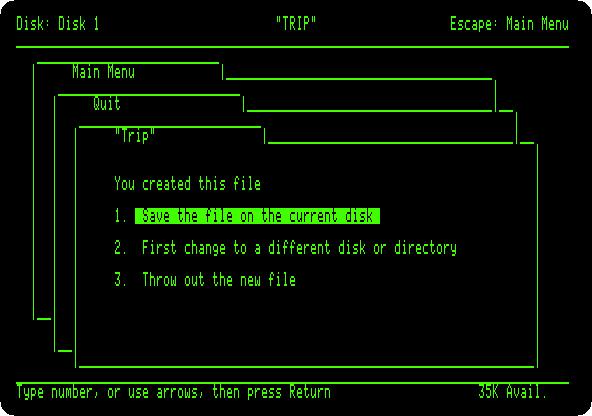

    AppleWorks ends in the program selector of its disk.

    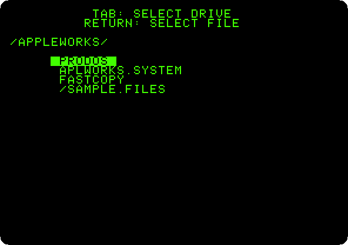

11. **Choose `APLWORKS.SYSTEM`** to start it again, Return for the date,
    and **choose 1** and **1**, *The current disk*: the three files are on
    the disk, next to the samples that came on it, with the date given to
    AppleWorks.

    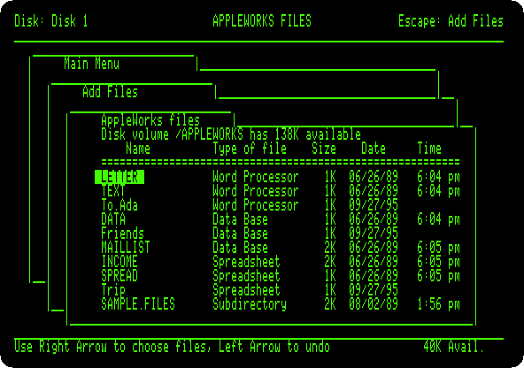

## What next

[ProDOS](prodos.md) is the system AppleWorks runs on, and
[Apple II DeskTop](desktop.md) the other way of the //e with files, with a
mouse.
