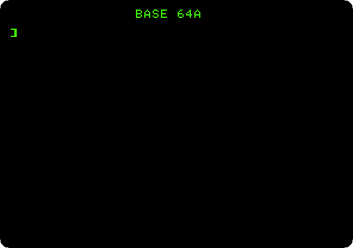
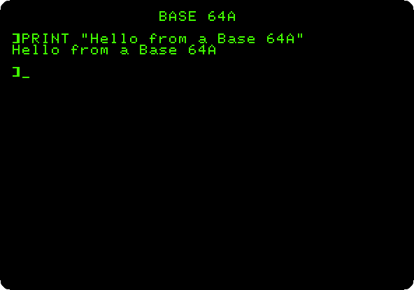
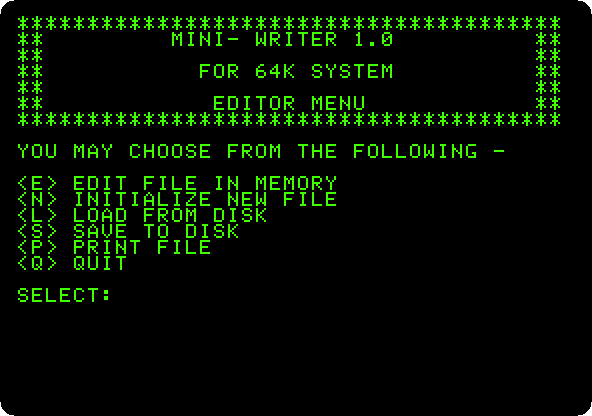
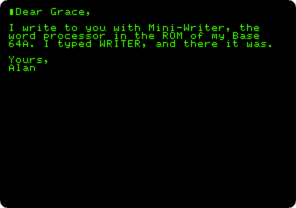
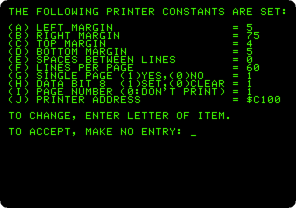
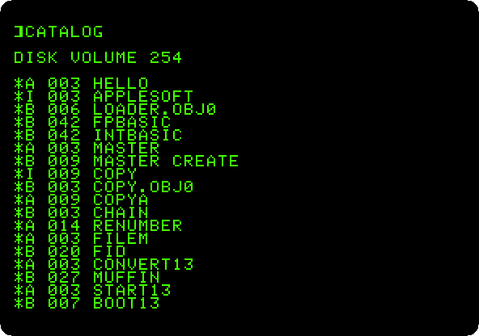

# The Base 64A, an Apple \]\[+ from Taiwan

[Back to the activities](../README.md)

The Apple \]\[ was easy to copy: its schematics and the listing of its
Monitor came in its manuals, and its parts could be bought anywhere. In the
early eighties workshops in Taiwan made copies of the Apple \]\[+, some
sold as kits, some under names of their own, and Apple went to court
against many of them.

The **Base 64A**, of Copam Electronics, is one: an Apple \]\[+ with 64 KB,
that runs the programs of the Apple and its disks, with a few things of its
own. It shows small letters on the screen, which the \]\[+ can't, and its
ROM, larger than the Apple's, has a word processor that BASIC starts with a
command: `WRITER`.

This page switches it on, writes and prints a letter with that word
processor, and starts Apple's own DOS 3.3 on it.

## What you need

For the last step, **`DOS 3.3 System Master - 680-0210-A (1982).dsk`**,
Apple's DOS 3.3 System Master, on the
[Asimov archive](https://mirrors.apple2.org.za/ftp.apple.asimov.net/images/masters/).
`./fetch-disks.sh` in this repository downloads it into `disks/` and checks
it. The rest needs nothing but izapple2, which carries the ROMs of the
Base 64A.

The [user's manual of the Base 64A](https://archive.org/details/base64a) is
on the Internet Archive, with a chapter on Mini-Writer, its seventh.

## The machine

A Base 64A with a printer:

- the 6502 processor at 1 MHz and 64 KB of memory: 48 KB on the board, and
  16 KB of a language card, which izapple2 puts in slot 0;
- the ROM of the Base 64A, with Applesoft BASIC, the Monitor and
  Mini-Writer, and its characters, small letters among them;
- a parallel printer card in slot 1, with a printer that is a file: what
  the card prints goes to `printer.out`, in the folder izapple2 runs in.

```bash
izapple2 -model none -board base64a -cpu 6502 -screen green \
    -rom "<custom>" \
    -charrom "<internal>/BASE64A_ROM7_CharGen.BIN" \
    -s0 language \
    -s1 parallel,file=printer.out
```

For DOS 3.3, the same machine with a Disk II controller in slot 6 and the
System Master in drive 1, and no printer:

```bash
izapple2 -model none -board base64a -cpu 6502 -screen green \
    -rom "<custom>" \
    -charrom "<internal>/BASE64A_ROM7_CharGen.BIN" \
    -s0 language \
    -s6 'diskii,disk1=disks/DOS 3.3 System Master - 680-0210-A (1982).dsk'
```

The model `base64a` of izapple2 has the first machine, with a Disk II
controller more and the DOS 3.3 diskette that izapple2 carries:

```bash
izapple2 -model base64a -screen green
```

## Switched on

1. **Start izapple2** with the first command. Where an Apple \]\[+ says
   `APPLE ][`, this one says its own name, and gives the prompt of
   Applesoft.

   

2. **Type `PRINT "Hello from a Base 64A"`**, with small letters inside the
   quotes.

   

   The Apple \]\[+ has no small letters: its keyboard types capitals, and
   its screen shows none. The Base 64A shows them, from its own characters.

## Mini-Writer

3. **Type `WRITER`.** The word processor of the ROM, *Mini-Writer 1.0*,
   shows its menu. A key and Return choose. `WRITER` is a command added to
   Applesoft; `WRITE` alone is a syntax error.

   

4. **Choose `N`**, *Initialize new file*, and **press `Y`** to erase what
   is in memory; then **choose `E`**, *Edit file in memory*. The screen is
   the page, with the cursor at the top. **Type the letter**, with Return at
   the end of each line:

   ```text
   Dear Ada,

   I write to you with Mini-Writer, the
   word processor in the ROM of my Base
   64A. I typed WRITER, and there it was.

   Yours,
   Alan
   ```

   

5. **Replace Ada with Grace.** **Control-B** takes the cursor to the
   beginning; **Control-S** is *search and replace*, which asks for
   `/what is/what it becomes/`: **type `/Ada/Grace/`**, **`A`** for
   automatic, and **Return**.

   

   Mini-Writer's other commands are Control keys too, each with a line of
   help when pressed: Control-Y to move text between two markers,
   Control-K to copy a part to the disk, Control-I to bring a file of the
   disk in, Control-D for a command of DOS.

6. **Press Escape and then Control-Q** to go back to the menu, and **choose
   `P`**, *Print file*, and `P` again, *Print new document*. Mini-Writer
   shows how it will print.

   

   It prints with a margin, a number at the top of each page, to a printer
   card at `$C100`, slot 1, and a sheet at a time: it waits for a key at
   each page, for the next sheet to be put in. **Type `G`**, single page,
   and **`0`**, for paper that goes on, and **Return** to accept. **Press
   Return** for no heading, and **Return** to start printing.

   The letter goes to `printer.out`:

   ```text
                                         Page 1


        Dear Grace,

        I write to you with Mini-Writer, the
        word processor in the ROM of my Base
        64A. I typed WRITER, and there it was.

        Yours,
        Alan
   ```

   The Base 64A sends its characters with the top bit set and ends each
   line with a carriage return and a line feed. This turns `printer.out`
   into plain text on a Mac or on Linux:

   ```bash
   LC_ALL=C tr '\200-\377' '\000-\177' < printer.out | tr -d '\r'
   ```

## Apple's DOS

7. **Quit izapple2 and start it with the second command.** The Base 64A
   starts DOS 3.3 from the System Master, as an Apple \]\[+ would, and its
   greeting program says `APPLE II`. **Type `CATALOG`.**

   

   That was the point of a copy: the programs and the diskettes of the
   Apple ran on it as they were. `WRITER` works here too.

## What next

[Switch on an Apple \]\[+](switch-on.md) is the machine it copied, and
[Printing](printing.md) prints from Applesoft on the same card.
