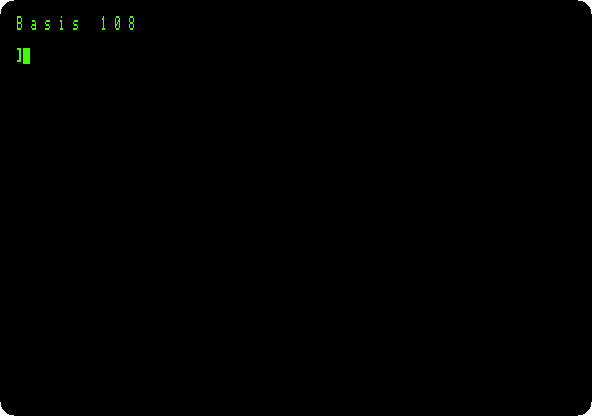
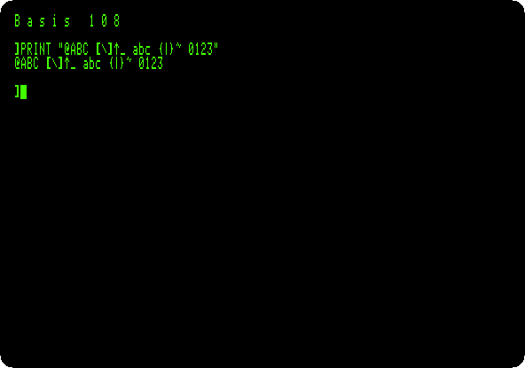
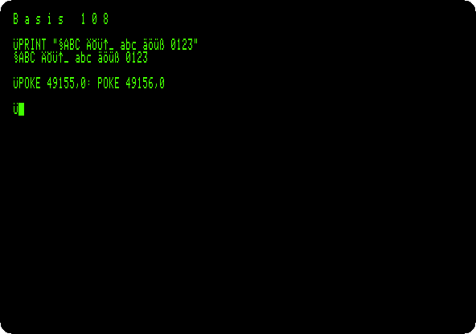
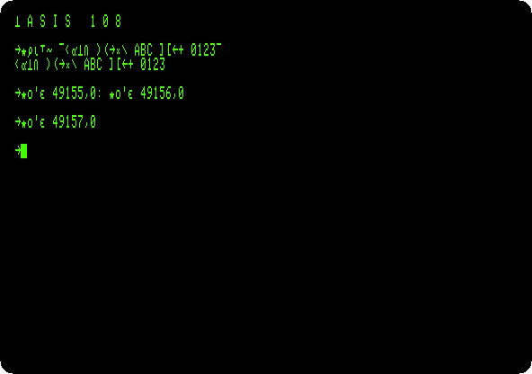
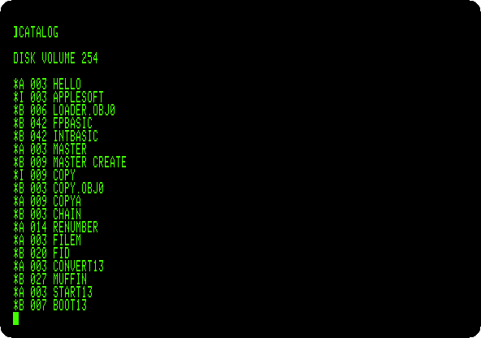

# The Basis 108, an Apple \]\[+ from Germany

[Back to the activities](../README.md)

In the early eighties Basis, a small company in West Germany, made its own
Apple \]\[+: the **Basis 108**. It was built for work, in a heavy case of
cast aluminium with the keyboard apart, and it had what an Apple \]\[+
needed cards for: 80 columns of text with small letters, a parallel and a
serial port, and a second processor, a Z80, to run CP/M, beside the 6502
for the programs of the Apple. Its characters could be the ones of ASCII,
the German ones, the signs of APL, or the Apple's own.

This page switches it on, writes in small letters, changes its characters
from BASIC, and starts Apple's DOS 3.3 on it, in 80 columns.

## What you need

For the last step, **`DOS 3.3 System Master - 680-0210-A (1982).dsk`**,
Apple's DOS 3.3 System Master, on the
[Asimov archive](https://mirrors.apple2.org.za/ftp.apple.asimov.net/images/masters/).
`./fetch-disks.sh` in this repository downloads it into `disks/` and checks
it. The rest needs nothing but izapple2, which carries the ROMs of the
Basis 108.

The [instruction manual of the Basis 108](https://www.applefritter.com/files/Basis%201982%20basis%20108%20instruction%20manual.pdf),
of 1982, in German, is on Applefritter, a scan of 100 MB.

## The machine

A Basis 108:

- the 6502 processor at 1 MHz and its memory, with 16 KB of a language
  card, which izapple2 puts in slot 0;
- the ROM of the Basis 108, with Applesoft BASIC and the Monitor, and its
  80 columns built in;
- its characters, in four sets.

izapple2 has neither its Z80 nor its ports.

```bash
izapple2 -model none -board basis108 -cpu 6502 -screen green \
    -rom "<custom>" \
    -charrom "<internal>/D29_basis_cg_2532.rom.BIN" \
    -s0 language
```

For DOS 3.3, the same machine with a Disk II controller in slot 6 and the
System Master in drive 1:

```bash
izapple2 -model none -board basis108 -cpu 6502 -screen green \
    -rom "<custom>" \
    -charrom "<internal>/D29_basis_cg_2532.rom.BIN" \
    -s0 language \
    -s6 'diskii,disk1=disks/DOS 3.3 System Master - 680-0210-A (1982).dsk'
```

The model `basis108` of izapple2 has this second machine, with the DOS 3.3
diskette that izapple2 carries, and a Videx Videoterm 80 column card more:

```bash
izapple2 -model basis108 -screen green
```

## Switched on

1. **Start izapple2** with the first command. Where an Apple \]\[+ says
   `APPLE ][` in 40 columns, the Basis 108 says its name in small letters,
   and in 80 columns: the screen has twice as many characters across, from
   the start, with no card.

   

2. **Type `PRINT "@ABC [\]^_ abc {|}~ 0123"`.**

   

   Capitals, small letters and the signs of ASCII, as a terminal of the
   time had them. The Apple \]\[+ shows no small letters,
   and none of `` ` { | } ~ ``.

## Its characters

The Basis 108 keeps four sets of characters, and soft switches of its own
choose among them: `$C002` and `$C003` the first bit of the set, and
`$C004` and `$C005` the second. A `POKE` to one of these addresses from
BASIC, with any value, throws the switch. The characters in memory stay as
they are; what changes is how they look.

3. **Type `POKE 49155,0: POKE 49156,0`**, `$C003` and `$C004`: the
   German set.

   

   The signs that German has no use for are its letters: `@` is `§`,
   `[ \ ]` are `Ä Ö Ü`, and `{ | } ~` are `ä ö ü ß`. Even the prompt of
   Applesoft, `]`, is an `Ü` now.

4. **Type `POKE 49157,0`**, `$C005`: the set of APL, the language of
   mathematicians, with a sign for each of its operations.

   

5. **Type `POKE 49154,0: POKE 49156,0`**, `$C002` and `$C004`: the set of
   the Apple \]\[, the one for programs written for it.

   ![The characters of the Apple \]\[](images/basis108/apple.png)

   It has no small letters, and shows signs where they were. `POKE
   49157,0` brings back ASCII, the set it started with.

## Apple's DOS

6. **Quit izapple2 and start it with the second command.** The Basis 108
   starts DOS 3.3 from the System Master, as an Apple \]\[+ would, but in 80
   columns. **Type `CATALOG`.**

   

   DOS writes its lines as on the Apple, and they take half the width of
   the screen.

## What next

[The Base 64A](base64a.md) is another copy, from Taiwan, with a word
processor in its ROM, and [Switch on an Apple \]\[+](switch-on.md) the
machine both copied.
