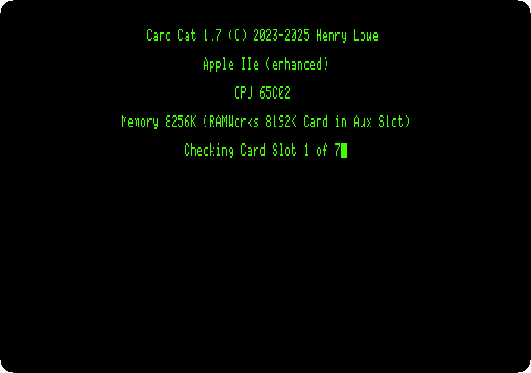
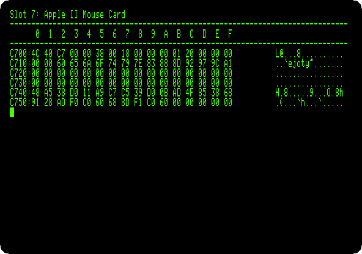

# What is in the slots: Card Cat

[Back to the activities](../README.md)

The seven slots of an Apple II took cards for everything: disk drives,
printers, clocks, sound, a mouse, more memory, another processor. A card
brings its own program, in a ROM that the machine sees at an address of its
slot, `$Cn00` for slot *n*, and a program finds out what card is in a slot by
looking at that ROM. Apple settled on a few bytes in it to say what a card
is, and the rest is recognised by its code.

Card Cat is a modern program, by Henry Lowe, that does exactly that for every
slot of the machine. This page runs it on an enhanced Apple //e with a card in
each slot, and looks at the ROM of one of them.

## What you need

Only izapple2: the disk of Card Cat 1.7 comes inside it, named `cardcat`.

## The machine

An enhanced Apple //e with a card in each slot:

- the 65C02 processor at 1 MHz, 128 KB of memory, and a RAMWorks memory card
  with 8 MB more in its auxiliary slot, with the 80 column card;
- a No-Slot Clock under the ROM;
- an Apple Parallel Interface card, for a printer, in slot 1;
- a VidHD card in slot 2;
- a FASTChip accelerator in slot 3;
- a Mockingboard sound card in slot 4;
- a ThunderClock Plus clock card in slot 5;
- a Disk II controller card in slot 6, with Card Cat in drive 1;
- a mouse card in slot 7.

```bash
izapple2 -model 2enh -s1 parallel -s5 thunderclock -s7 mouse cardcat
```

## Run it

1. **Start izapple2** with the command above. Card Cat starts from the disk,
   says what machine it is on, how much memory it has, and checks the slots
   one after the other.

   

2. **Wait for the list.**

   

   Every card but one is found by name. The VidHD in slot 2 shows as a card
   with no firmware. In slot 3 Card Cat finds the 80 column firmware of the
   //e, which takes slot 3 for itself, where the FASTChip is.

## A card's ROM

3. **Press V, and then 7**, to view the ROM of the mouse card.

   

   This is the page of slot 7, from `$C700`. Its first bytes say what card
   it is, in the way Apple set with Apple Pascal 1.1: `$38` at
   `$C705`, `$18` at `$C707` and `$01` at `$C70B` mean the card follows
   that convention, and `$20` at `$C70C` says it is a mouse. The rest is the
   code a program calls to read the mouse, from the addresses listed at
   `$C712`.

## What next

[Apple II DeskTop](desktop.md) uses the mouse card of slot 4, and
[The Mockingboard](mockingboard.md) the sound card of slot 4.
