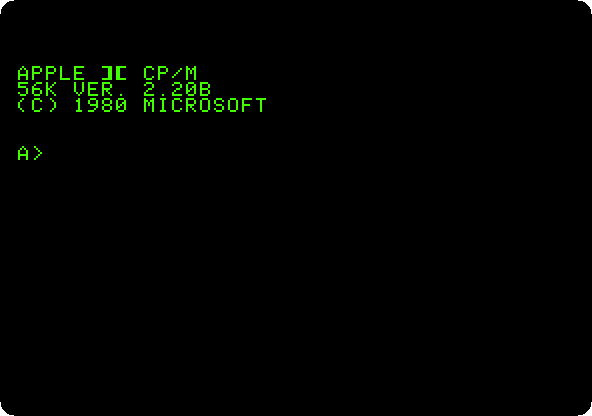
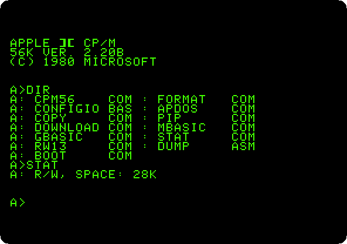
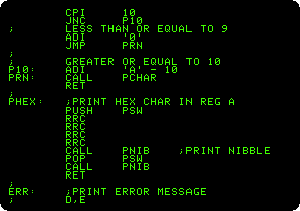
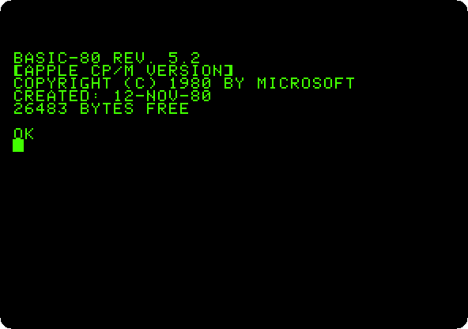
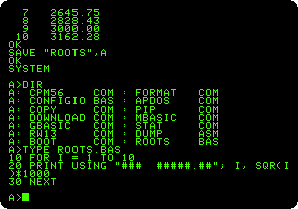
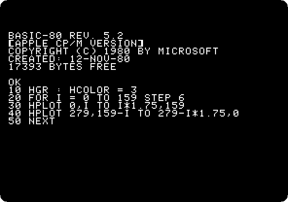

# CP/M on the Z80 SoftCard

[Back to the activities](../README.md)

At the end of the seventies the business software of small computers ran on
CP/M, the operating system of Digital Research, and CP/M ran on the Z80 and
the 8080 processors, not on the 6502 of the Apple II. In 1980 Microsoft sold
a card that changed that, the **Z80 SoftCard**: a Z80 processor on a card,
which takes over the machine while the 6502 waits, with CP/M and Microsoft's
BASIC on a diskette. The Apple II could then run the programs written for
CP/M.

This page starts CP/M on an Apple \]\[+ with the SoftCard, looks at its
disk, writes a program in Microsoft BASIC-80 and saves it among the files of
CP/M, and draws in high resolution from GBASIC, the BASIC-80 of the SoftCard
with the graphics of the Apple II.

## What you need

**`cpm-2.20b.po`**, the CP/M 2.20B diskette of the Microsoft SoftCard, for 56
KB. It is in `softcard.zip` on the [Asimov
archive](https://mirrors.apple2.org.za/ftp.apple.asimov.net/images/cpm/os/):
download it, take *CPM1.PO* out of it and rename it `cpm-2.20b.po`.
`./fetch-disks.sh` in this repository downloads it into `disks/` and checks
it.

## The machine

An Apple \]\[+ with the Microsoft Z80 SoftCard:

- the 6502 processor at 1 MHz, 48 KB of memory, and Applesoft BASIC in its ROM;
- the keyboard of the \]\[+, which types only capitals;
- a 16 KB Language Card in slot 0, which makes the memory of CP/M 56 KB;
- the Microsoft Z80 SoftCard in slot 4;
- a Disk II controller card in slot 6, with the CP/M diskette in drive 1.

```bash
izapple2 -model _base -board 2plus -cpu 6502 \
    -rom "<internal>/Apple2_Plus.rom" \
    -charrom "<internal>/Apple2rev7CharGen.rom" -forceCaps \
    -s0 language \
    -s4 z80softcard \
    -s6 diskii,disk1=disks/cpm-2.20b.po
```

The model `cpm` of izapple2 is this same machine, with the CP/M diskette
inside izapple2:

```bash
izapple2 -model cpm
```

## Start it

1. **Start izapple2** with the command above. The Apple \]\[+ starts from
   the diskette as always, and what it loads hands the machine over to the
   Z80. CP/M shows its version, 2.20B for 56K, and its prompt, `A>`: the
   drive it works on is drive A.

   

## The disk

2. **Type `DIR` and then `STAT`**, each with Return. `DIR` lists the files
   of the disk, with a name of up to eight letters and a type of three:
   `COM` is a program, run by typing its name. `STAT` says how much room is
   left on it.

   

   `PIP` copies files, `FORMAT` prepares a blank diskette, and `MBASIC` is
   Microsoft BASIC.

3. **Type `TYPE DUMP.ASM`.** `TYPE` shows a text file on the screen: this
   one is the source of a program of CP/M, in the assembly language of the
   8080, which the Z80 also runs. Press Control-C to stop it.

   

## Microsoft BASIC-80

4. **Type `MBASIC`.** BASIC-80 starts, says how much memory it has left for
   your program, and waits with `OK`. Type the program and run it:

   ```basic
   10 FOR I = 1 TO 10
   20 PRINT USING "###  #####.##"; I, SQR(I)*1000
   30 NEXT
   RUN
   ```

   

   It is the BASIC of Microsoft on another processor, a cousin of Applesoft:
   the same language with more, as `PRINT USING`, which lines up the numbers
   in columns with the decimals given.

5. **Type `SAVE "ROOTS",A`**, and then **`SYSTEM`** to leave BASIC and go
   back to CP/M. `,A` saves the program as plain text, not in the compact
   form BASIC keeps it in, so that any program of CP/M can read it. **Type
   `DIR` and `TYPE ROOTS.BAS`.**

   

   `ROOTS.BAS` is on the disk now, with the programs of CP/M, and `TYPE`
   shows it as it was typed.

## Graphics from the Z80

6. **Type `GBASIC`**, the same BASIC-80 with the graphics of the Apple II
   added, and the program:

   ```basic
   10 HGR : HCOLOR = 3
   20 FOR I = 0 TO 159 STEP 6
   30 HPLOT 0,I TO I*1.75,159
   40 HPLOT 279,159-I TO 279-I*1.75,0
   50 NEXT
   RUN
   ```

   Press F6 in izapple2 for colour.

   

   `HGR`, `HCOLOR` and `HPLOT` are the words of Applesoft for the high
   resolution graphics, 280 dots across, here run by the Z80. The lines are
   white, and the colours at their edges are those of a colour television
   showing white dots next to black ones. GBASIC leaves 17,393 bytes for
   programs, where MBASIC left 26,483.

7. **Type `SYSTEM`** to go back to CP/M.

## What next

[Apple Pascal](pascal.md) is another system that brought its own world to
the Apple II, the p-System of the University of California.
