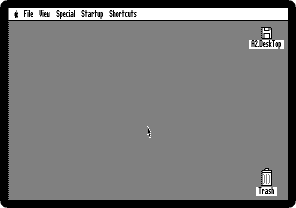
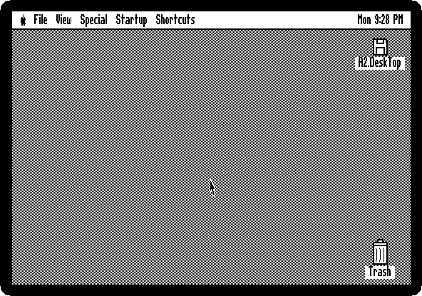
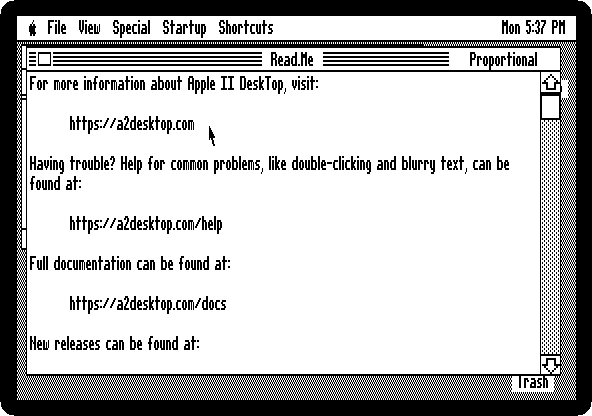
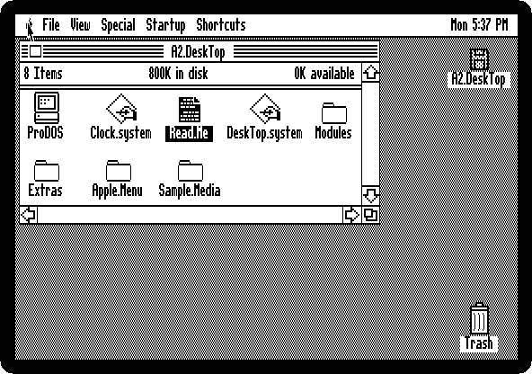
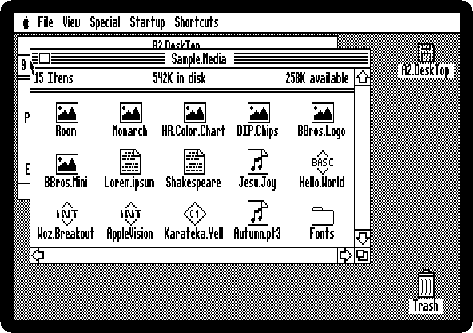
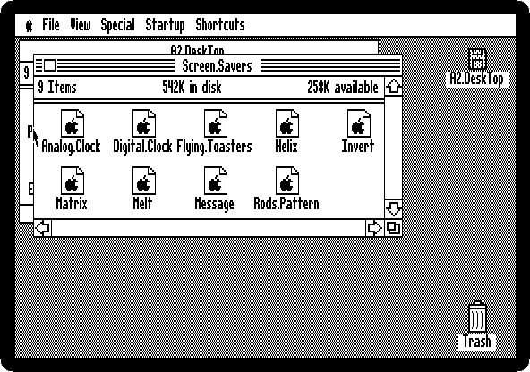
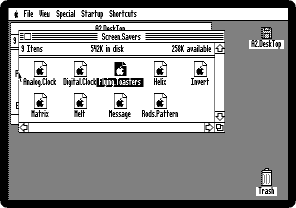
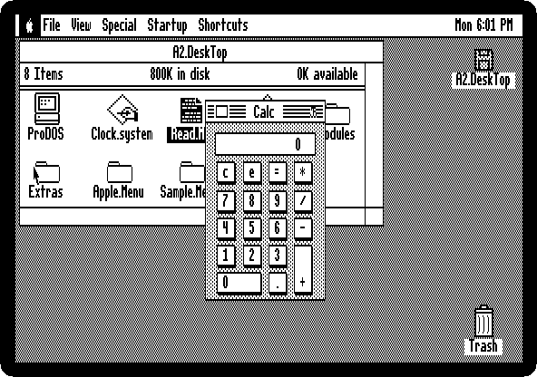

# Apple II DeskTop

[Back to the activities](../README.md)

In 1984 the Macintosh showed what a mouse, windows and icons were for, and the
Apple II got them too: Apple sold a mouse for the //e and the //c, and
programs to use it. Apple II DeskTop was the Apple II's own Finder: the disks
and their files as icons, opened with a double click, moved with the mouse,
and the menus and the desk accessories along the top of the screen, all in
the 560 dots across of the 80 column graphics of a //e with 128 KB.

It started as MouseDesk, by the French company Version Soft, which Apple then
sold as Apple II DeskTop. Today a group of Apple II enthusiasts keeps it alive
and adds to it, at [a2desktop.com](https://a2desktop.com). This page starts
their version 1.4, opens a disk, reads a file, asks the machine what it has
inside, opens a picture in colour, runs a screen saver, and uses the
Calculator.

## What you need

**`A2DeskTop-1.4-en_800k.2mg`**, the 800 KB disk of Apple II DeskTop 1.4,
from the [releases of the project](https://github.com/a2stuff/a2d/releases/tag/v1.4):
download *A2DeskTop-1.4-en.zip* and take it out of it. `./fetch-disks.sh` in
this repository downloads it into `disks/` and checks it.

## The machine

An enhanced Apple //e with a mouse and a hard disk:

- the 65C02 processor at 1 MHz and 128 KB of memory: 64 KB on the board,
  the top 16 KB of it the memory of a language card, which izapple2 puts in
  slot 0, and 64 KB more on the extended 80 column card, in the auxiliary
  slot;
- the RGB modes of the extended 80 column card, which DeskTop uses to show
  its double high resolution graphics in black and white;
- a mouse card in slot 4;
- a hard disk interface, SmartPort, in slot 7, with the disk of Apple II
  DeskTop 1.4.

```bash
izapple2 -model _base -board 2e -cpu 65c02 \
    -rom "<internal>/Apple2e_Enhanced.rom" \
    -charrom "<internal>/Apple IIe Video Enhanced.bin" -rgb \
    -s0 language \
    -s4 mouse \
    -s7 smartport,image1=disks/A2DeskTop-1.4-en_800k.2mg
```

`<internal>/` names a file inside izapple2: the ROMs, of the machine and of
its characters.

The model `desktop` of izapple2 has this machine, with 8 MB more of memory on
a RAMWorks card, a No-Slot Clock, a VidHD card, a FASTChip accelerator and a
Disk II controller more, and the disk of DeskTop inside izapple2:

```bash
izapple2 -model desktop
```

## Start it

1. **Start izapple2** with the command above. The machine starts ProDOS from the disk in slot 7, and ProDOS starts
   DeskTop. There is a disk, *A2.DeskTop*, at the top right, the Trash at the
   bottom right, a menu bar, and a pointer.

   

   The mouse is the mouse of your computer: wherever the pointer is on the
   izapple2 window, it is on the Apple II screen. With a clock in the
   machine, DeskTop would show the time at the right of the menu bar; this
   one has none.

## Open a disk

2. **Double-click the disk icon.** A window opens out of it, with the files
   of the disk.

   

   The top of the window says how many items there are, how much the disk
   holds and how much of it is free. *ProDOS* is the operating system,
   *DeskTop.system* is DeskTop, and the folders hold the rest.

3. **Double-click *Read.Me*.** DeskTop shows the text in a window of its own,
   with a scroll bar. Press Escape to close it.

   

## What is in the machine

4. **Pull down the Apple menu**, at the left of the menu bar, holding the
   button down, and let go on *About This Apple II*.

   

   Under the two *About* items are the desk accessories, small programs that
   open over DeskTop.

5. **Read what the machine is.**

   

   It is the machine of the command above: an enhanced Apple //e, with the
   65C02 processor and 128 KB of memory. Then what is in each of its seven
   slots: the 80 column card in slot 3, as the //e shows it, the mouse card
   in slot 4, and the hard disk card that has the disk of DeskTop in slot 7.
   The other slots are empty in this machine, which DeskTop shows as
   *(unknown)*. Press Escape to close it.

## Pictures

6. **Type `SAMPLE`**, the start of the name of the folder *Sample.Media*,
   and **press Open Apple and O.** Typing a name selects the icon that
   starts with it, and Open Apple-O, the left Alt or Option key with O, is
   *Open* in the *File* menu. The folder has pictures, texts, music and
   fonts that come with DeskTop.

   

7. **Type `MONARCH` and press Open Apple and O.** DeskTop shows the
   picture on the whole screen.

   

   It is in the double high resolution graphics of the //e, 140 dots across
   in 16 colours, the graphics of the 80 column card: DeskTop shows them in
   colour, and its own screen in black and white, with the RGB modes of the
   card. Press Escape to go back, and **Open Apple and W** to close the
   window of the folder.

## The screen savers

8. **Choose *Screen Savers* from the Apple menu.** It is a folder, of
   programs that keep the picture of the desktop from burning into the tube
   when the machine is left alone.

   

9. **Type `FLY` and press Open Apple and O**, for *Flying Toasters*, after
   the screen saver of the Macintosh *After Dark*.

   

   Press a key to stop it, and Open Apple and W to close the window.

## The Calculator

10. **Choose *Calculator* from the Apple menu**, and click its keys, *1*, *2*,
    *\**, *3* and *=*.

    

    The Calculator stays open over the desktop until it is closed with the
    box at the left of its title.

## What next

The other desk accessories of the Apple menu, the other screen savers, and
the *Toys* folder, are worth a look. [Switch on an Apple \]\[+](switch-on.md)
shows the Apple II before all this, with nothing on the screen but a prompt.
