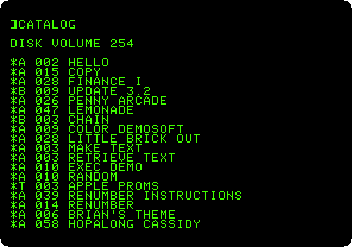
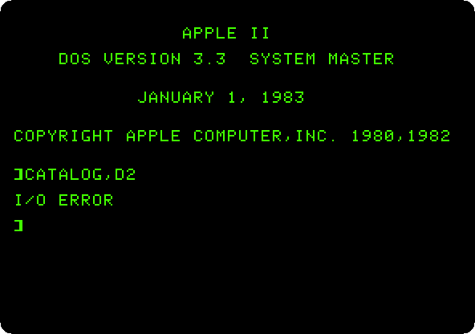
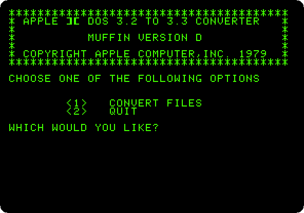
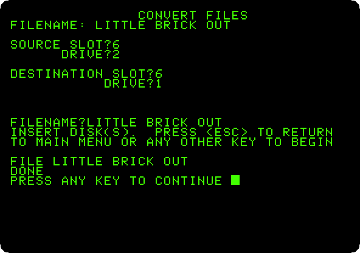
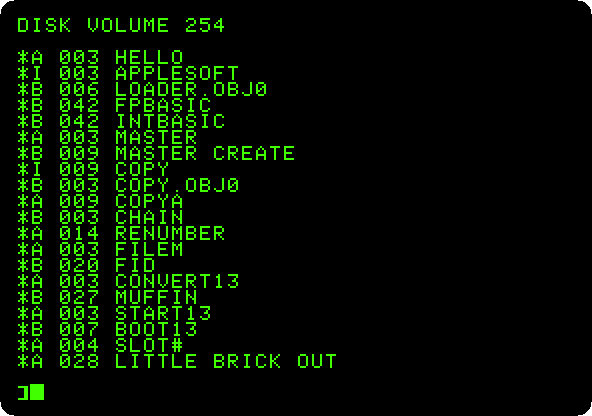
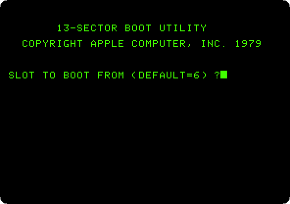
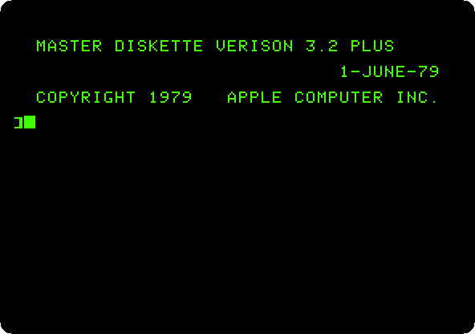

# From 13 sectors to 16: DOS 3.2 and DOS 3.3

[Back to the activities](../README.md)

The Disk II wrote 35 tracks on a diskette, and DOS 3.2, of February 1979,
cut each track into 13 sectors of 256 bytes. In August 1980 Apple brought
out DOS 3.3: a new way of encoding the bits on the diskette put 16 sectors
on each track, and a diskette held 140 KB, 23 percent more. The drive stayed
as it was; what changed was the ROM of the Disk II controller card, which an
owner changed, or had the dealer change, with the upgrade.

Then came the diskettes already written. A controller of 16 sectors can't
read one of 13, so the System Master of DOS 3.3 brought two programs for
them: **BOOT13**, which starts an old diskette, and **MUFFIN**, which moves
its files to a new one. Rich Williams wrote MUFFIN at Apple, and the name was
meant to stand for *Move Utility For Files In NewDOS*.

This page starts DOS 3.2 on an Apple \]\[+ with the controller of 13
sectors, then the same machine with the controller of 16 and DOS 3.3, which
can't read the old diskette, moves a program from it with MUFFIN, and starts
the old diskette anyway with BOOT13.

## What you need

- **`Apple DOS 3.2 Plus.nib`**, the System Master of DOS 3.2 for the Apple
  \]\[+, on the
  [Asimov archive](https://mirrors.apple2.org.za/ftp.apple.asimov.net/images/masters/);
  a `.nib` keeps the 13 sectors as they are on the diskette;
- **`DOS 3.3 System Master - 680-0210-A (1982).dsk`**, the System Master of
  DOS 3.3, in the same folder.

`./fetch-disks.sh` in this repository downloads them into `disks/` and checks
them.

## The machine

An Apple \]\[+ with 48 KB and Applesoft in its ROM, and a Disk II controller
card in slot 6 with the ROM of 13 sectors and the System Master of DOS 3.2:

```bash
izapple2 -model none -board 2plus -cpu 6502 -screen green \
    -rom "<internal>/Apple2_Plus.rom" \
    -charrom "<internal>/Apple2rev7CharGen.rom" -forceCaps \
    -s6 'diskii,sectors13,disk1="disks/Apple DOS 3.2 Plus.nib"'
```

The same Apple \]\[+ after the upgrade, its controller with the ROM of 16
sectors, the System Master of DOS 3.3 in drive 1 and the one of DOS 3.2 in
drive 2:

```bash
izapple2 -model none -board 2plus -cpu 6502 -screen green \
    -rom "<internal>/Apple2_Plus.rom" \
    -charrom "<internal>/Apple2rev7CharGen.rom" -forceCaps \
    -saveDir changes \
    -s6 'diskii,disk1=disks/DOS 3.3 System Master - 680-0210-A (1982).dsk,disk2="disks/Apple DOS 3.2 Plus.nib"'
```

MUFFIN writes to the System Master. With `-saveDir changes`, izapple2 keeps
what is written in the folder `changes`, and leaves the file of the System
Master as it was downloaded; started again with the same option, the machine
finds the changes there. Make the folder before starting izapple2:
`mkdir changes`.

The model `dos32` of izapple2 is a first Apple \]\[ with a controller of 13
sectors, a firmware card and a diskette of DOS 3.2 that izapple2 carries:

```bash
izapple2 -model dos32 -screen green
```

## DOS 3.2

1. **Start izapple2** with the first command. The Apple \]\[+ starts the
   diskette, and the System Master of DOS 3.2 greets, from June 1979.
   **Type `CATALOG`.**

   

   Its programs are in Applesoft, `A`, for the Apple \]\[+: Little Brick
   Out, a smaller Breakout, Color Demosoft, Lemonade.

## DOS 3.3

2. **Quit izapple2 and start it with the second command**, the machine
   after the upgrade. DOS 3.3 starts from drive 1. **Type `CATALOG,D2`**,
   the diskette of DOS 3.2 in drive 2:

   

   The new controller does not find its sectors on the old diskette.

## MUFFIN

3. **Type `BRUN MUFFIN,D1`.** MUFFIN is a program in machine code on the
   System Master, run with `BRUN`, *binary run*; `,D1` because DOS still
   looks at drive 2.

   

4. **Choose `1`**, *Convert files*, and answer: the source in **slot `6`,
   drive `2`**, the old diskette; the destination in **slot `6`, drive
   `1`**, the new one; the file **`LITTLE BRICK OUT`**. **Press Return** to
   begin.

   

   The program is the same, its sectors laid out in the new format.

5. **Press Return, choose `2`** to quit, and **type `CATALOG,D1`**. The
   catalog stops when the screen is full; **press Space** for the rest.

   

   *Little Brick Out* is at the end, on a diskette of 16 sectors now, and
   `RUN LITTLE BRICK OUT` runs it.

## BOOT13

6. **Type `RUN START13`**, the program of the System Master that runs
   BOOT13 and asks where to start from:

   

7. BOOT13 starts the diskette in drive 1: **put the System Master of DOS
   3.2 in drive 1**, dropping its file on the area of drive 1 of the
   izapple2 window (F8 shows the areas), and **press Return** for slot 6.

   

   DOS 3.2 is running on the controller of 16 sectors, started by BOOT13
   and not by the ROM of the card. A diskette of DOS 3.2 kept working,
   started this way, until its files were moved.

## What next

[Life with DOS 3.3](dos33.md) goes on with DOS 3.3, a diskette of your own
initialized and written to.
