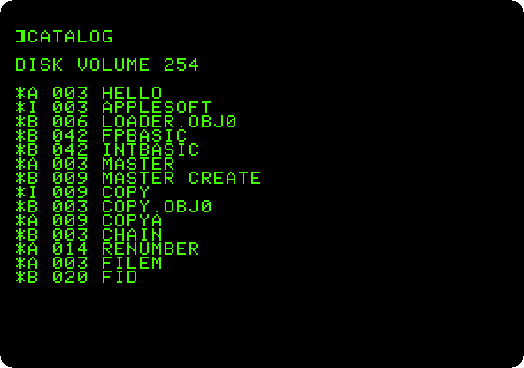
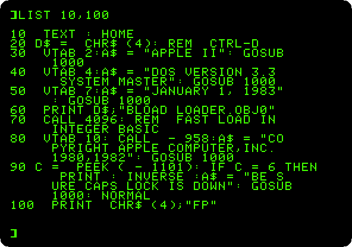
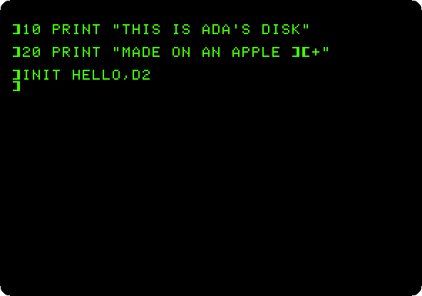
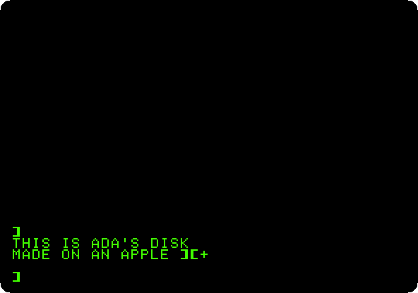

# Life with DOS 3.3

[Back to the activities](../README.md)

The Disk II drive of 1978 is what turned the Apple II from a home computer
that loaded its programs from cassettes into one people could work with: a
5¼ inch diskette held more than a hundred kilobytes, and a file was found on
it in seconds. The drive came with a disk operating system, DOS, that hid itself inside BASIC and
added commands to it: `CATALOG`, `LOAD`, `SAVE`, `RUN`, `INIT`. DOS 3.3, of
1980, fitted sixteen sectors on a track where DOS 3.2 had fitted thirteen,
140 KB on a diskette, and was the DOS of the Apple II from then on.

Every drive came with a **System Master** diskette, the one to start the
machine with. This page starts an Apple \]\[+ with two drives from it, looks at
what is on it, and makes a diskette of your own, which then starts the machine
by itself.

## What you need

- **`DOS 3.3 System Master - 680-0210-A (1982).dsk`**, the DOS 3.3 System
  Master of January 1983, Apple's part number 680-0210-A, on the
  [Asimov archive](https://mirrors.apple2.org.za/ftp.apple.asimov.net/images/masters/).
- **`my-disk.dsk`**, a blank diskette: a file of 143,360 zero bytes, 35 tracks
  of 16 sectors of 256 bytes. DOS formats it, so nothing has to be on it.

`./fetch-disks.sh`, in this repository, downloads the first into the folder
`disks`, checks it, and makes `disks/blank.dsk`, the blank one. Copy the blank
one to have a diskette of your own to write on, and keep `blank.dsk` blank:

```bash
./fetch-disks.sh
cp disks/blank.dsk my-disk.dsk
```

Without the script, this makes the blank diskette on a Mac or on Linux:

```bash
head -c 143360 /dev/zero > my-disk.dsk
```

izapple2 writes what DOS saves straight into `my-disk.dsk`.

## The machine

An Apple \]\[+ with two disk drives:

- the 6502 processor at 1 MHz, 48 KB of memory, and Applesoft BASIC in its ROM;
- the keyboard of the \]\[+, which types only capitals;
- a 16 KB Language Card in slot 0, where the System Master loads Integer
  BASIC;
- a Disk II controller card in slot 6, with two drives: the System Master in
  drive 1 and your blank diskette in drive 2.

```bash
izapple2 -model none -board 2plus -cpu 6502 -screen green \
    -rom "<internal>/Apple2_Plus.rom" \
    -charrom "<internal>/Apple2rev7CharGen.rom" -forceCaps \
    -s0 language \
    -s6 'diskii,disk1=disks/DOS 3.3 System Master - 680-0210-A (1982).dsk,disk2=my-disk.dsk'
```

At the end, the same machine with your diskette alone, in drive 1:

```bash
izapple2 -model none -board 2plus -cpu 6502 -screen green \
    -rom "<internal>/Apple2_Plus.rom" \
    -charrom "<internal>/Apple2rev7CharGen.rom" -forceCaps \
    -s0 language \
    -s6 diskii,disk1=my-disk.dsk
```

The model `2plus` of izapple2 has this machine, with a Videx Videoterm 80
column card more:

```bash
izapple2 -model 2plus -screen green "disks/DOS 3.3 System Master - 680-0210-A (1982).dsk" my-disk.dsk
izapple2 -model 2plus -screen green my-disk.dsk
```

## Start the System Master

1. **Start izapple2** with the first command. The machine starts from
   drive 1: it writes `APPLE ][` at the top of the screen and the drive
   reads DOS into memory. Then the greeting of the System Master comes up,
   and it tells you it is loading Integer BASIC, the BASIC of the first
   Apple II, into memory, so that the programs written in it run on an
   Apple \]\[+ too.

   

## What is on the diskette

2. **Type `HOME` and `CATALOG`**, each with Return. DOS lists the files of
   the diskette in drive 1, a screen at a time; press any key for the rest.

   

   The letter before each name is what the file is: `A` an Applesoft
   program, `I` an Integer BASIC one, `B` binary, machine code or data
   loaded into memory as it is, and `T` text. The number is its size in
   sectors of 256 bytes. The `*` says the file is locked, and can't be
   changed or deleted until it is unlocked with `UNLOCK`.

3. **Type `LOAD HELLO`, `HOME`, and `LIST 10,100`.** `HELLO` is the program
   DOS runs when it starts from this diskette, the one that wrote the
   greeting.

   

   Line 20 is how a program talks to DOS: `CHR$(4)` is Control-D, and a line
   printed after it is a DOS command and not text for the screen. Line 60
   loads a machine code program, and line 70 calls it to load Integer BASIC
   faster than DOS would. Line 100 ends with `FP`, the DOS command that
   starts Applesoft.

## A diskette of your own

4. **Type a new program**, and **`INIT HELLO,D2`**:

   ```basic
   NEW
   HOME
   10 PRINT "THIS IS ADA'S DISK"
   20 PRINT "MADE ON AN APPLE ][+"
   INIT HELLO,D2
   ```

   `INIT` formats the diskette in drive 2, `D2`, wiping it, writes DOS on it,
   and saves the program in memory on it as `HELLO`, the program the new
   diskette runs when it starts. The drive works for a while, with nothing
   on the screen, and gives back the prompt when it is done.

5. **Type `CATALOG,D2`.** The new diskette has one file, the greeting, two
   sectors long. DOS itself does not show: it is in the first three tracks,
   out of the way of the files.

   

   `SAVE` and `LOAD` keep and bring back more programs on it, by name, and
   `,D1` and `,D2` say which drive, which stays the one used until another
   is named.

6. **Close izapple2, and start it with your diskette alone**, with the
   second command. The machine starts from your diskette, loads its DOS and runs its
   `HELLO`.

   

## What next

[Switch on an Apple \]\[+](switch-on.md) has more on Applesoft, the BASIC
these programs are written in.
