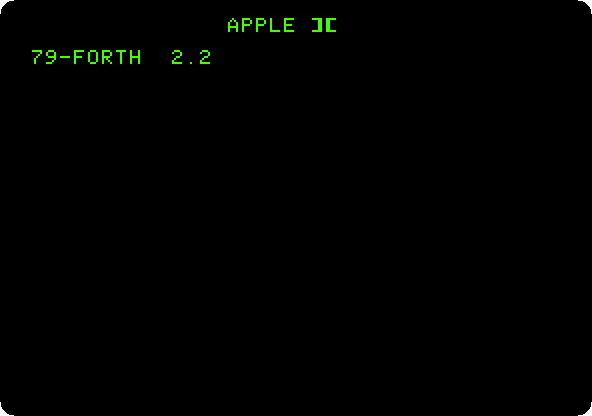
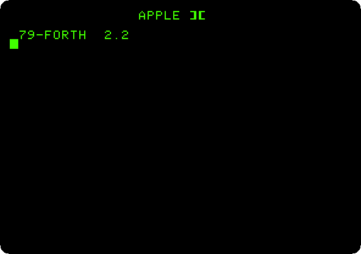
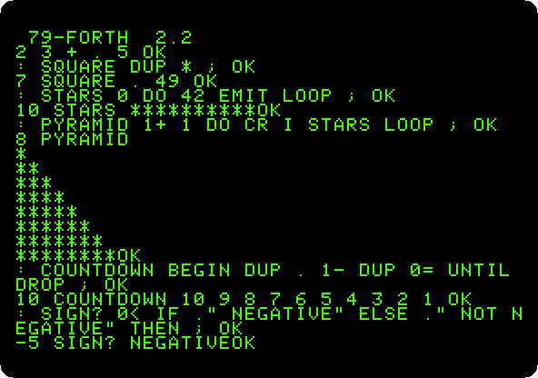
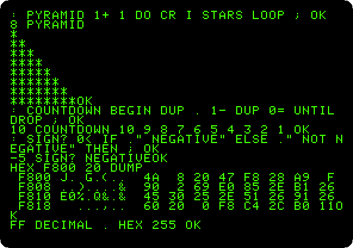
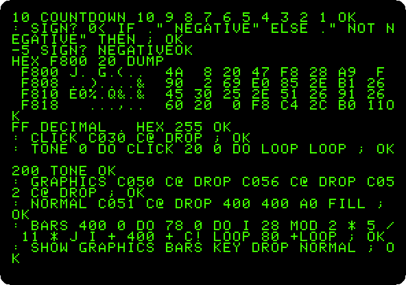
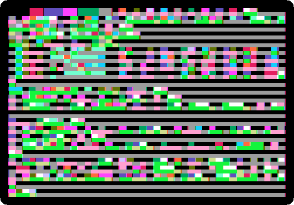
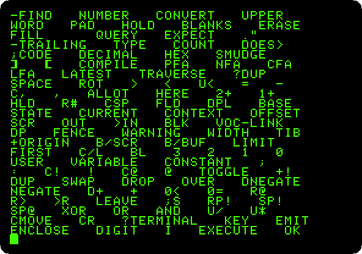

# Forth in ROM

[Back to the activities](../README.md)

Forth is a language made of *words*: each does something to a stack of
numbers, and a program is new words defined from the ones there are, until
there is one for the whole job. It needs little memory and runs fast, close
to the machine, and in the early eighties it had a following among owners
of small computers who found BASIC slow and assembler hard.

Offete Industries sold a card that put FORTH-79 in the ROM of an Apple \]\[+,
there when the machine is switched on, the way Applesoft is. This page
switches on that machine, uses some words and defines new ones, with loops
and decisions, and then goes to the machine itself, as Forth programmers
did: memory read in hexadecimal, the speaker clicked into a tone, and the
graphics painted a byte at a time.

## What you need

Only izapple2: the ROM of the Forth card comes inside it. The
[reference manual of this Forth](https://archive.org/details/forth79-A2) is
on the Internet Archive.

## The machine

An Apple \]\[+ with Forth in ROM:

- the 6502 processor at 1 MHz, 48 KB of memory, and Applesoft BASIC in its ROM;
- the keyboard of the \]\[+, which types only capitals;
- the Forth ROM card of Offete Industries in slot 0;
- no disk controller card: Forth starts from the card.

```bash
izapple2 -model _base -board 2plus -cpu 6502 \
    -rom "<internal>/Apple2_Plus.rom" \
    -charrom "<internal>/Apple2rev7CharGen.rom" -forceCaps \
    -s0 forthrom
```

The model `forth` of izapple2 has this machine, with a Videx Videoterm 80
column card more:

```bash
izapple2 -model forth
```

## Switch it on

1. **Start izapple2** with the command above. The Apple \]\[+ writes its
   name, and the card starts Forth, which says its version and waits.

   

## Words

2. **Type these lines**, each with Return:

   ```forth
   2 3 + .
   : SQUARE DUP * ;
   7 SQUARE .
   : STARS 0 DO 42 EMIT LOOP ;
   10 STARS
   ```

   

   - `2 3 + .` puts 2 and 3 on the stack, `+` adds them, and `.` prints
     the result and takes it off. Forth answers `OK` after each line.
   - `: SQUARE DUP * ;` defines a new word, `SQUARE`, from `:` to `;`: it
     duplicates the number on the stack with `DUP` and multiplies it by
     itself. `7 SQUARE .` prints 49.
   - `STARS` loops from 0 to the number on the stack, and each time `EMIT`
     writes the character 42, an asterisk.

## Loops and decisions

3. **Type these lines**, each with Return:

   ```forth
   : PYRAMID 1+ 1 DO CR I STARS LOOP ;
   8 PYRAMID
   : COUNTDOWN BEGIN DUP . 1- DUP 0= UNTIL DROP ;
   10 COUNTDOWN
   : SIGN? 0< IF ." NEGATIVE" ELSE ." NOT NEGATIVE" THEN ;
   -5 SIGN?
   ```

   

   - `PYRAMID` is made of `STARS`, the word you defined before: a word is
     used the same whether it came in the ROM or you wrote it. `I` is the
     number of the turn of the loop, and `CR` starts a new line.
   - `COUNTDOWN` prints the number on the stack and takes one off, `1-`,
     from `BEGIN` until it is 0.
   - `SIGN?` decides with `IF`, `ELSE` and `THEN`, which comes last, after
     what to do in each case. `."` prints the text up to the next quote.

## The machine underneath

4. **Type `HEX`, `F800 20 DUMP`, and `FF DECIMAL . HEX`.** `HEX` makes Forth
   read and write numbers in hexadecimal, as the addresses of the machine
   are written, until `DECIMAL`. `DUMP` shows 32 bytes of memory from
   `F800`, the start of the Monitor in the ROM: its machine code, byte by
   byte, and its characters at the left.

   

   `FF DECIMAL .` reads `FF` in hexadecimal and prints it in decimal, 255.
   Forth stays in hexadecimal now, for the next steps.

5. **Make the speaker sound:**

   ```forth
   : CLICK C030 C@ DROP ;
   : TONE 0 DO CLICK 20 0 DO LOOP LOOP ;
   200 TONE
   ```

   The speaker of the Apple II is moved by reading the address `C030`:
   `C@` reads the byte there, and `DROP` throws it away, as the reading is
   all that matters. `TONE` clicks it as many times as the number on the
   stack, `200`, 512 in decimal, with an empty loop between two clicks to
   wait.

   🔊 [Listen to it](images/forth/tone.wav), a low buzz of about four
   seconds: each turn of the loops runs a few words of Forth, and the clicks
   come slowly.

6. **Define the words of the graphics:**

   ```forth
   : GRAPHICS C050 C@ DROP C056 C@ DROP C052 C@ DROP ;
   : NORMAL C051 C@ DROP 400 400 A0 FILL ;
   : BARS 400 0 DO 78 0 DO I 28 MOD 2 * 5 / 11 * J I + 400 + C! LOOP 80 +LOOP ;
   : SHOW GRAPHICS BARS KEY DROP NORMAL ;
   ```

   

   Reading `C050` switches the screen to graphics, `C056` to low resolution
   and `C052` to the whole screen; `C051` back to text. The low resolution
   graphics are the memory of the text, from `400` to `7FF`, shown as
   blocks: each byte is two blocks, one above the other, its two halves the
   colours. `BARS` writes each byte with `C!`, a colour from 0 to 15 by its
   column, in both halves, `11 *`. `NORMAL` fills the memory with spaces,
   `A0`, so that the text screen is clean again.

7. **Type `SHOW`, and press a key when the bars are drawn.** Press F6 in
   izapple2 for colour.

   

   The screen shows what was in the memory of the text, as blocks, and
   Forth draws the sixteen colours over it, a byte at a time, in about ten
   seconds. The order is the order of the memory, not of the lines: the
   first 128 bytes are the lines 1, 9 and 17, the next ones 2, 10 and 18,
   and so on, the way Wozniak laid out the memory of the screen.

## The dictionary

8. **Type `VLIST`.** Forth lists every word it knows, the newest first: the
   ones you defined, and then those of the ROM, down to the first ones, the
   few in machine code that the rest are built from, `DUP`, `SWAP`, `+`,
   `EMIT`, `KEY`.

   

## What next

[The Apple \]\[ of 1977](apple-ii.md) has the other way of programming the
machine close to the metal, its Mini-Assembler.
