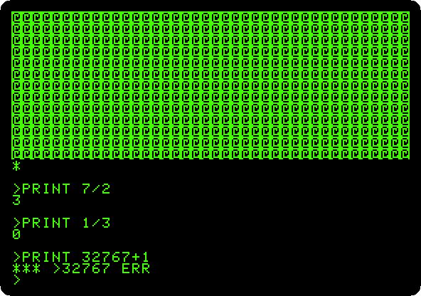
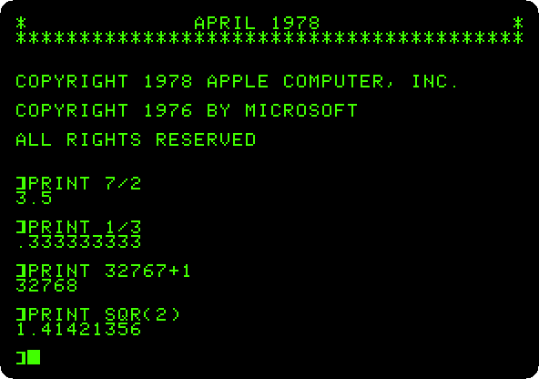
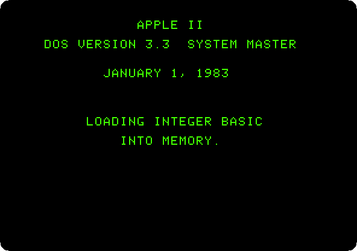
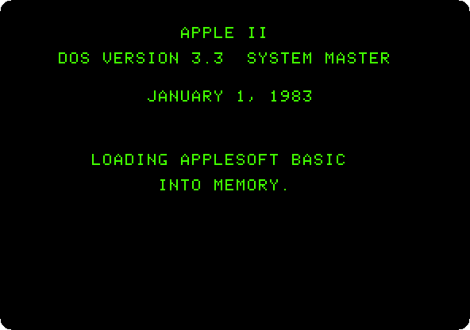

# From Integer BASIC to Applesoft

[Back to the activities](../README.md)

The first Apple \]\[ had Wozniak's **Integer BASIC** in its ROM: fast, and
made for the colour graphics, but counting only in whole numbers, from
-32767 to 32767. A program about money, or about anything with a decimal
point, needed more. Apple went to Microsoft, which had a BASIC for the 6502
with floating point, and in August 1977 paid the first half of a licence for
it. Apple added the graphics commands of its machine, and called it
**Applesoft**.

It came first on cassette, at the end of 1977: a program that Integer BASIC
loaded and ran, and that then took its place, in the memory of the
machine. In 1979 the **Apple \]\[+** had Applesoft in its ROM instead of
Integer BASIC, at $1,195, less than the first Apple \]\[. The same year
Apple Pascal came with the **Language Card**, 16 KB of memory for slot 0,
which made an Apple \]\[ a computer of 64 KB. DOS 3.3, of 1980, loads into
it the BASIC the ROM does not have: the two BASICs on one machine.

This page loads Applesoft from its tape into the first Apple \]\[, starts
an Apple \]\[+ with Applesoft in its ROM and no Language Card, and then
gives a Language Card to an Apple \]\[+ and to a first Apple \]\[, for the
other BASIC. The prompt tells which BASIC is listening: `>` Integer BASIC,
`]` Applesoft.

## What you need

- **`k7_apple_600200600_applesoftiia.wav`**, the recording of Apple's tape
  600-2006-00, *Applesoft IIa*, from the
  [Apple cassettes](https://www.brutaldeluxe.fr/projects/cassettes/apple/index.html)
  of the Brutal Deluxe cassette project, in a `.zip` of the same name;
- **`DOS 3.3 System Master - 680-0210-A (1982).dsk`**, Apple's DOS 3.3
  System Master, on the
  [Asimov archive](https://mirrors.apple2.org.za/ftp.apple.asimov.net/images/masters/).

`./fetch-disks.sh` in this repository downloads them into `disks/` and checks
them.

The [Applesoft II Reference Manual](https://archive.org/details/asb-bluebook)
of 1978, and the
[manual of the Language Card](https://archive.org/details/APPLE_Language_Card_Installation_Operation_Manual),
are on the Internet Archive.

## The machines

Four machines, the Language Card only in the last two.

**The first Apple \]\[**, with 48 KB, the ROM of Integer BASIC and the
Monitor, and the tape of Applesoft in its cassette recorder; no Language
Card:

```bash
izapple2 -model none -board 2plus -cpu 6502 -screen green \
    -rom "<internal>/341-000x_integer.rom" \
    -charrom "<internal>/Apple2rev7CharGen.rom" -forceCaps \
    -tape disks/k7_apple_600200600_applesoftiia.wav
```

**An Apple \]\[+**, with 48 KB and Applesoft in its ROM, and a Disk II
controller in slot 6 with the System Master in drive 1; no Language Card:

```bash
izapple2 -model none -board 2plus -cpu 6502 -screen green \
    -rom "<internal>/Apple2_Plus.rom" \
    -charrom "<internal>/Apple2rev7CharGen.rom" -forceCaps \
    -s6 'diskii,disk1=disks/DOS 3.3 System Master - 680-0210-A (1982).dsk'
```

**The same Apple \]\[+ with a Language Card** in slot 0, 16 KB more:

```bash
izapple2 -model none -board 2plus -cpu 6502 -screen green \
    -rom "<internal>/Apple2_Plus.rom" \
    -charrom "<internal>/Apple2rev7CharGen.rom" -forceCaps \
    -s0 language \
    -s6 'diskii,disk1=disks/DOS 3.3 System Master - 680-0210-A (1982).dsk'
```

**The first Apple \]\[ with a Language Card**, and the same Disk II:

```bash
izapple2 -model none -board 2plus -cpu 6502 -screen green \
    -rom "<internal>/341-000x_integer.rom" \
    -charrom "<internal>/Apple2rev7CharGen.rom" -forceCaps \
    -s0 language \
    -s6 'diskii,disk1=disks/DOS 3.3 System Master - 680-0210-A (1982).dsk'
```

## Integer BASIC

1. **Start izapple2** with the first command. The first Apple \]\[ starts
   in the Monitor, `*`; **press Control-B and Return** for Integer BASIC,
   `>`. **Type `PRINT 7/2`, `PRINT 1/3` and `PRINT 32767+1`.**

   

   Three and a half is 3, a third is 0, and one more than 32767 is an
   error: Integer BASIC keeps each number in two bytes, a whole number.

## Applesoft from the tape

2. **Type `LOAD`**: Integer BASIC loads Applesoft from the tape, as it
   would one of its own programs, 10,702 bytes. On the machine it took more
   than a minute; izapple2 plays the tape as fast as it can. **Type `RUN`**,
   and Applesoft takes over the machine, with its prompt, `]`. **Type the
   same three `PRINT`s, and `PRINT SQR(2)`.**

   

   3.5, a third to nine figures, 32768, and the square root of two. The
   banner says *Applesoft \]\[ Floating Point BASIC, April 1978*, Apple's
   copyright and Microsoft's of 1976. It lives in the memory of the machine
   now: switched off, it is gone, and loading it again was a minute more.

## Applesoft in the ROM

3. **Quit izapple2 and start it with the second command**, the Apple \]\[+
   with no Language Card. It starts the disk by itself, and DOS 3.3 with
   Applesoft, from the ROM. **Type `PRINT 1/3`**, and **`INT`**, which asks
   DOS for Integer BASIC:

   ![No Integer BASIC on the Apple \]\[+](images/integer-and-applesoft/plus-no-card.png)

   Applesoft answers at once, with no tape. But Integer BASIC is not in the
   ROM of the \]\[+ any more, and there is no room to load it.

## The Language Card

The Language Card is 16 KB of memory, in slot 0, at the addresses of the
ROM. DOS 3.3 loads into it the BASIC the ROM does not have, and switches
between the two with `INT` and `FP`.

4. **Quit izapple2 and start it with the third command**, the same Apple
   \]\[+ with the card. As DOS 3.3 starts, the System Master loads Integer
   BASIC into the card, and says so for a few seconds:

   

   **Type `PRINT 1/3`**, in Applesoft, then **`INT`**, which goes to
   Integer BASIC, **`PRINT 1/3`** again, **`FP`**, back to Applesoft, and
   **`PRINT 1/3`**.

   ![The two BASICs on an Apple \]\[+](images/integer-and-applesoft/card-plus.png)

   The prompt changes with the BASIC: `>` after `INT`, `]` after `FP`.
   Programs written for Integer BASIC kept running on the new machine.

5. **Quit izapple2 and start it with the last command**, the first Apple
   \]\[ with the card. It starts in the Monitor; **type `6`, then
   Control-P, and Return** to start the disk in slot 6. Here the System
   Master loads Applesoft into the card:

   

   **Type `PRINT 1/3`**, in the Integer BASIC of the ROM, then **`FP`**,
   **`PRINT 1/3`**, **`INT`** and **`PRINT 1/3`**.

   ![The two BASICs on the first Apple \]\[](images/integer-and-applesoft/card-integer.png)

   The same two BASICs, the other way round: the card held what the ROM
   lacked, and an owner of the first Apple \]\[ had Applesoft from the disk
   in seconds, instead of a minute of tape.

## What next

[Life with DOS 3.3](dos33.md) goes on with the System Master, and
[The Apple \]\[ of 1977](apple-ii.md) with the Monitor and Integer BASIC.
