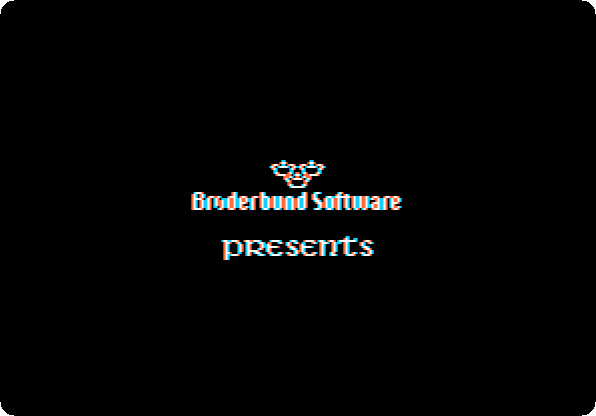
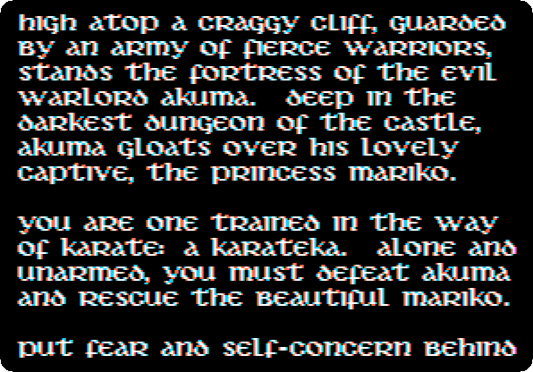
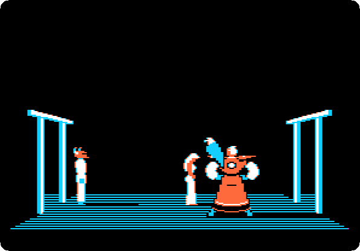
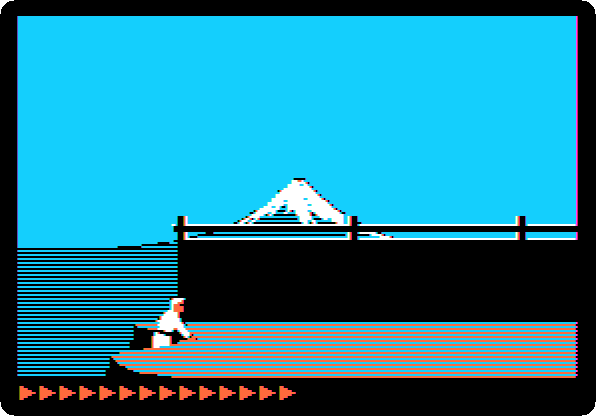
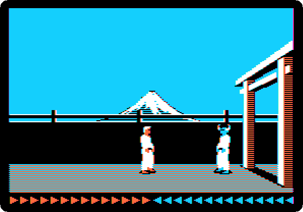
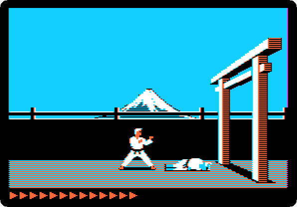

# Karateka

[Back to the activities](../README.md)

**Karateka** came out in 1984, written by Jordan Mechner while he was a
student, and published by Brøderbund. It told its story like a film: titles,
a prologue, scenes that cut between the hero and the villain, and fighters
that moved as people do, at a time when the figures of games jumped from one
pose to the next. Mechner went on to write Prince of Persia.

This page starts Karateka from its original disk, watches its titles and
prologue, and plays the start of the game, up the cliff and through the
first guard.

## What you need

**`karateka.woz`**, Karateka in the
[woz-a-day collection](https://archive.org/details/wozaday_Karateka) of the
Internet Archive: download *00playable.woz* and rename it `karateka.woz`.
It is the original disk, copy protection and all. `./fetch-disks.sh` in this
repository downloads it into `disks/` and checks it.

## The machine

An Apple \]\[+ with one disk drive and a joystick:

- the 6502 processor at 1 MHz, 48 KB of memory, and Applesoft BASIC in its ROM;
- the keyboard of the \]\[+, which types only capitals;
- a joystick in its game port, which izapple2 makes of the mouse of your
  computer when no joystick is connected;
- a Disk II controller card in slot 6, with the Karateka disk in drive 1.

```bash
izapple2 -model _base -board 2plus -cpu 6502 \
    -rom "<internal>/Apple2_Plus.rom" \
    -charrom "<internal>/Apple2rev7CharGen.rom" -forceCaps \
    -s6 diskii,disk1=disks/karateka.woz
```

The model `2plus` of izapple2 has this machine, with a Language Card and a
Videx Videoterm 80 column card more:

```bash
izapple2 -model 2plus disks/karateka.woz
```

## The film

1. **Start izapple2** with the command above, and press F6 until the screen
   is in colour. After the drive, the titles, one after the other.

   

2. **Wait.** The prologue rolls up the screen, in the letters of the game.

   

   *High atop a craggy cliff, guarded by an army of fierce warriors, stands
   the fortress of the evil warlord Akuma.* You are the karateka, to fight
   your way in and free the princess Mariko.

3. **Wait.** The first scene: Akuma in his fortress, and the princess
   Mariko, his captive. He sends her away, to a room of her own, where she
   faints.

   

   Then the game plays a part of itself, a demonstration, until a key is
   pressed.

## The game

4. **Press Space** when the demonstration starts. The fortress, on its
   cliff against the moon.

   

5. **Wait for the karateka to climb up**, and then **push the joystick up
   and to the right** to run, and **let go of it** when a guard comes,
   which puts the karateka in the fighting stance.

   

   The arrows at the bottom are the strength of each, the karateka's at
   the left, the guard's at the right.

6. **Fight: press button 0 to kick.** The joystick up or down makes the
   kick high or low, and button 1 punches. Each blow that lands takes an
   arrow away; the guard is down when he has none left. The recording, at
   the speed of the machine, kicks every 0.6 seconds with the joystick in
   the middle, and wins in about a minute.

   

   

   The manual gives keys for all of it as well, `Q`, `A` and `Z` to punch
   high, middle and low and `W`, `S` and `X` to kick, but in izapple2 they
   did not make the karateka fight; the joystick does.

## What next

[Lode Runner](lode-runner.md) is the other game of Brøderbund on these
pages, from the year before.
