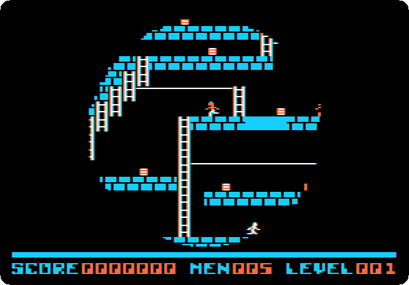
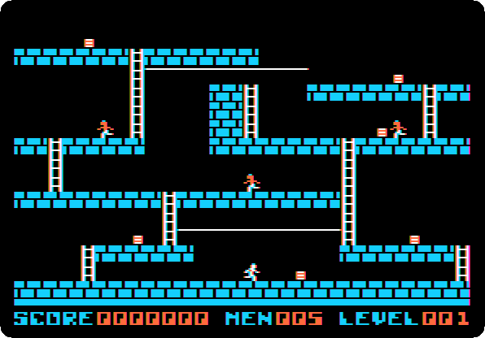
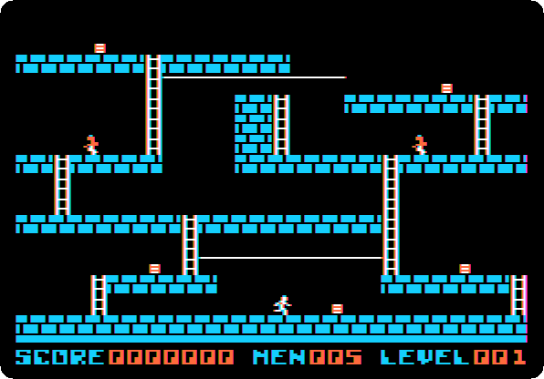

# Lode Runner

[Back to the activities](../README.md)

Lode Runner was Doug Smith's game, published by Broderbund in 1983 for the
Apple II before any other computer. A runner collects the gold of a level of
bricks, ladders and ropes while guards chase him; he can't jump or fight, only
dig a hole in the bricks for a guard to fall into, and the hole fills again
after a while. It came with 150 levels and an editor to make more, and it
went on to most computers and consoles of the eighties.

This page starts Lode Runner from a copy of its original disk, watches the
demonstration that plays itself, and plays the start of a game from the
keyboard.

## What you need

**`lode-runner.woz`**, a copy of the original Lode Runner disk, from the
[woz-a-day collection](https://archive.org/details/wozaday_Lode_Runner) of
the Internet Archive: download *00playable.woz* and rename it
`lode-runner.woz`. `./fetch-disks.sh` in this repository downloads it into
`disks/`.

A WOZ file records a diskette bit by bit, its copy protection included, so
it is the disk Broderbund sold, as it was, and not a copy with the protection
taken out.

## The machine

An Apple \]\[+ with one disk drive:

- the 6502 processor at 1 MHz, 48 KB of memory, and Applesoft BASIC in its ROM;
- the keyboard of the \]\[+, which types only capitals;
- a Disk II controller card in slot 6, with the Lode Runner disk in drive 1.

```bash
izapple2 -model _base -board 2plus -cpu 6502 \
    -rom "<internal>/Apple2_Plus.rom" \
    -charrom "<internal>/Apple2rev7CharGen.rom" -forceCaps \
    -s6 diskii,disk1=disks/lode-runner.woz
```

`<internal>/` names a file inside izapple2: the ROMs, of the machine and of
its characters.

The model `2plus` of izapple2 has this machine, with a Language Card and a
Videx Videoterm 80 column card more:

```bash
izapple2 -model 2plus disks/lode-runner.woz
```

## Start it

1. **Start izapple2** with the command above, and press F6 until the screen
   is in colour. After a few seconds of the drive, the title comes up.

   

## The demonstration

2. **Wait.** The game shows its first level, opening from the middle, and
   plays it by itself: the runner in white, the guards in orange, the gold
   in the small boxes.

   

   The runner goes for the gold and away from the guards, and digs holes in
   front of them. When all the gold is taken, a ladder appears to the top of
   the screen, the way out to the next level.

## Play

3. **Press Space** to play. The first level comes up, with five runners,
   `MEN 005` at the bottom.

   

   Lode Runner is played with a joystick, or with the keyboard. Without a
   joystick connected, izapple2 makes the mouse of your computer the
   joystick of the Apple II.

4. **Press Control-K** to play with the keyboard, then **L** to run right,
   **I**, when he is at the ladder, to climb, and **J** to run left. One key
   sets the runner going, and he goes on until the next key or a wall.

   

   He takes the gold at his right, 250 points, climbs the ladder, and takes
   the next piece on the way left, but a guard is there, and catches him.
   The screen closes in a circle, and the level starts again, with one
   runner less, `MEN 004`, and the score kept. The guards are not fooled for
   long: the way past them is to dig a hole in the bricks they walk on, and
   go on while they climb out.

## What next

[A game in Applesoft](paddle-game.md) is a game you write yourself, in
BASIC, for the same machine.
