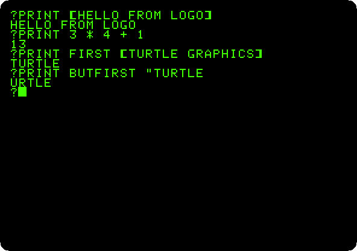
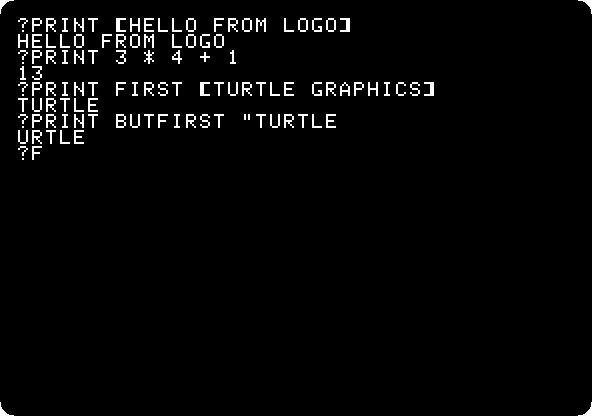
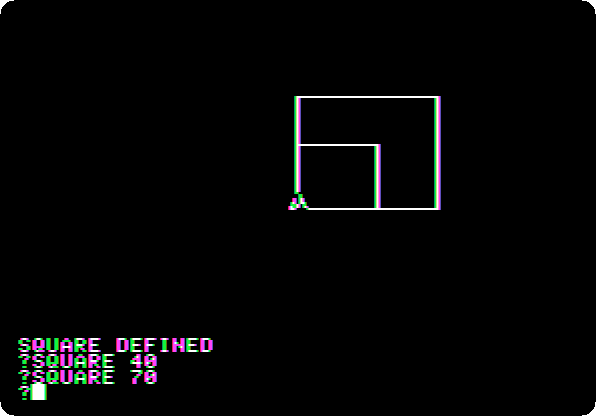
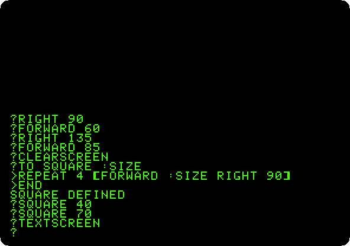
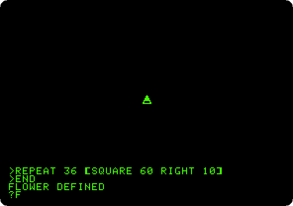
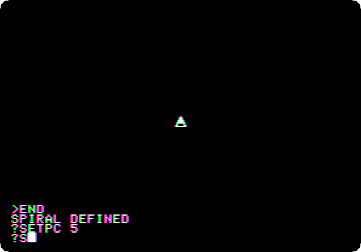
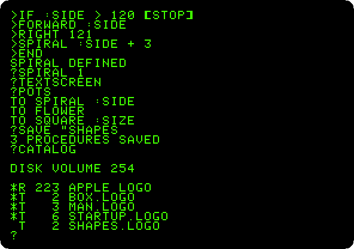

# Logo and its turtle

[Back to the activities](../README.md)

Logo was made at the end of the sixties, at Bolt Beranek and Newman and at
MIT, by Wally Feurzeig, Seymour Papert and Cynthia Solomon, as a language
for children to learn with: a **turtle** on the floor, or on the screen, that
goes forward and turns as it is told, drawing its path, and procedures that
teach it new words. In the eighties it came to the school computers, and on
the Apple II as **Apple Logo**, made for Apple by Logo Computer Systems, in
1982.

This page starts Apple Logo, prints words and lists, moves the turtle by
hand, teaches it a square, a flower made of squares and a spiral that calls
itself, and saves what it learnt on the diskette.

## What you need

**`Apple LOGO.dsk`**, the Apple Logo disk, on the
[Asimov archive](https://mirrors.apple2.org.za/ftp.apple.asimov.net/images/programming/logo/).
`./fetch-disks.sh` in this repository downloads it into `disks/` and checks
it. izapple2 writes into it the procedures the page saves.

## The machine

An Apple \]\[+ with 64 KB and one disk drive:

- the 6502 processor at 1 MHz, 48 KB of memory, and Applesoft BASIC in its ROM;
- the keyboard of the \]\[+, which types only capitals;
- a 16 KB Language Card in slot 0: Apple Logo needs 64 KB, and does not
  start without it;
- a Disk II controller card in slot 6, with the Logo disk in drive 1.

```bash
izapple2 -model none -board 2plus -cpu 6502 -screen green \
    -rom "<internal>/Apple2_Plus.rom" \
    -charrom "<internal>/Apple2rev7CharGen.rom" -forceCaps \
    -s0 language \
    -s6 'diskii,disk1=disks/Apple LOGO.dsk'
```

The model `2plus` of izapple2 has this machine, with a Videx Videoterm 80
column card more:

```bash
izapple2 -model 2plus -screen green "disks/Apple LOGO.dsk"
```

## Words and lists

1. **Start izapple2** with the command above. After the drive, Logo clears
   the screen and waits at its prompt, `?`.

2. **Type these lines**, each with Return:

   ```logo
   PRINT [HELLO FROM LOGO]
   PRINT 3 * 4 + 1
   PRINT FIRST [TURTLE GRAPHICS]
   PRINT BUTFIRST "TURTLE
   ```

   

   Logo works with words and lists as well as with numbers: a list is in
   brackets, a word starts with a quote. `FIRST` takes the first item of a
   list, or the first letter of a word, and `BUTFIRST` all but the first.

## The turtle

3. **Move the turtle:** `FORWARD 60`, `RIGHT 90`, `FORWARD 60`, `RIGHT 135`
   and `FORWARD 85`.

   

   The first `FORWARD` changes the screen to the high resolution graphics,
   with four lines of text at the bottom. The turtle is the triangle, in the
   middle and pointing up when it starts; `RIGHT` turns it, in degrees, and
   `FORWARD` moves it, drawing.

4. **Teach it a square**, and draw two:

   ```logo
   CLEARSCREEN
   TO SQUARE :SIZE
   REPEAT 4 [FORWARD :SIZE RIGHT 90]
   END
   SQUARE 40
   SQUARE 70
   ```

   

   `TO` starts a procedure, a new word of Logo, and `END` ends it; Logo
   prompts with `>` while you type it. `:SIZE` is its input, the number
   given after `SQUARE`, and `REPEAT 4` does the list after it four times.
   **Type `TEXTSCREEN`** to see the whole text again.

   

## Procedures of procedures

5. **Make a flower of squares:**

   ```logo
   CLEARSCREEN
   TO FLOWER
   REPEAT 36 [SQUARE 60 RIGHT 10]
   END
   FLOWER
   ```

   

   `FLOWER` uses `SQUARE` the same as the words Logo came with: 36 squares,
   each turned 10 degrees from the one before, the whole turn. It takes
   about fifteen seconds; the recording is at the speed of the machine.

6. **Make a spiral that calls itself:**

   ```logo
   CLEARSCREEN
   TO SPIRAL :SIDE
   IF :SIDE > 120 [STOP]
   FORWARD :SIDE
   RIGHT 121
   SPIRAL :SIDE + 3
   END
   SPIRAL 1
   ```

   

   `SPIRAL` draws one side, turns, and calls `SPIRAL` again with a longer
   side, until `IF` finds it longer than 120 and `STOP`s. Turning 121
   degrees, a little more than a third of a turn, turns each triangle a
   little from the one before.

## Saved on the diskette

7. **Type `TEXTSCREEN`, `POTS`, `SAVE "SHAPES` and `CATALOG`.** `POTS`
   prints the titles of the procedures, `SAVE` writes them all to the
   diskette in a file, and `CATALOG` lists the diskette, a disk of DOS 3.3.

   

   `SHAPES.LOGO` is there now, next to Logo itself and the files that came
   with it. `LOAD "SHAPES` brings the procedures back another day.

## What next

[Apple Pascal](pascal.md) has a turtle too, in its unit `TURTLEGRAPHICS`,
for programs that are compiled.
