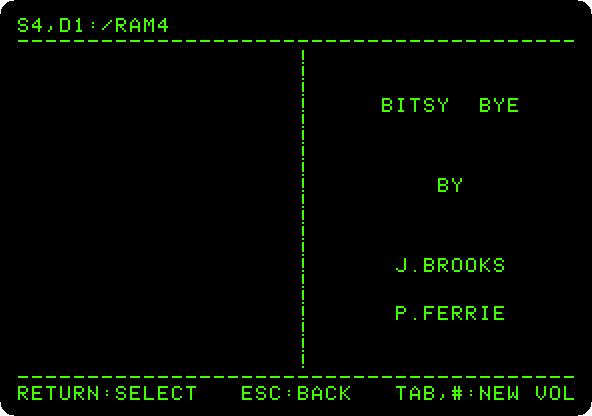
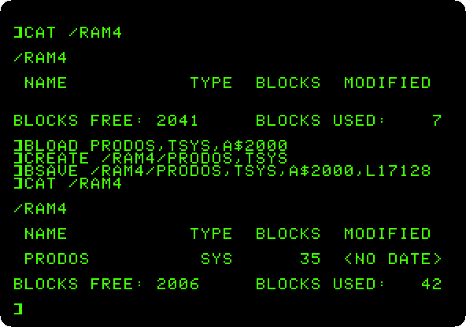
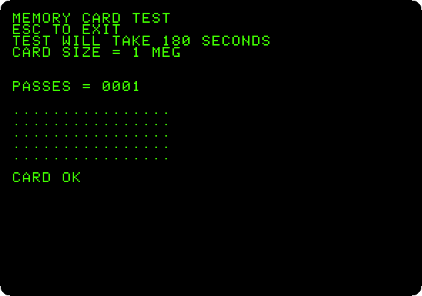
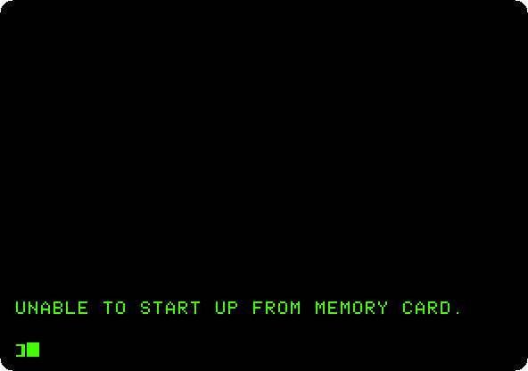
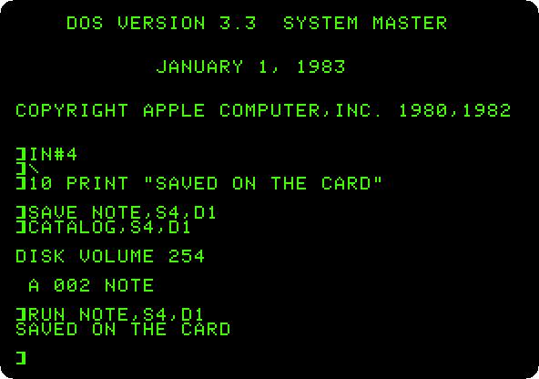

# A megabyte on a card: the Apple II Memory Expansion Card

[Back to the activities](../README.md)

The 6502 sees 64 KB, and an Apple \]\[+ with a Language Card has all of them.
More memory had to be reached another way. Apple's **Memory Expansion
Card**, whose manual is of 1985, went in a slot of an Apple \]\[, \]\[+ or
//e with 256 KB, and could be filled up to a megabyte. It did not add to the
memory the processor sees: the card is read and written a byte at a time
through four addresses of its slot, and its ROM makes of it a disk, a
**RAM disk**, as fast as memory and as forgetful, empty again when the Apple
is switched off. Programs like AppleWorks could be copied to it, to run
without waiting for the drive.

This page puts a card of a megabyte in an Apple \]\[+, finds it as a disk of
ProDOS, copies a file to it and times loading it from both, runs the test in
the ROM of the card, tries to start up from it, and uses it from DOS 3.3.

## What you need

- **`ProDOS_2_4_3.po`**, ProDOS 2.4.3, from
  [its page](https://prodos8.com/releases/prodos-243/);
- **`DOS 3.3 System Master - 680-0210-A (1982).dsk`**, Apple's DOS 3.3
  System Master, on the
  [Asimov archive](https://mirrors.apple2.org.za/ftp.apple.asimov.net/images/masters/).

`./fetch-disks.sh` in this repository downloads them into `disks/` and checks
them. The ROM of the card comes inside izapple2.

The
[manual of the Apple II Memory Expansion Card](http://www.apple-iigs.info/doc/fichiers/a2me.pdf),
of 1985, is on apple-iigs.info.

## The machine

An Apple \]\[+ with a megabyte more:

- the 6502 processor at 1 MHz and 64 KB of memory: 48 KB on the board, and
  16 KB of a language card, which izapple2 puts in slot 0;
- the Apple II Memory Expansion Card in slot 4, with 1 MB;
- a Disk II controller card in slot 6, with ProDOS in drive 1.

```bash
izapple2 -model none -board 2plus -cpu 6502 -screen green \
    -rom "<internal>/Apple2_Plus.rom" \
    -charrom "<internal>/Apple2rev7CharGen.rom" -forceCaps \
    -s0 language \
    -s4 memexp \
    -s6 diskii,disk1=disks/ProDOS_2_4_3.po
```

The same machine with DOS 3.3:

```bash
izapple2 -model none -board 2plus -cpu 6502 -screen green \
    -rom "<internal>/Apple2_Plus.rom" \
    -charrom "<internal>/Apple2rev7CharGen.rom" -forceCaps \
    -s0 language \
    -s4 memexp \
    -s6 'diskii,disk1=disks/DOS 3.3 System Master - 680-0210-A (1982).dsk'
```

`memexp,size=256` gives the card as it was sold, with 256 KB; 512 and 768
are the sizes in between.

## A disk of memory

1. **Start izapple2** with the first command. ProDOS starts Bitsy Bye;
   **press Tab**, which goes to the next disk.

   

   `S4,D1:/RAM4`, slot 4, drive 1: the card made itself a disk of ProDOS
   the first time it was used, named for its slot, and empty.

2. **Press Tab** to go back to the diskette, **the down arrow three times**
   to `BASIC.SYSTEM`, and **Return**. Then **type**:

   ```
   CAT /RAM4
   BLOAD PRODOS,TSYS,A$2000
   CREATE /RAM4/PRODOS,TSYS
   BSAVE /RAM4/PRODOS,TSYS,A$2000,L17128
   CAT /RAM4
   ```

   

   2,048 blocks of 512 bytes, the megabyte. `BLOAD` loads the file `PRODOS`
   into memory from `$2000`, and `BSAVE` writes its 17,128 bytes to the
   card; a file of the type `SYS` has to be created first.

3. **Type `BLOAD /PRODOS.2.4.3/PRODOS,TSYS,A$2000`**, from the diskette,
   and **`BLOAD /RAM4/PRODOS,TSYS,A$2000`**, from the card. The first takes
   about three seconds, the drive turning; the second, a sixth of a second.

## The test of the card

4. **Type `CALL -151`** for the Monitor, and **`C40AG`**: the test in the
   ROM of the card, at `$C40A` for a card in slot 4. It says how big the
   card is, and goes over it, a dot at a time, for three minutes a pass.

   

   One pass, and `CARD OK`. **Press Escape** to leave it.

## Starting up from the card

5. **Press Reset**, Control-F2 in izapple2, and **type `HOME` and `PR#4`**,
   to start up from the card:

   

   The card formats itself as a disk for data, not as a disk to start up
   from. Its manual tells how: format it with the formatter of ProDOS, which
   writes what a startup disk needs, and copy the programs to it.

## With DOS 3.3

6. **Quit izapple2 and start it with the second command.** DOS 3.3 does not
   find the card by itself: **type `IN#4`**, which formats it for DOS, as
   slot 4, drive 1. **Type** a program, save it on the card, catalog it and
   run it:

   ```
   IN#4
   10 PRINT "SAVED ON THE CARD"
   SAVE NOTE,S4,D1
   CATALOG,S4,D1
   RUN NOTE,S4,D1
   ```

   

   DOS 3.3 sees 400 KB of the card, as much as it can handle on a disk.

## What next

[ProDOS](prodos.md) has another RAM disk, `/RAM`, in the extended 80 column
card of the //e, and [AppleWorks](appleworks.md) is the program people
copied to the card.
