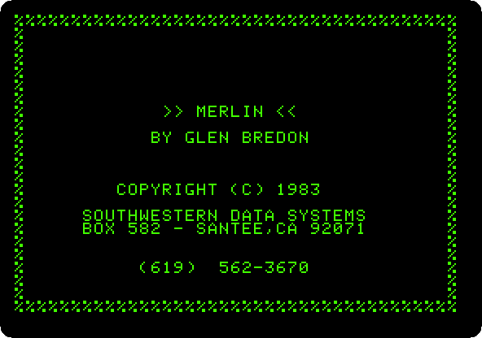
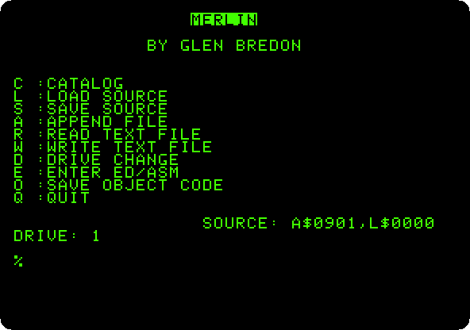
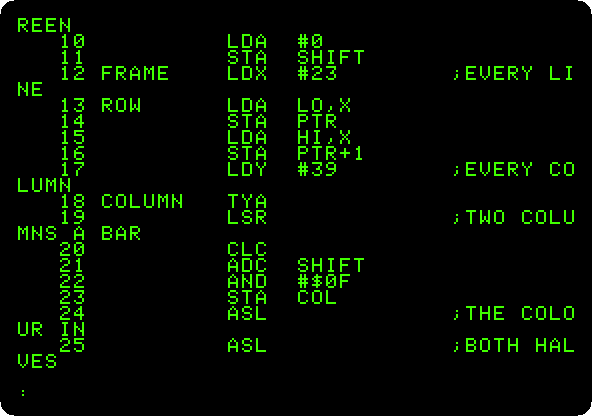
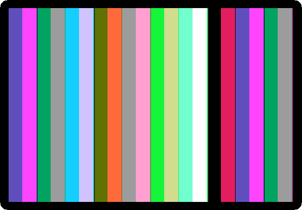
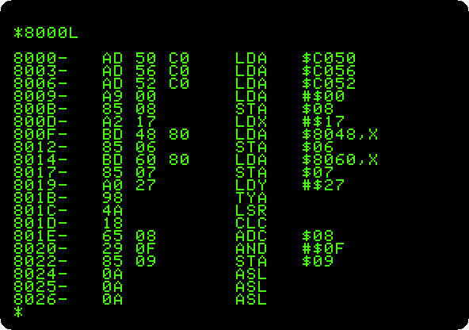

# Assembly language with Merlin

[Back to the activities](../README.md)

BASIC on the Apple II worked out each line again every time it ran it, and
games and anything that had to be fast were written in the language of the
6502 itself: its instructions, a byte or three each, written as names, `LDA`,
`STA`, `JSR`, and turned into bytes by an **assembler**. Merlin, by Glen
Bredon, sold by Southwestern Data Systems from 1981, was the assembler of
many: an editor, the assembler, and the Monitor of the ROM a command away.

This page types a program of 50 lines in the assembly language of the 6502
into Merlin, assembles it, and runs it: bars of colour in the low resolution
graphics, drawn and moved many times a second, the picture
[Forth](forth.md) takes ten seconds to draw once.

## What you need

**`merlin.dsk`**, Merlin 1983, on the
[Asimov archive](https://mirrors.apple2.org.za/ftp.apple.asimov.net/images/programming/assembler/merlin/):
download *Merlin Macroassembler Side 1 (SDS, 1983).dsk* and rename it
`merlin.dsk`. It is a copy with its protection taken out, as its
[readme](https://mirrors.apple2.org.za/ftp.apple.asimov.net/images/programming/assembler/merlin/Merlin%20Macroassembler%20-%20readme%20-%20softkey.txt)
says. `./fetch-disks.sh` in this repository downloads it into `disks/` and
checks it. The program is in this repository too,
[listings/bars.s](listings/bars.s).

## The machine

An Apple \]\[+ with 64 KB and one disk drive:

- the 6502 processor at 1 MHz, 48 KB of memory, and Applesoft BASIC in its ROM;
- the keyboard of the \]\[+, which types only capitals;
- a 16 KB Language Card in slot 0, which Merlin keeps itself in: without
  it, it says `RAMCARD NOT FOUND`;
- a Disk II controller card in slot 6, with Merlin in drive 1.

```bash
izapple2 -model _base -board 2plus -cpu 6502 \
    -rom "<internal>/Apple2_Plus.rom" \
    -charrom "<internal>/Apple2rev7CharGen.rom" -forceCaps \
    -s0 language \
    -s6 diskii,disk1=disks/merlin.dsk
```

This Merlin is for the \]\[+: on an enhanced //e, in izapple2, it stops at
a black screen after its title. The model `2plus` of izapple2 has this
machine, with a Videx Videoterm 80 column card more:

```bash
izapple2 -model 2plus disks/merlin.dsk
```

## Merlin

1. **Start izapple2** with the command above. Merlin loads, and shows its
   title until a key is pressed.

   

2. **Press Return** for its menu: the disk on one side, and **E** for the
   editor and the assembler on the other.

   

## The program

3. **Press E**, and at the prompt of the editor, `:`, **type `A`** and
   Return to add lines. Merlin numbers each line, and puts each field in its
   column: the label, the instruction, its operand and the comment after a
   `;`. Type a single space between the fields, and one at the start of a
   line without a label; a line that starts with `*` is a comment. An empty
   line ends the adding. Here is the program in parts:

   The start: `ORG` says where the program runs, `$8000`, where Merlin
   puts what it assembles, so that it can be run right there. `EQU` names
   three bytes of the zero page, the first 256 bytes of memory, which the
   6502 reaches faster and through which it reaches others. Reading the
   addresses `$C050`, `$C056` and `$C052` switches the screen to the low
   resolution graphics, on all of it:

   ```asm
   * COLOUR BARS THAT MOVE, IN THE
   * LOW RESOLUTION GRAPHICS
            ORG $8000
   PTR      EQU $06
   SHIFT    EQU $08
   COL      EQU $09
   START    LDA $C050      ;GRAPHICS
            LDA $C056      ;LOW RESOLUTION
            LDA $C052      ;WHOLE SCREEN
            LDA #0
            STA SHIFT
   ```

   The picture: for each of the 24 lines of the screen, from the last, its
   address from the tables at the end goes in `PTR`, and for each of the 40
   columns, from the last, a colour, half the column plus `SHIFT`, from 0
   to 15. Each byte of the screen is two blocks, one above the other, so the
   colour goes in both halves, shifted four bits up and joined to itself,
   and `STA (PTR),Y` writes it at the address in `PTR` plus the column:

   ```asm
   FRAME    LDX #23        ;EVERY LINE
   ROW      LDA LO,X
            STA PTR
            LDA HI,X
            STA PTR+1
            LDY #39        ;EVERY COLUMN
   COLUMN   TYA
            LSR            ;TWO COLUMNS A BAR
            CLC
            ADC SHIFT
            AND #$0F
            STA COL
            ASL            ;THE COLOUR IN
            ASL            ;BOTH HALVES
            ASL
            ASL
            ORA COL
            STA (PTR),Y
            DEY
            BPL COLUMN
            DEX
            BPL ROW
   ```

   Then `SHIFT` goes up by one, so that the next picture has every colour
   one place along, `$FCA8` in the ROM waits a moment, and if no key is
   down, `$C000`, it goes round again. A key, `$C010` cleared, the text
   back, and the screen cleared with `$FC58` of the ROM, as `HOME` does:

   ```asm
            INC SHIFT
            LDA #$60
            JSR $FCA8      ;WAIT
            LDA $C000      ;A KEY?
            BPL FRAME
            STA $C010
            LDA $C051      ;TEXT AGAIN
            JSR $FC58      ;CLEARED
            RTS
   ```

   The tables, the address of each line of the screen, the low byte and
   the high byte, as Wozniak laid out its memory:

   ```asm
   * WHERE EACH LINE OF THE SCREEN IS
   LO       DFB $00,$80,$00,$80,$00,$80,$00,$80
            DFB $28,$A8,$28,$A8,$28,$A8,$28,$A8
            DFB $50,$D0,$50,$D0,$50,$D0,$50,$D0
   HI       DFB $04,$04,$05,$05,$06,$06,$07,$07
            DFB $04,$04,$05,$05,$06,$06,$07,$07
            DFB $04,$04,$05,$05,$06,$06,$07,$07
   ```

4. **Type `L1,25`** to list the first lines, as Merlin keeps them, in their
   columns, the long comments folded at the edge of the screen.

   

## Assemble and run

5. **Type `ASM`**, and N when it asks whether to update the source, a
   question for the date in its header. Merlin assembles the program in
   two passes, the first to learn where each label is and the second to
   write the bytes, and ends with the size, 120 bytes, no errors, and the
   table of the labels and their values. `START` has a `?`: no instruction
   uses it.

   

6. **Type `MON`** to go to the Monitor of the ROM, and **`8000G`** to run
   the program at `$8000`. Press F6 in izapple2 for colour.

   

   Every colour moves one bar along at each picture. The picture is drawn
   while the screen shows it, and the edge between the old and the new one
   is the tear across. Press a key to stop it, back to the Monitor.

7. **Type `8000L`**: the Monitor lists the bytes from `$8000` as
   instructions, as it finds them, with no names: the program as the 6502
   sees it.

   

   Control-Y, in the Monitor, goes back to Merlin's editor.

## What next

[The Apple \]\[ of 1977](apple-ii.md) has the Mini-Assembler, which
assembles a line at a time with no labels, and [Forth in ROM](forth.md)
draws the same bars, slowly.
