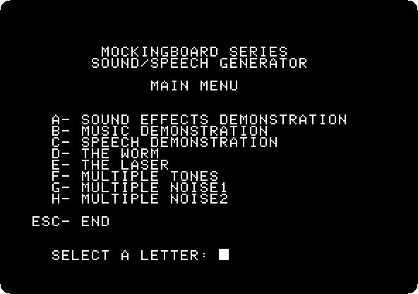
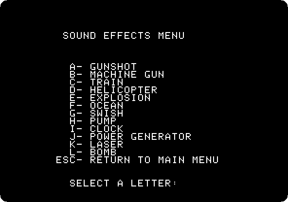

# The Mockingboard

[Back to the activities](../README.md)

The Apple II has a speaker and nothing else: a program makes sound by
clicking it, one click at a time, and has no time left for anything else
while it does. Sweet Micro Systems' **Mockingboard** was a card that gave it
sound chips of its own, General Instrument sound generators of three voices
each, that play tones and noise while the program goes on with the game.
Games with music and effects for it, Ultima among them, made it the sound
card of the Apple II.

Each card came with a demonstration disk. This page starts the one of the
Mockingboard Sound/Speech I, and listens to its sound effects.

## What you need

**`Mockingboard_Sound_and_Speech_I_Demo_Disk_Apple_II_Plus_Sweet_Micro_Systems_1982.dsk`**,
the *Mockingboard Sound and Speech I Demo Disk* of 1982, from the
[Internet Archive](https://archive.org/details/Mockingboard_Sound_and_Speech_I_Demo_Disk_Apple_II_Plus_Sweet_Micro_Systems_1982).
`./fetch-disks.sh` in this repository downloads it into `disks/`.

## The machine

An Apple \]\[+ with a Mockingboard:

- the 6502 processor at 1 MHz, 48 KB of memory, and Applesoft BASIC in its ROM;
- the keyboard of the \]\[+, which types only capitals;
- a Mockingboard in slot 4, with two sound generators of three voices each,
  and no speech chip;
- a Disk II controller card in slot 6, with the demonstration disk in drive 1.

```bash
izapple2 -model none -board 2plus -cpu 6502 -screen color \
    -rom "<internal>/Apple2_Plus.rom" \
    -charrom "<internal>/Apple2rev7CharGen.rom" -forceCaps \
    -s4 mockingboard \
    -s6 diskii,disk1=disks/Mockingboard_Sound_and_Speech_I_Demo_Disk_Apple_II_Plus_Sweet_Micro_Systems_1982.dsk
```

The model `2plus` of izapple2 has this machine, with a Language Card and a
Videx Videoterm 80 column card more:

```bash
izapple2 -model 2plus -screen color -s4 mockingboard disks/Mockingboard_Sound_and_Speech_I_Demo_Disk_Apple_II_Plus_Sweet_Micro_Systems_1982.dsk
```

## Start it

1. **Start izapple2** with the command above. The disk loads its programs
   and draws its title, a few lines at a time.

   

2. **Wait for the main menu.** Each letter is a demonstration.

   

   The speech demonstration needs the speech chip of the Sound/Speech I,
   which the Mockingboard of izapple2 does not have.

## Sound effects

3. **Press A** for the sound effects. Each letter plays one.

   

4. **Press A, B, D, E and K**, the gunshot, the machine gun, the helicopter,
   the explosion and the laser, waiting a little after each.

   🔊 [Listen to them](images/mockingboard/effects.wav), as izapple2 played
   them: the five, three seconds apart.

   A sound starts when its key is pressed and the menu is back at once,
   while it plays: the program only tells the chips what to play, and they
   play it on their own. Press Escape to go back to the main menu.

## What next

[A game in Applesoft](paddle-game.md) has a game with no sound at all: the
speaker is all an Apple II without a card has.
