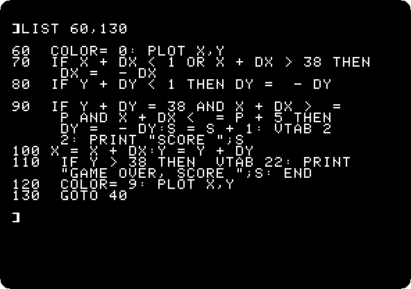
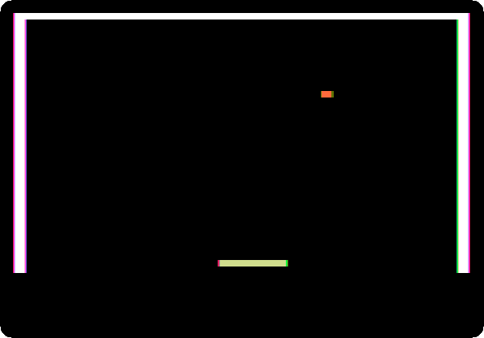

# A game in Applesoft

[Back to the activities](../README.md)

The Apple II was made to play games, and to write them. It had colour graphics
and a speaker, and a game port on the main board for paddles, a knob and a
button each, all within reach of a line of BASIC: `GR` switches to
graphics, `COLOR=` and `PLOT` draw, `PDL` reads where a paddle is turned to.
Magazines and books printed the listings of games, and their readers typed
them in.

This page writes one of those, a bat and a ball in the low resolution
graphics of the Apple \]\[+, types it in, and plays it.

## What you need

Only izapple2, as in [Switch on an Apple \]\[+](switch-on.md): nothing to
download.

## The machine

An Apple \]\[+ with no disk drive:

- the 6502 processor at 1 MHz, 48 KB of memory, and Applesoft BASIC in its ROM;
- the keyboard of the \]\[+, which types only capitals;
- a pair of paddles in its game port;
- no cards in its slots.

```bash
izapple2 -model _base -board 2plus -cpu 6502 \
    -rom "<internal>/Apple2_Plus.rom" \
    -charrom "<internal>/Apple2rev7CharGen.rom" -forceCaps
```

The model `2plus` of izapple2 has this machine, with a Language Card and a
Videx Videoterm 80 column card more:

```bash
izapple2 -model 2plus -s6 empty
```

## Type the game

1. **Start izapple2** with the command above, and press F6 until the screen is
   in colour, as on the colour television many Apple IIs were plugged into:
   the game is in colour.

2. **Type the program**, each line ended with Return:

   ```basic
   10 GR : HOME
   20 X = 20:Y = 5:DX = 1:DY = 1:S = 0:Q = -1
   30 COLOR= 15: HLIN 0,39 AT 0: VLIN 0,39 AT 0: VLIN 0,39 AT 39
   40 P = INT ( PDL (0) * 32 / 255) + 1
   50 IF P <> Q THEN COLOR= 0: HLIN 1,38 AT 38: COLOR= 13: HLIN P,P + 5 AT 38:Q = P
   60 COLOR= 0: PLOT X,Y
   70 IF X + DX < 1 OR X + DX > 38 THEN DX = - DX
   80 IF Y + DY < 1 THEN DY = - DY
   90 IF Y + DY = 38 AND X + DX >= P AND X + DX <= P + 5 THEN DY = - DY:S = S + 1: VTAB 22: PRINT "SCORE ";S
   100 X = X + DX:Y = Y + DY
   110 IF Y > 38 THEN VTAB 22: PRINT "GAME OVER, SCORE ";S: END
   120 COLOR= 9: PLOT X,Y
   130 GOTO 40
   ```

   In izapple2 you can paste it instead, with Command-V on a Mac or
   Shift-Insert elsewhere: izapple2 types what you paste, slowly enough for
   the machine to keep up. A line longer than the screen goes on on the next
   one as you type it; it is still one line until Return.

   - `GR` switches to the low resolution graphics: 40 by 40 blocks in 16
     colours, with four lines of text under them.
   - Line 30 draws the walls in white, colour 15, with horizontal and vertical
     lines, `HLIN` and `VLIN`.
   - Line 40 reads the paddle, from 0 to 255, and turns it into where the bat
     starts, from 1 to 33. Line 50 draws the bat, six blocks of yellow,
     colour 13, when it has moved, after clearing its row with black, colour 0.
   - Lines 60 to 120 are the ball: rubbed out, bounced off the walls and the
     bat, moved, and drawn again in orange, colour 9.

3. **Type `HOME` and `LIST 60,130`** to see the end of it the way Applesoft
   keeps it.

   

## Play it

4. **Type `RUN`, and move the mouse left and right** over the izapple2
   window. Without a joystick connected, izapple2 turns the mouse into one:
   the position of the pointer across the window is paddle 0, from 0 a
   hundred and twenty eight dots left of the middle of the window to 255 as
   far right of it.

   

   This is the speed of the machine: Applesoft works out every line of the
   program again each time round the loop, and a ball that moves a block at a
   time is as fast as it goes. The ball blinks because it is rubbed out
   before it is drawn again. Control-C stops the game, as it stops any
   Applesoft program.

   The walls are white with a fringe of colour at their edges: on a
   television, the Apple II makes its colours out of the timing of its
   white dots, and the dots at the edge of a white line are coloured.

5. **Miss the ball.** The program ends, with the score.

   

   `RUN` plays again. `TEXT` gives back the whole screen to text.

## What next

[Life with DOS 3.3](dos33.md) shows how to keep the game on a diskette: with
DOS started, `SAVE GAME` saves it and `RUN GAME` runs it again.
