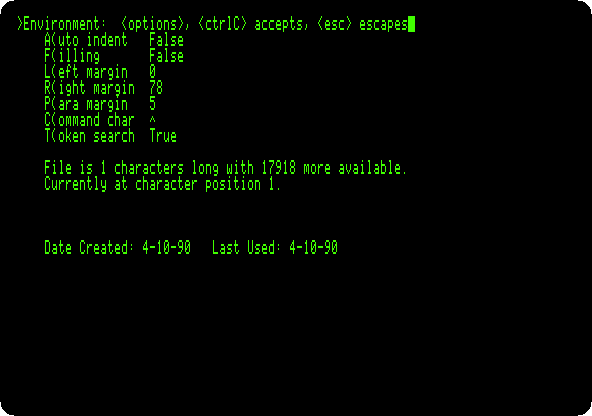
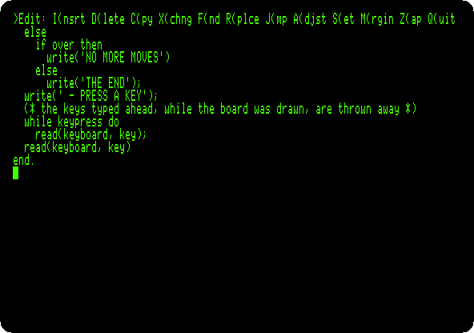
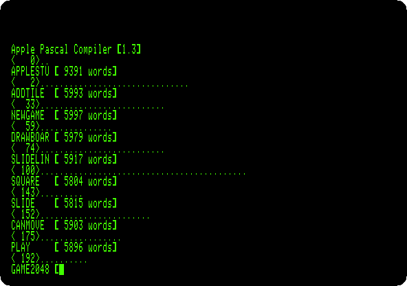
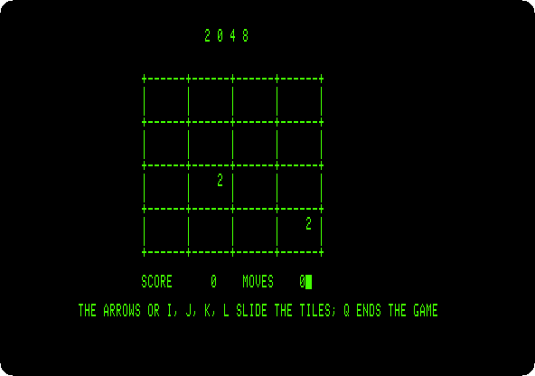
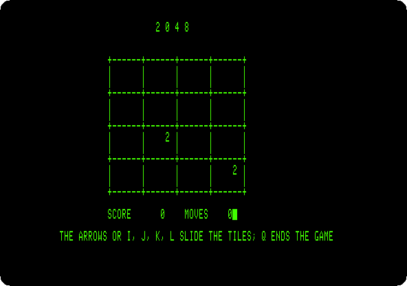

# A game in Apple Pascal: 2048

[Back to the activities](../README.md)

[Apple Pascal](pascal.md) wrote a few lines; this page writes a whole
game in it. **2048**, by Gabriele Cirulli in 2014, slides numbered tiles on
a board of four by four: two equal tiles that meet become one, their sum,
and a new tile comes after every move, until the board is full. It is
small enough to type in, and has what a program needs: a data structure,
procedures that call each other, the keyboard and the screen.

This page sets the editor of Apple Pascal for typing a program, types the
game, compiles it, and plays it to the end.

## What you need

Only izapple2: the disks of Apple Pascal 1.3 come inside it, as on
[Apple Pascal](pascal.md). The program is in this repository,
[listings/2048.pas](listings/2048.pas).

## The machine

An enhanced Apple //e with two disk drives:

- the 65C02 processor at 1 MHz and 128 KB of memory: 64 KB on the board,
  the top 16 KB of it the memory of a language card, which izapple2 puts in
  slot 0, and 64 KB more on the extended 80 column card, in the auxiliary
  slot;
- a Disk II controller card in slot 6, with `APPLE1`, the disk it starts
  from, in drive 1, and `APPLE2`, with the compiler, in drive 2.

```bash
izapple2 -model none -board 2e -cpu 65c02 -screen green \
    -rom "<internal>/Apple2e_Enhanced.rom" \
    -charrom "<internal>/Apple IIe Video Enhanced.bin" \
    -s0 language \
    -s6 'diskii,disk1=<internal>/Apple II Pascal 1.3 APPLE1_ 680-0283-A.dsk,disk2=<internal>/Apple II Pascal 1.3 APPLE2_ 680-0284-A.dsk'
```

The model `pascal` of izapple2 has this machine, with 8 MB more of memory on
a RAMWorks card, a No-Slot Clock, a VidHD card, a FASTChip accelerator and a
Mockingboard more, and a second Disk II controller in slot 5 with `APPLE3`
and `APPLE0`:

```bash
izapple2 -model pascal -screen green
```

## The editor

1. **Start izapple2**, and **press E** for the editor and Return for a new
   file, as on [Apple Pascal](pascal.md).

2. **Press S and E**, *Set Environment*, and **A and F**, to make *Auto
   indent* False, and **Control-C** to keep it. The editor indents a new
   line as the one above; the program has its own indentation, and the
   editor would add to it.

   

## The program

3. **Press I** to insert, **type the program**, and **press Control-C** at
   the end. Here it is in parts, with what each does.

   The program starts with the option `(*$S+*)`, which lets the compiler
   swap its parts in and out of memory to make room, and `uses
   applestuff`, the unit of Apple Pascal with `random` and `keypress`.
   The board is 16 numbers, 0 for an empty square:

   ```pascal
   (*$S+*)
   program game2048;
   uses applestuff;

   const
     left = 1;
     right = 2;
     up = 3;
     down = 4;

   type
     four = array[1..4] of integer;

   var
     tiles: array[1..4, 1..4] of integer;
     score, moves: integer;
     won, over, quit: boolean;
     key: char;

   ```

   `addtile` counts the empty squares, picks one by chance, and puts a 2 in
   it, or a 4 one time in ten; `newgame` empties the board and adds two
   tiles:

   ```pascal
   procedure addtile;
   var
     row, col, empty, pick: integer;
   begin
     empty := 0;
     for row := 1 to 4 do
       for col := 1 to 4 do
         if tiles[row, col] = 0 then
           empty := empty + 1;
     if empty > 0 then
       begin
         pick := random mod empty;
         for row := 1 to 4 do
           for col := 1 to 4 do
             if tiles[row, col] = 0 then
               begin
                 if pick = 0 then
                   if random mod 10 = 0 then
                     tiles[row, col] := 4
                   else
                     tiles[row, col] := 2;
                 pick := pick - 1
               end
       end
   end;

   procedure newgame;
   var
     row, col: integer;
   begin
     for row := 1 to 4 do
       for col := 1 to 4 do
         tiles[row, col] := 0;
     score := 0;
     moves := 0;
     won := false;
     over := false;
     addtile;
     addtile
   end;

   ```

   `drawboard` draws the board with `gotoxy`, which moves the cursor to a
   column and a line of the screen, and `write`, with `:4` to give each
   number four places:

   ```pascal
   procedure drawboard;
   var
     row, col: integer;
   begin
     for row := 1 to 4 do
       begin
         gotoxy(20, row * 3 + 1);
         write('+------+------+------+------+');
         gotoxy(20, row * 3 + 2);
         for col := 1 to 4 do
           if tiles[row, col] = 0 then
             write('|      ')
           else
             write('| ', tiles[row, col]:4, ' ');
         write('|');
         gotoxy(20, row * 3 + 3);
         write('|      |      |      |      |')
       end;
     gotoxy(20, 16);
     write('+------+------+------+------+');
     gotoxy(20, 18);
     write('SCORE ', score:6, '    MOVES ', moves:4)
   end;

   ```

   `slideline` is the heart of the game: it takes four squares in the order
   they slide, packs the tiles to the front, and joins two equal ones that
   meet, once each, adding the new tile to the score. It says whether
   anything moved. Pascal works out both sides of an `and`, so a test that
   would look at `result[0]` is split in two:

   ```pascal
   function slideline(var squares: four): boolean;
   var
     result: four;
     i, count: integer;
     joined, join: boolean;
   begin
     for i := 1 to 4 do
       result[i] := 0;
     count := 0;
     joined := false;
     for i := 1 to 4 do
       if squares[i] <> 0 then
         begin
           (* pascal works out both sides of an and: result[0] does not exist *)
           join := false;
           if (count > 0) and not joined then
             join := result[count] = squares[i];
           if join then
             begin
               result[count] := result[count] * 2;
               score := score + result[count];
               if result[count] = 2048 then
                 won := true;
               joined := true
             end
           else
             begin
               count := count + 1;
               result[count] := squares[i];
               joined := false
             end
         end;
     slideline := false;
     for i := 1 to 4 do
       begin
         if result[i] <> squares[i] then
           slideline := true;
         squares[i] := result[i]
       end
   end;

   ```

   `slide` reads the board in four lines of four in the direction of the
   key, a row from the left for the left arrow, a column from the bottom
   for the down arrow, slides each with `slideline`, and puts them back:

   ```pascal
   function slide(way: integer): boolean;
   var
     k, i, row, col: integer;
     squares: four;
     moved: boolean;

     procedure square(k, i: integer; var row, col: integer);
     begin
       case way of
         left:  begin row := k; col := i end;
         right: begin row := k; col := 5 - i end;
         up:    begin row := i; col := k end;
         down:  begin row := 5 - i; col := k end
       end
     end;

   begin
     moved := false;
     for k := 1 to 4 do
       begin
         for i := 1 to 4 do
           begin
             square(k, i, row, col);
             squares[i] := tiles[row, col]
           end;
         if slideline(squares) then
           moved := true;
         for i := 1 to 4 do
           begin
             square(k, i, row, col);
             tiles[row, col] := squares[i]
           end
       end;
     slide := moved
   end;

   ```

   `canmove` looks for an empty square or two equal tiles side by side;
   when there are none, the game is over. `play` makes a move, and adds a
   tile and draws the board only if the tiles moved:

   ```pascal
   function canmove: boolean;
   var
     row, col: integer;
   begin
     canmove := false;
     for row := 1 to 4 do
       for col := 1 to 4 do
         begin
           if tiles[row, col] = 0 then
             canmove := true;
           if col < 4 then
             if tiles[row, col] = tiles[row, col + 1] then
               canmove := true;
           if row < 4 then
             if tiles[row, col] = tiles[row + 1, col] then
               canmove := true
         end
   end;

   procedure play(way: integer);
   begin
     if slide(way) then
       begin
         moves := moves + 1;
         addtile;
         drawboard;
         over := not canmove
       end
   end;

   ```

   And the program itself: the screen cleared with `page`, and a key read
   at a time with `read(keyboard, key)`, which does not show it, until Q
   or the end. The arrows of the //e send the codes 8, 21, 11 and 10;
   I, J, K and L, in capitals or not, do the same, for the keyboard of the
   \]\[+:

   ```pascal
   begin
     randomize;
     page(output);
     gotoxy(30, 1);
     write('2 0 4 8');
     gotoxy(10, 20);
     write('THE ARROWS OR I, J, K, L SLIDE THE TILES; Q ENDS THE GAME');
     newgame;
     drawboard;
     quit := false;
     repeat
       read(keyboard, key);
       if ord(key) in [8, 10, 11, 21, 73..76, 81, 105..108, 113] then
         case ord(key) of
           8, 74, 106:   play(left);
           21, 76, 108:  play(right);
           11, 73, 105:  play(up);
           10, 75, 107:  play(down);
           81, 113:      quit := true
         end
     until quit or over;
     gotoxy(20, 22);
     if won then
       write('2048! YOU WIN')
     else
       if over then
         write('NO MORE MOVES')
       else
         write('THE END');
     write(' - PRESS A KEY');
     (* the keys typed ahead, while the board was drawn, are thrown away *)
     while keypress do
       read(keyboard, key);
     read(keyboard, key)
   end.
   ```

   

4. **Press Q and U** to keep it in the work file, and E to go back to the
   command line.

## Compile and play

5. **Press R.** The compiler asks for a listing file, Return for none, and
   compiles, a line for each procedure with the memory it leaves, the dots
   the lines of the program.

   

6. **Play**: the arrows, or I, J, K and L.

   

   The recording is of the first thirty moves, at the speed of the machine,
   played by the generator of the pictures as a simple player does: down
   when the tiles slide down, else left, else right, else up, which keeps
   the big tiles in the bottom left corner.

   

7. **Play to the end.** The same player, playing on, fills the board
   after 200 moves:

   

   Press a key to go back to the command line. `R` runs the game again,
   without compiling it, as the work file has not changed.

## What next

[CP/M on the Z80 SoftCard](cpm.md) has Microsoft's BASIC, the other way
of writing programs for business on the Apple II.
