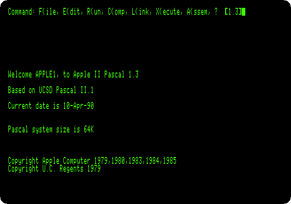
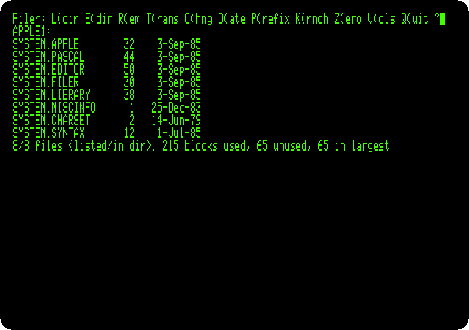
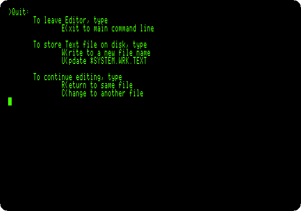
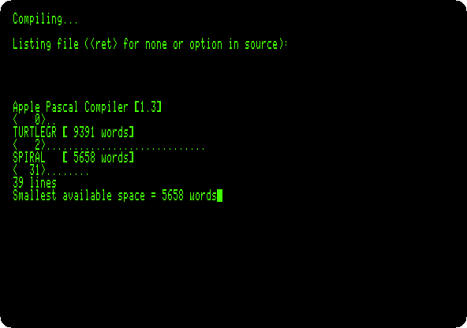

# Apple Pascal

[Back to the activities](../README.md)

Pascal was the language for teaching programming at the end of the
seventies, and the University of California, San Diego had a version of it
that ran the same on very different computers: UCSD Pascal compiled programs
not into the code of a processor but into *p-code*, for a machine of its own
that an interpreter ran. The p-System came with its own editor, filer,
compiler, assembler and linker, and Apple adapted it as **Apple Pascal**, in
1979, with libraries of its own for the machine, among them turtle graphics,
to draw by steering a turtle, as in Logo.

This page starts Apple Pascal 1.3, the last version, on an enhanced Apple //e
with four disk drives, looks at a disk with the Filer, writes a program in
the editor, and compiles and runs it.

## What you need

Only izapple2: the disks of Apple Pascal 1.3 come inside it. The originals,
the four disks `APPLE0` to `APPLE3` as Apple sold them, are in the [woz-a-day
collection](https://archive.org/details/wozaday_Apple_Pascal_v13) of the
Internet Archive, but izapple2 cannot write to their WOZ images yet, and the
system writes your program to its disk.

## The machine

An enhanced Apple //e with two disk drives:

- the 65C02 processor at 1 MHz and 128 KB of memory: 64 KB on the board,
  the top 16 KB of it the memory of a language card, which izapple2 puts in
  slot 0, and 64 KB more on the extended 80 column card, in the auxiliary
  slot;
- a Disk II controller card in slot 6, with `APPLE1`, the disk it starts
  from, in drive 1, and `APPLE2`, with the compiler, in drive 2.

```bash
izapple2 -model none -board 2e -cpu 65c02 -screen green \
    -rom "<internal>/Apple2e_Enhanced.rom" \
    -charrom "<internal>/Apple IIe Video Enhanced.bin" \
    -s0 language \
    -s6 'diskii,disk1=<internal>/Apple II Pascal 1.3 APPLE1_ 680-0283-A.dsk,disk2=<internal>/Apple II Pascal 1.3 APPLE2_ 680-0284-A.dsk'
```

The model `pascal` of izapple2 has this machine, with 8 MB more of memory on
a RAMWorks card, a No-Slot Clock, a VidHD card, a FASTChip accelerator and a
Mockingboard more, and a second Disk II controller in slot 5 with `APPLE3`
and `APPLE0`:

```bash
izapple2 -model pascal -screen green
```

## Start it

1. **Start izapple2** with the command above. Apple Pascal starts from
   `APPLE1`, greets you in 80 columns, and shows its command line at the top
   of the screen: each command is one key, the letter before the
   parenthesis.

   

   The date is the one kept on the disk, not the one of the clock of the
   machine.

## The Filer

2. **Press F for the Filer, then L to list a directory, and type `*` and
   Return**: `*` is the disk the system started from.

   

   The disks of the p-System are *volumes*, with names: this is `APPLE1:`.
   The sizes are in blocks of 512 bytes. `SYSTEM.PASCAL` is the system
   itself, `SYSTEM.EDITOR` the editor and `SYSTEM.FILER` the Filer, each
   loaded from the disk when its command is given. Press Q to leave the
   Filer.

## A program

3. **Press E for the editor**, and Return to start a new file. **Press I to
   insert**, type the program, and **press Control-C** to end the insertion
   (Escape would throw it away):

   ```pascal
   (*$S+*)
   program spiral;
   uses turtlegraphics;
   var i: integer;
   begin
   initturtle;
   pencolor(white);
   for i := 1 to 90 do
   begin
   move(i * 2);
   turn(89)
   end;
   readln
   end.
   ```

   

   The editor keeps the indentation of the line above, so the program is
   typed without any. The program draws ninety lines with the turtle, each
   longer than the one before, turning 89 degrees after each: a square that
   does not quite close, and turns as it grows. `(*$S+*)` is an option for
   the compiler, not part of the program: it makes the compiler swap its
   parts in and out of memory, to leave room for the turtle graphics. The
   system says it has 64 KB, and the compiler stops for lack of memory
   without it.

4. **Press Q to quit the editor**, **U to keep the program** in the work
   file, and **E** to go back to the command line.

   

   The work file, `SYSTEM.WRK.TEXT`, is the program the commands of the
   command line work on.

## Compile and run

5. **Press R to run it.** The work file has not been compiled, so the
   compiler starts first. It asks for a listing file: press Return for none.
   It reads the turtle graphics unit, `TURTLEGR`, from the library, and the
   program, a dot for each line.

   

6. **Watch it run.** The screen changes to the high resolution graphics, and
   the turtle draws. Press F6 in izapple2 for colour.

   

   Press Return to end the program, which waits for it with `readln`, and go
   back to the command line.

## What next

[The Apple \]\[ of 1977](apple-ii.md) has the Mini-Assembler, machine code
written a line at a time; the p-System has a full assembler, `A(ssem`.
