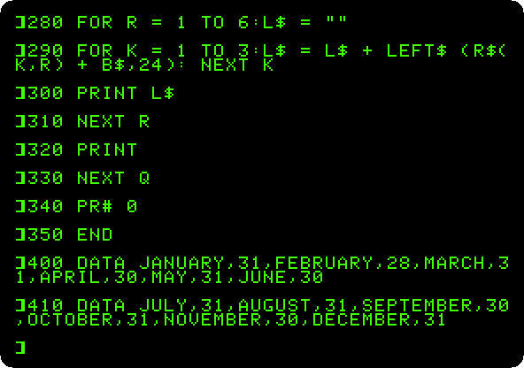

# Printing

[Back to the activities](../README.md)

A printer was what turned a home computer into an office one: letters,
listings of programs to read away from the screen, reports. The Apple II
had no printer port of its own; a card in a slot gave it one, and the
**Apple Parallel Interface Card** was Apple's, for the printers with a
parallel cable, of the Centronics kind. BASIC sends
its output to the card with `PR#` and the number of the slot, and back to
the screen with `PR#0`.

This page types a program that makes a calendar of a year, prints its
listing, and then runs it on the printer: three months across, more than
the 40 columns of the screen could show. izapple2 writes what the card
prints to a file.

## What you need

Only izapple2. The ROM of the Apple \]\[+ and the one of the card come
inside it, and the program is typed in.

## The machine

An Apple \]\[+ with a printer:

- the 6502 processor at 1 MHz, 48 KB of memory, and Applesoft BASIC in its ROM;
- the keyboard of the \]\[+, which types only capitals;
- an Apple Parallel Interface Card in slot 1, with a printer that is a
  file: what the card prints goes to `printer.out`, in the folder izapple2
  runs in;
- no disk drive.

```bash
izapple2 -model none -board 2plus -cpu 6502 -screen green \
    -rom "<internal>/Apple2_Plus.rom" \
    -charrom "<internal>/Apple2rev7CharGen.rom" -forceCaps \
    -s1 parallel,file=printer.out
```

The model `2plus` of izapple2 has this machine with `-s1 parallel`, and a
Language Card, a Videx Videoterm 80 column card and a Disk II controller
with DOS 3.3 more:

```bash
izapple2 -model 2plus -screen green -s1 parallel
```

## The program

1. **Start izapple2** with the command above, and **type the program**, a
   line at a time. It is in
   [listings/calendar.bas](listings/calendar.bas) too. First the names and
   lengths of the months, from the `DATA` at the end, February with 29
   days in a leap year, and the day of the week of the first of January:

   ```basic
   10 REM A CALENDAR OF A YEAR, FOR THE PRINTER
   20 DIM D(12),N$(12),R$(3,6)
   30 FOR M = 1 TO 12: READ N$(M),D(M): NEXT M
   40 B$ = "                     "
   50 INPUT "YEAR? ";Y
   60 IF Y / 4 = INT (Y / 4) AND (Y / 100 < > INT (Y / 100) OR Y / 400 = INT (Y / 400)) THEN D(2) = 29
   70 REM THE DAY OF THE WEEK OF JANUARY 1, 0 FOR SUNDAY
   80 Z = Y - 1:W = Z + INT (Z / 4) - INT (Z / 100) + INT (Z / 400) + 1
   90 W = W - INT (W / 7) * 7
   ```

   Then, for each quarter, the three months are laid out in rows of weeks,
   a string for each week of each month, the first one starting with
   blanks up to the first day:

   ```basic
   100 PR# 1
   120 PRINT : PRINT SPC( 30);Y: PRINT
   130 FOR Q = 0 TO 3
   140 FOR K = 1 TO 3:M = Q * 3 + K
   150 FOR R = 1 TO 6:R$(K,R) = "": NEXT R
   160 IF W > 0 THEN R$(K,1) = LEFT$ (B$,W * 3)
   170 FOR I = 1 TO D(M)
   180 R = INT ((W + I - 1) / 7) + 1
   190 R$(K,R) = R$(K,R) + RIGHT$ (" " + STR$ (I),2) + " "
   200 NEXT I
   210 W = W + D(M):W = W - INT (W / 7) * 7
   220 NEXT K
   ```

   And printed: the names centred over their months, the days of the week,
   and the weeks of the three months side by side, 24 characters each.
   `PR# 1` at line 100 sent all of it to the printer, and `PR# 0` brings
   the output back to the screen:

   ```basic
   230 L$ = ""
   240 FOR K = 1 TO 3:M = Q * 3 + K:P = INT ((21 - LEN (N$(M))) / 2)
   250 L$ = L$ + LEFT$ (B$,P) + N$(M) + LEFT$ (B$,24 - P - LEN (N$(M))): NEXT K
   260 PRINT L$
   270 PRINT "SU MO TU WE TH FR SA   SU MO TU WE TH FR SA   SU MO TU WE TH FR SA"
   280 FOR R = 1 TO 6:L$ = ""
   290 FOR K = 1 TO 3:L$ = L$ + LEFT$ (R$(K,R) + B$,24): NEXT K
   300 PRINT L$
   310 NEXT R
   320 PRINT
   330 NEXT Q
   340 PR# 0
   350 END
   ```

   ```basic
   400 DATA JANUARY,31,FEBRUARY,28,MARCH,31,APRIL,30,MAY,31,JUNE,30
   410 DATA JULY,31,AUGUST,31,SEPTEMBER,30,OCTOBER,31,NOVEMBER,30,DECEMBER,31
   ```

   

## Printed

2. **Type `PR#1`, `LIST 10,90` and `PR#0`.** Everything the machine writes
   goes to the printer as well as to the screen while slot 1 has the
   output, the commands typed included. The listing is printed as `LIST`
   puts it on the screen, folded the same way:

   ```text
   ]LIST 10,90

   10  REM  A CALENDAR OF A YEAR, FO
        R THE PRINTER
   20  DIM D(12),N$(12),R$(3,6)
   30  FOR M = 1 TO 12: READ N$(M),D
        (M): NEXT M
   40 B$ = "                     "
   50  INPUT "YEAR? ";Y
   60  IF Y / 4 =  INT (Y / 4) AND (
        Y / 100 <  >  INT (Y / 100) OR
        Y / 400 =  INT (Y / 400)) THEN
        D(2) = 29
   70  REM  THE DAY OF THE WEEK OF J
        ANUARY 1, 0 FOR SUNDAY
   80 Z = Y - 1:W = Z +  INT (Z / 4)
         -  INT (Z / 100) +  INT (Z /
        400) + 1
   90 W = W -  INT (W / 7) * 7


   ]PR#0
   ```

3. **Type `RUN`, and `1977` for the year.** The program works out each
   quarter and prints it. On the screen, the lines of nearly 70 characters
   fold over and over:

   

   On the paper, the year of the Apple II, as it came out of `printer.out`:

   ```text
                                 1977

          JANUARY                FEBRUARY                  MARCH
   SU MO TU WE TH FR SA   SU MO TU WE TH FR SA   SU MO TU WE TH FR SA
                      1           1  2  3  4  5           1  2  3  4  5
    2  3  4  5  6  7  8     6  7  8  9 10 11 12     6  7  8  9 10 11 12
    9 10 11 12 13 14 15    13 14 15 16 17 18 19    13 14 15 16 17 18 19
   16 17 18 19 20 21 22    20 21 22 23 24 25 26    20 21 22 23 24 25 26
   23 24 25 26 27 28 29    27 28                   27 28 29 30 31
   30 31

           APRIL                    MAY                    JUNE
   SU MO TU WE TH FR SA   SU MO TU WE TH FR SA   SU MO TU WE TH FR SA
                   1  2     1  2  3  4  5  6  7              1  2  3  4
    3  4  5  6  7  8  9     8  9 10 11 12 13 14     5  6  7  8  9 10 11
   10 11 12 13 14 15 16    15 16 17 18 19 20 21    12 13 14 15 16 17 18
   17 18 19 20 21 22 23    22 23 24 25 26 27 28    19 20 21 22 23 24 25
   24 25 26 27 28 29 30    29 30 31                26 27 28 29 30


           JULY                   AUGUST                 SEPTEMBER
   SU MO TU WE TH FR SA   SU MO TU WE TH FR SA   SU MO TU WE TH FR SA
                   1  2        1  2  3  4  5  6                 1  2  3
    3  4  5  6  7  8  9     7  8  9 10 11 12 13     4  5  6  7  8  9 10
   10 11 12 13 14 15 16    14 15 16 17 18 19 20    11 12 13 14 15 16 17
   17 18 19 20 21 22 23    21 22 23 24 25 26 27    18 19 20 21 22 23 24
   24 25 26 27 28 29 30    28 29 30 31             25 26 27 28 29 30
   31

          OCTOBER                NOVEMBER                DECEMBER
   SU MO TU WE TH FR SA   SU MO TU WE TH FR SA   SU MO TU WE TH FR SA
                      1           1  2  3  4  5                 1  2  3
    2  3  4  5  6  7  8     6  7  8  9 10 11 12     4  5  6  7  8  9 10
    9 10 11 12 13 14 15    13 14 15 16 17 18 19    11 12 13 14 15 16 17
   16 17 18 19 20 21 22    20 21 22 23 24 25 26    18 19 20 21 22 23 24
   23 24 25 26 27 28 29    27 28 29 30             25 26 27 28 29 30 31
   30 31
   ```

   The Apple sends its characters with the top bit set, as it keeps them in
   memory, and ends each line with a carriage return and a line feed, so
   `printer.out` looks odd in an editor. This turns it into plain text on a
   Mac or on Linux:

   ```bash
   LC_ALL=C tr '\200-\377' '\000-\177' < printer.out | tr -d '\r'
   ```

## What next

[A game in Applesoft](paddle-game.md) is another program typed into the
same machine, for the screen this time.
