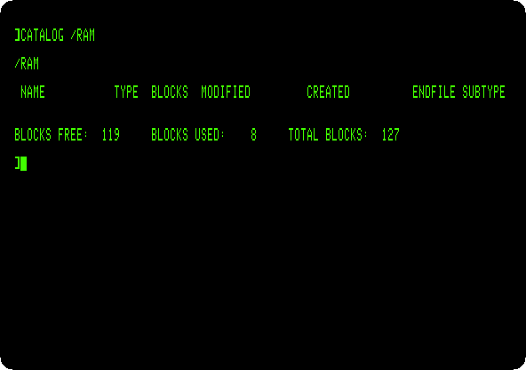
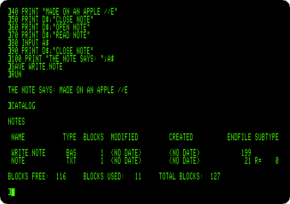
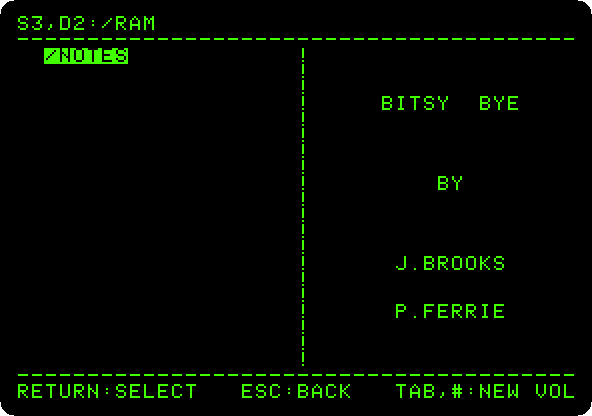
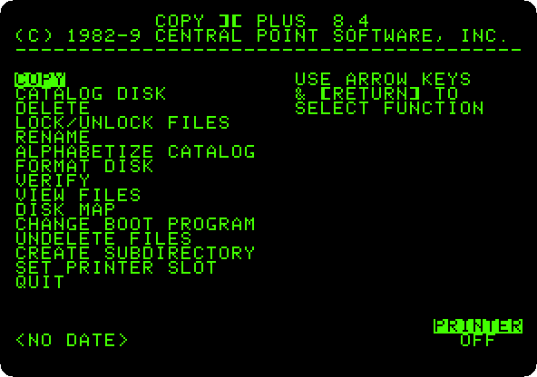
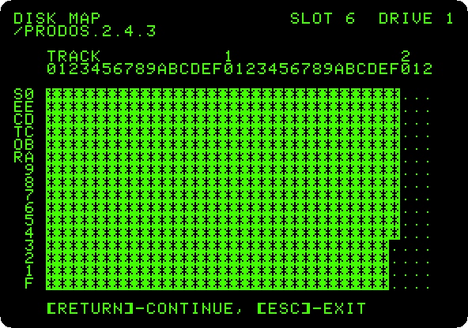
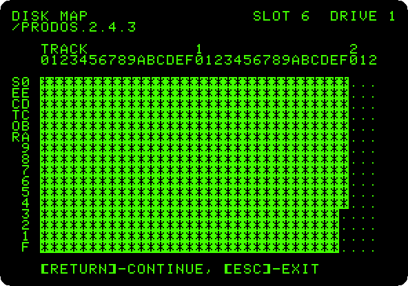

# ProDOS

[Back to the activities](../README.md)

DOS 3.3 was made for diskettes of 140 KB. When hard disks came, Apple made a
new operating system for the Apple II, **ProDOS**, out at the start of 1984:
disks of up to 32 MB, files in folders inside folders, and the same format
on a diskette and on a hard disk. It became the system of the //e, the //c and the IIgs,
and Apple left it at version 2.0.3 in 1993. Enthusiasts took it up again in
2016, and ProDOS 2.4 runs on every Apple II with 64 KB, from the first one.

This page starts ProDOS 2.4.3 on an enhanced //e, chooses a program in the
selector it starts with, and catalogues the disk from BASIC. Then it makes a
folder on the RAM disk of the //e, with a program that writes a text file
and reads it back, and looks at the diskette with Copy II Plus, the utility
everyone had.

## What you need

**`ProDOS_2_4_3.po`**, ProDOS 2.4.3, from
[its page](https://prodos8.com/releases/prodos-243/). `./fetch-disks.sh` in
this repository downloads it into `disks/` and checks it.

## The machine

An enhanced Apple //e with one disk drive:

- the 65C02 processor at 1 MHz and 128 KB of memory: 64 KB on the board,
  the top 16 KB of it the memory of a language card, which izapple2 puts in
  slot 0, and 64 KB more on the extended 80 column card, in the auxiliary
  slot;
- a Disk II controller card in slot 6, with ProDOS 2.4.3 in drive 1.

```bash
izapple2 -model none -board 2e -cpu 65c02 -screen green \
    -rom "<internal>/Apple2e_Enhanced.rom" \
    -charrom "<internal>/Apple IIe Video Enhanced.bin" \
    -s0 language \
    -s6 diskii,disk1=disks/ProDOS_2_4_3.po
```

The model `prodos` of izapple2 has this machine, with 8 MB more of memory on
a RAMWorks card, a No-Slot Clock, a VidHD card, a FASTChip accelerator and a
Mockingboard more, and the ProDOS disk inside izapple2:

```bash
izapple2 -model prodos -screen green
```

## The program selector

1. **Start izapple2** with the command above. ProDOS starts, and with it
   Bitsy Bye, the program selector of ProDOS 2.4, by John Brooks and Peter
   Ferrie: the files of the disk, the first one highlighted.

   

   The top line is the drive, slot 6 drive 1, and the name of the disk,
   `/PRODOS.2.4.3`: in ProDOS a disk is a *volume* with a name, and a file
   is found by its *path*, from the volume through the folders to it. The
   letter before each name is its type: `-` a system program, `A` a BASIC
   program, `B` a binary file, `T` text.

2. **Press the down arrow three times**, to `BASIC.SYSTEM`, and **Return**.
   BASIC.SYSTEM is Applesoft with the commands of ProDOS added. It loads,
   and gives the prompt of Applesoft.

   

## The catalog

3. **Type `PR#3` and `CATALOG`.** In 80 columns, `CATALOG` gives the whole
   story of each file: its type, its size in blocks of 512 bytes, when it
   was changed and made, its length in bytes and, for binary files, the
   address it loads at.

   

   The diskette has 280 blocks, 140 KB, as under DOS 3.3. `CAT` gives a
   shorter list that fits in 40 columns, and `PREFIX` says which folder the
   commands work in.

## The RAM disk

4. **Type `HOME` and `CATALOG /RAM`.** `/RAM` is a disk that ProDOS makes in
   the 64 KB of memory of the extended 80 column card: 127 blocks, as fast
   as memory, and empty again when the machine is switched off.

   

5. **Make a folder on it, and a program that writes a note there:**

   ```
   HOME
   CREATE /RAM/NOTES
   PREFIX /RAM/NOTES
   10 D$ = CHR$ (4)
   20 PRINT D$;"OPEN NOTE"
   30 PRINT D$;"WRITE NOTE"
   40 PRINT "MADE ON AN APPLE //E"
   50 PRINT D$;"CLOSE NOTE"
   60 PRINT D$;"OPEN NOTE"
   70 PRINT D$;"READ NOTE"
   80 INPUT A$
   90 PRINT D$;"CLOSE NOTE"
   100 PRINT "THE NOTE SAYS: ";A$
   SAVE WRITE.NOTE
   RUN
   CATALOG
   ```

   `CREATE` makes the folder, and `PREFIX` makes it the one the commands
   work in, so `NOTE` is `/RAM/NOTES/NOTE`. A program gives ProDOS a command
   by printing it after Control-D, `CHR$(4)`: after `WRITE`, what it prints
   goes to the file, and after `READ`, `INPUT` reads from the file. The
   program writes its line, reads it back, and prints it.

   

   The catalog of the folder has the program, `BAS`, and the note, `TXT`, 21
   bytes. There is no date: the machine has no clock.

## Copy II Plus

6. **Type `BYE`.** BASIC.SYSTEM ends, and Bitsy Bye comes back, on the disk
   of the prefix, `/RAM`, with the folder on it.

   

7. **Press Tab** to go to the next disk, the diskette in slot 6, and **choose
   `COPYIIPLUS.8.4`**, the fifth. **Press Escape** when it asks for the
   date. Copy II Plus, by Central Point Software, copied, catalogued, renamed
   and repaired files and disks, of DOS 3.3 and of ProDOS, and its *Copy*
   still has the bit copies, for disks protected against copying.

   

8. **Choose *Disk Map*, with the arrows and Return, and Return again** for
   the diskette in slot 6, drive 1. It reads the diskette and draws its
   blocks: a column for each of its 35 tracks, numbered in hexadecimal, a
   row for each of the 16 sectors of a track, and a star where a sector is
   used.

   

   The diskette is nearly full, as the catalog said: 26 blocks free.

9. **Press Return, and the right arrow, a file at a time.** The map shows
   where each file is on the diskette.

   

   A file of ProDOS is in blocks wherever there is room, not always next to
   each other, and the map shows when it is in pieces.

## What next

[Life with DOS 3.3](dos33.md) is the system ProDOS replaced, and
[Apple II DeskTop](desktop.md) runs on ProDOS, from a hard disk.
