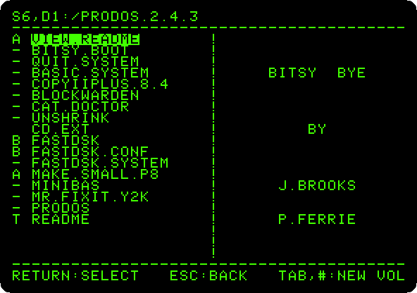
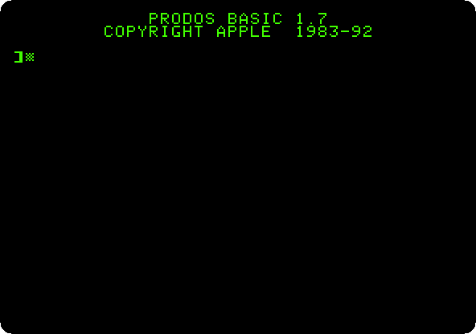
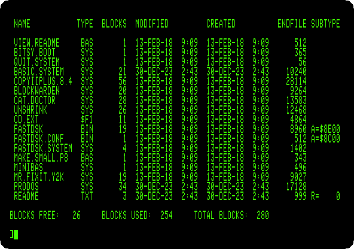

# ProDOS

[Back to the activities](../README.md)

DOS 3.3 was made for diskettes of 140 KB. When hard disks came, Apple made a
new operating system for the Apple II, **ProDOS**, out at the start of 1984:
disks of up to 32 MB, files in folders inside folders, and the same format
on a diskette and on a hard disk. It became the system of the //e, the //c and the IIgs,
and Apple left it at version 2.0.3 in 1993. Enthusiasts took it up again in
2016, and ProDOS 2.4 runs on every Apple II with 64 KB, from the first one.

This page starts ProDOS 2.4.3 on an enhanced //e, chooses a program in the
selector it starts with, and catalogues the disk from BASIC.

## What you need

Only izapple2: the ProDOS 2.4.3 disk comes inside it.

## The machine

An enhanced Apple //e with the ProDOS disk:

- the 65C02 processor at 1 MHz, 128 KB of memory, and a RAMWorks memory card
  with 8 MB more in its auxiliary slot, with the 80 column card;
- a No-Slot Clock under the ROM;
- a VidHD card in slot 2, a FASTChip accelerator in slot 3 and a Mockingboard
  sound card in slot 4, unused here;
- a Disk II controller card in slot 6, with ProDOS 2.4.3 in drive 1.

```bash
izapple2 -model prodos
```

## The program selector

1. **Start izapple2** with the command above. ProDOS starts, and with it
   Bitsy Bye, the program selector of ProDOS 2.4, by John Brooks and Peter
   Ferrie: the files of the disk, the first one highlighted.

   

   The top line is the drive, slot 6 drive 1, and the name of the disk,
   `/PRODOS.2.4.3`: in ProDOS a disk is a *volume* with a name, and a file
   is found by its *path*, from the volume through the folders to it. The
   letter before each name is its type: `-` a system program, `A` a BASIC
   program, `B` a binary file, `T` text.

2. **Press the down arrow three times**, to `BASIC.SYSTEM`, and **Return**.
   BASIC.SYSTEM is Applesoft with the commands of ProDOS added. It takes a
   while to load in izapple2, and then it gives the prompt of Applesoft.

   

## The catalog

3. **Type `PR#3` and `CATALOG`.** In 80 columns, `CATALOG` gives the whole
   story of each file: its type, its size in blocks of 512 bytes, when it
   was changed and made, its length in bytes and, for binary files, the
   address it loads at.

   

   The diskette has 280 blocks, 140 KB, as under DOS 3.3. `CAT` gives a
   shorter list that fits in 40 columns, and `PREFIX` says which folder the
   commands work in.

## What next

[Life with DOS 3.3](dos33.md) is the system ProDOS replaced, and
[Apple II DeskTop](desktop.md) runs on ProDOS, from a hard disk.
