# The RGB card and its fourteen video modes

[Back to the activities](../README.md)

The Apple II makes its colour the way a television expects it, a signal
where the colour is a wobble on top of the brightness, and that is why its
colours fringe and why its text in colour is unreadable. An **RGB monitor**
takes red, green and blue on wires of their own, sharp, and for the //e
there were cards that gave it that: the extended 80 column card of the //e,
with its 64 KB, and an RGB output. Video-7 made one, Apple sold one as the
AppleColor card. Besides a sharper picture they added video modes of their
own: text in any of 16 colours on any of 16, graphics of 160 dots across,
and black and white at 560.

This page starts the demonstration disk of the Video-7 card, and goes
through the fourteen video modes of its *Video Modes* part, the six the //e
has and the eight the card adds.

## What you need

**`Video-7 Apple II RGB Demo (Video-7, Inc.)(1984).dsk`**, the demonstration
disk of the card, of 1984, on the
[Asimov archive](https://mirrors.apple2.org.za/ftp.apple.asimov.net/images/hardware/video/).
`./fetch-disks.sh` in this repository downloads it into `disks/` and checks
it.

## The machine

An enhanced Apple //e with an RGB card:

- the 65C02 processor at 1 MHz and 128 KB of memory: 64 KB on the board,
  the top 16 KB of it the memory of a language card, which izapple2 puts in
  slot 0, and 64 KB more on the extended 80 column card, in the auxiliary
  slot;
- the RGB modes of that card, `-rgb`;
- a Disk II controller card in slot 6, with the demonstration disk in
  drive 1.

```bash
izapple2 -model none -board 2e -cpu 65c02 -screen color \
    -rom "<internal>/Apple2e_Enhanced.rom" \
    -charrom "<internal>/Apple IIe Video Enhanced.bin" -rgb \
    -s0 language \
    -s6 'diskii,disk1="disks/Video-7 Apple II RGB Demo (Video-7, Inc.)(1984).dsk"'
```

`<internal>/` names a file inside izapple2: the ROMs, of the machine and of
its characters.

The enhanced Apple //e izapple2 starts with, its model `2enh`, has this
machine with `-rgb`, and 8 MB more of memory on a RAMWorks card, a No-Slot
Clock, a VidHD card, a FASTChip accelerator and a Mockingboard more:

```bash
izapple2 -screen color -rgb "disks/Video-7 Apple II RGB Demo (Video-7, Inc.)(1984).dsk"
```

## The demonstration

1. **Start izapple2** with the command above. The menu of the
   demonstration, drawn in double high resolution, in the colours of the
   card.

   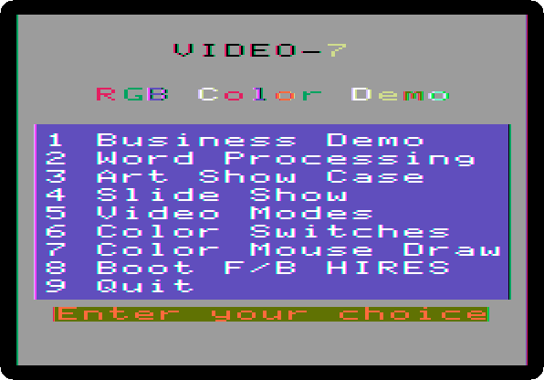

2. **Press 5**, *Video Modes*. The list of the fourteen modes, in 80
   columns; each is chosen by its number and Return, and Escape goes back
   to this list.

   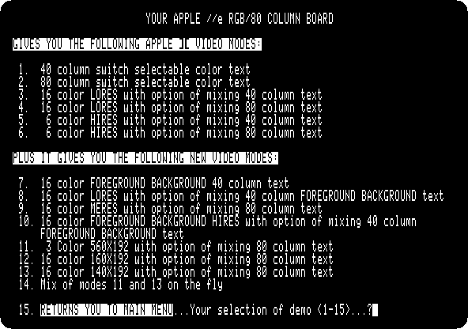

## The modes of the //e

3. **Type `1` and Return, and press 2**: the alternate character set of the
   //e in 40 columns, inverse, and normal with lower case; 1 would show the
   set of the Apple \]\[, with flashing characters in place of lower case.
   **Press Escape** to go back.

   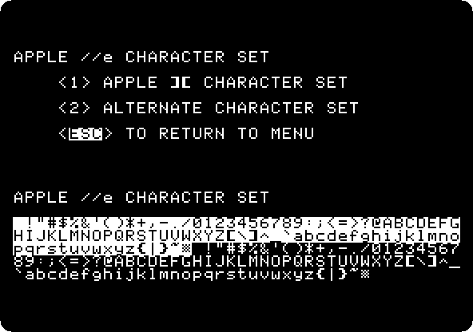

4. **Type `2`, Return, and 2**: the same in 80 columns.

   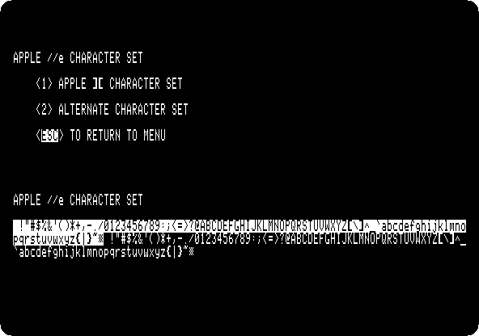

5. **Type `3` and Return**: the low resolution graphics, 40 blocks by 48 in
   16 colours, numbered from 0 to 15.

   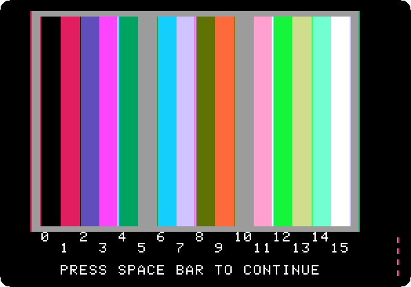

   **Press Space**, and a pattern grows from the edges, a block at a time.

   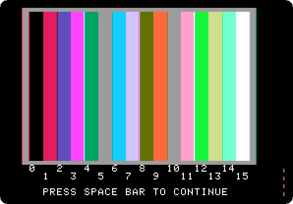

6. **Mode 4**: low resolution with 80 columns of text below, here a game of
   bricks that plays itself.

   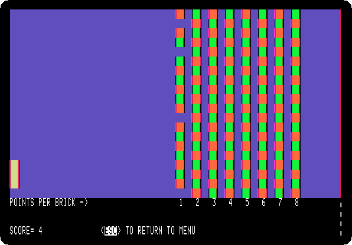

7. **Mode 5**: the high resolution graphics, 280 dots across in six
   colours, here lines drawn and drawn again.

   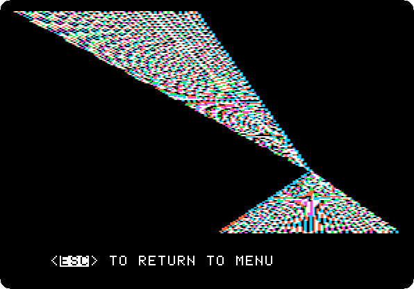

8. **Mode 6**: the colours of high resolution, named in 80 columns below:
   black, green, violet and white, and black, orange, blue and white again,
   the second four with the top bit of their bytes set, which moves their
   dots half a dot.

   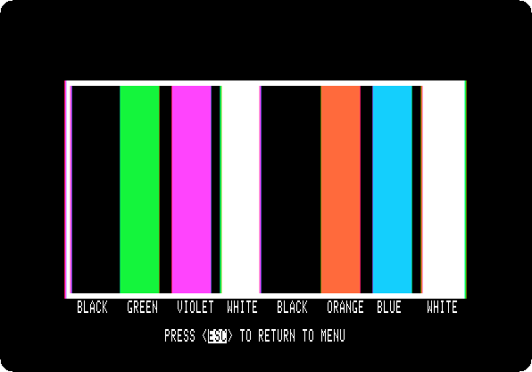

## The modes the card adds

9. **Mode 7**: text in 40 columns in any of the 16 colours on any other.
   **Type `0` and Return** for black letters, **and `13` and Return** for a
   yellow background. Type the same colour for both to go back.

   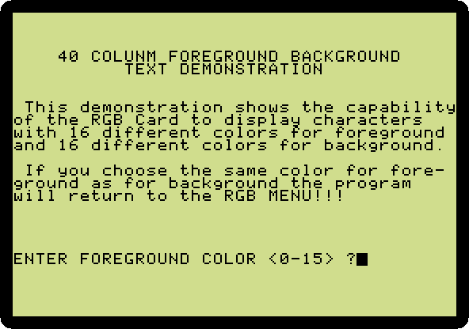

10. **Mode 8**: low resolution with the coloured text of mode 7 below.

    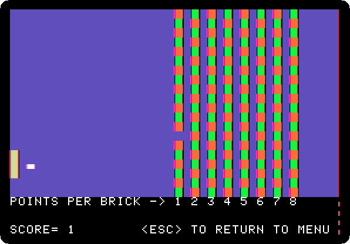

11. **Mode 9**: the double low resolution, 80 blocks across in 16 colours,
    which the card calls *MERES*, medium resolution.

    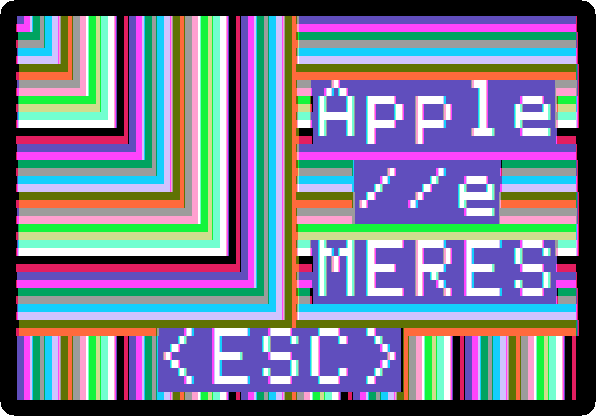

12. **Mode 10**: high resolution where each group of seven dots has two
    colours of its own, a foreground and a background, the *F/B HIRES*.

    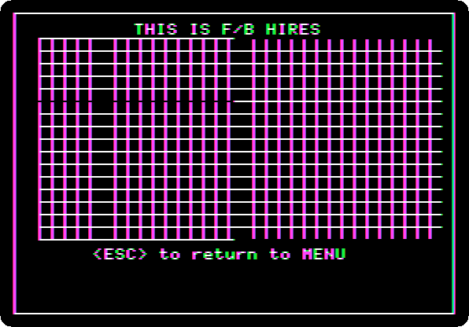

13. **Mode 11**: double high resolution in black and white, 560 dots
    across, the mode Apple II DeskTop uses.

    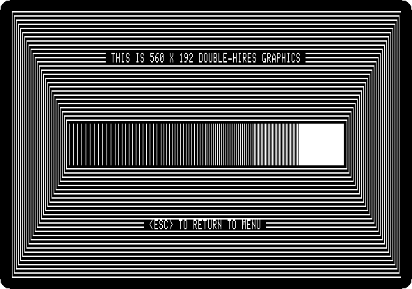

14. **Mode 12**: 160 dots across in 16 colours, each dot its own colour.

    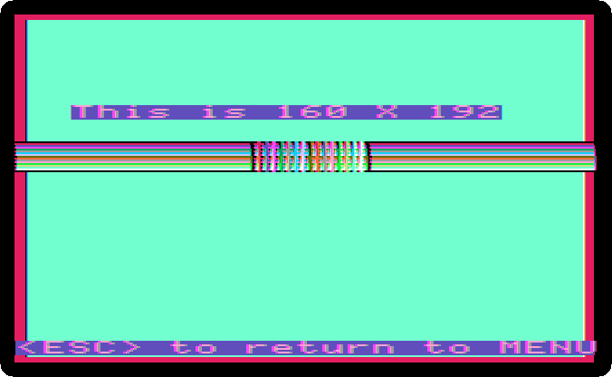

15. **Mode 13**: the double high resolution of the //e in colour, 140 dots
    across in 16 colours.

    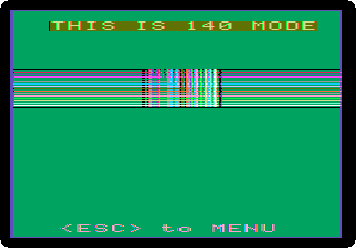

16. **Mode 14**: 140 in colour and 560 in black and white on the same
    screen: the small black and white text in the middle is at 560, on the
    colours at 140.

    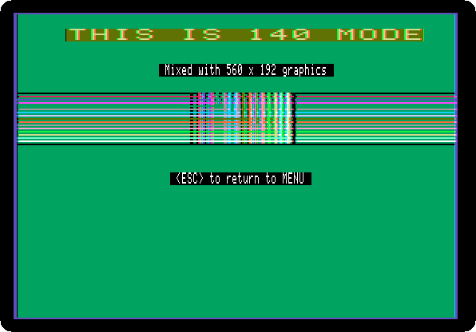

## What next

[Apple II DeskTop](desktop.md) uses the mode 11 for its whole screen, and
[Forth in ROM](forth.md) draws the sixteen colours of the low resolution
graphics a byte at a time.
