# Robot Odyssey, level 1: the Sewer

[Back to the activities](../README.md)

**Robot Odyssey** came out in 1984 from The Learning Company, written by
Mike Wallace and Leslie Grimm, after Rocky's Boots, which Leslie Grimm had
written with Warren Robinett in 1982. You have fallen
into Robotropolis, a city of robots under the ground, and you get out by
climbing through its five levels, each a maze of rooms and puzzles. Three
robots go with you. You can walk into them: inside, each has thrusters,
bumpers that feel the walls, a grabber, sensors, and the logic gates that
wire them together, and the puzzles are solved by wiring them to do a job
alone: a game to learn digital logic, and a hard one.

This page plays the first level, the Sewer, from the start to the
transporter to the second level, the Subway. It does not rewire anything:
in the Sewer the robots are wired already, and the level is about finding
out what each does. On the way it picks up all that the next levels need,
as the walkthrough linked below lists: the three robots, the blue key, a
magnet, an energy crystal, two sensors of the subway token and a chip.

## What you need

**Robot Odyssey v1.1 (4am crack)**, from
[its page on the Internet Archive](https://archive.org/details/RobotOdyssey_v11_4amCrack):
the zip `Robot Odyssey v1.1 (4am crack).zip`, with the two sides of the
diskette. This level uses only side A,
`Robot Odyssey v1.1 (4am crack) side A.dsk`. `./fetch-disks.sh` in this
repository downloads it into `disks/` and checks it.

The way through follows the
[walkthrough of ASchultz on GameFAQs](https://gamefaqs.gamespot.com/appleii/566255-robot-odyssey/faqs/57379).

No manual of the Apple II edition can be read on line; the
[manual of the edition for the Tandy Color Computer](https://archive.org/details/Robot_Odyssey_1_1986_Learning_Company),
of 1986, is on the Internet Archive.

## The machine

An Apple \]\[+ with 64 KB:

- the 6502 processor at 1 MHz and 48 KB of memory;
- a Language Card in slot 0, with 16 KB more: without it the game does not
  show its menu;
- a Disk II controller card in slot 6, with side A of Robot Odyssey in
  drive 1.

```bash
izapple2 -model none -board 2plus -cpu 6502 -screen color \
    -rom "<internal>/Apple2_Plus.rom" \
    -charrom "<internal>/Apple2rev7CharGen.rom" -forceCaps \
    -s0 language \
    -s6 "diskii,disk1=disks/Robot Odyssey v1.1 (4am crack) side A.dsk"
```

Shorter, the model `2plus` of izapple2 plays it too: the same Apple \]\[+,
with a Videx 80 column card in slot 3 more, on a colour monitor with its scan
lines.

```bash
izapple2 -model 2plus 'disks/Robot Odyssey v1.1 (4am crack) side A.dsk'
```

## Playing it

You are the small figure on the screen, one room at a time; walking off an
edge takes you to the next room.

- **I**, **J**, **K** and **M** walk up, left, right and down, a step each
  press. **Control** with them moves you a little, for the places where a
  step is too much: the reader's Control key, which izapple2 passes on.
- **Space** picks up what you stand on, and puts down what you carry; you
  carry one thing at a time, a robot too. Inside a robot, Space on its
  switch, at the lower right, turns it on or off.
- **R** makes you the remote control, and then **Space** stops all the
  robots that are on, or lets them go on; **C** makes you yourself again.
- **Escape** goes back to the menu.

To go into a robot, walk into its side; to come out, walk off any edge of
its inside.

Some things are put in places chosen at random when the game starts: the
chip, and which of two rooms has the magnet and which the energy crystal.
The pictures show where they were this time.

## The Sewer

- [1. Into Robotropolis](#1-into-robotropolis)
- [2. The three robots](#2-the-three-robots)
- [3. The blue key and the door of the City Sewer](#3-the-blue-key-and-the-door-of-the-city-sewer)
- [4. A chip and a sensor, in the maze](#4-a-chip-and-a-sensor-in-the-maze)
- [5. The orange robot and the first guard](#5-the-orange-robot-and-the-first-guard)
- [6. The blue robot and the second guard](#6-the-blue-robot-and-the-second-guard)
- [7. The sensor of directions](#7-the-sensor-of-directions)
- [8. Through the sewer grate](#8-through-the-sewer-grate)
- [9. The last door and the transporter](#9-the-last-door-and-the-transporter)

### 1. Into Robotropolis

**Start izapple2** with the command above. The menu comes after the drive:
the game, *Robotropolis*, the *Innovation Lab*, and three tutorials.

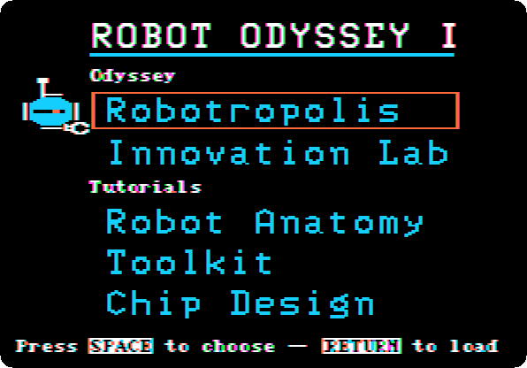

**Press Return** for Robotropolis, and **Return** again when the game asks,
for a new game rather than one saved.

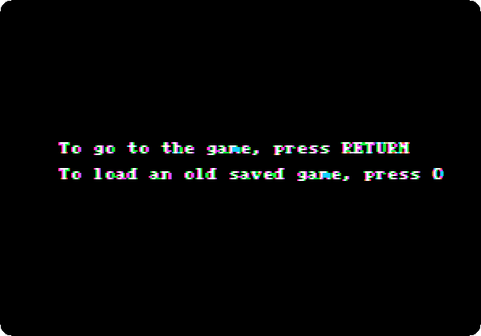

The first room, after the drive loads the level, with the way out to the
right.

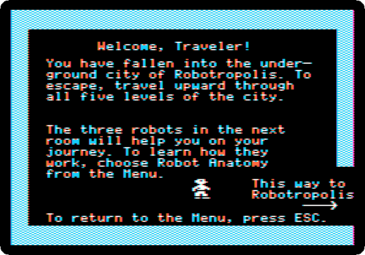

### 2. The three robots

**Walk right** into the next room. The three robots move about it: the
orange one, the blue one and the white one.

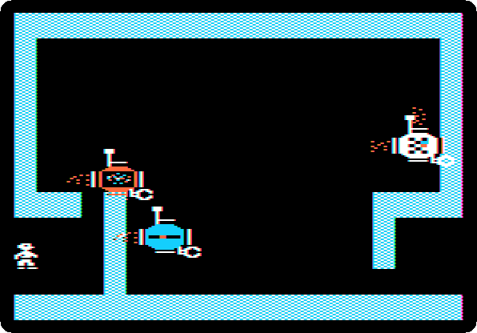

**Walk into each of them, from its left, and press Space on its switch**,
at the lower right of its inside, to turn it off, so that it stays where it
is. The inside of the orange one: the thrusters are the triangles at the
sides, the bumpers the half circles next to them, and the wires light up
where they are on.

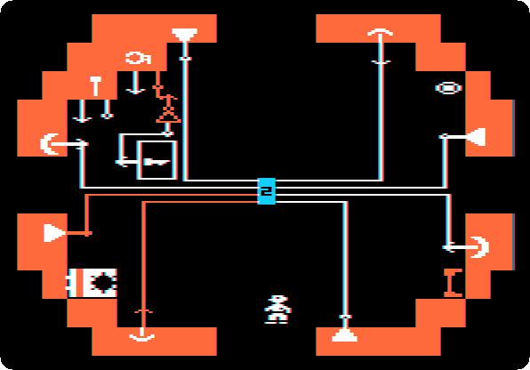

### 3. The blue key and the door of the City Sewer

The blue key is in one of the robots, a different one each game. **Walk
into it, pick the key up with Space, and walk out**: what you carry comes
with you.

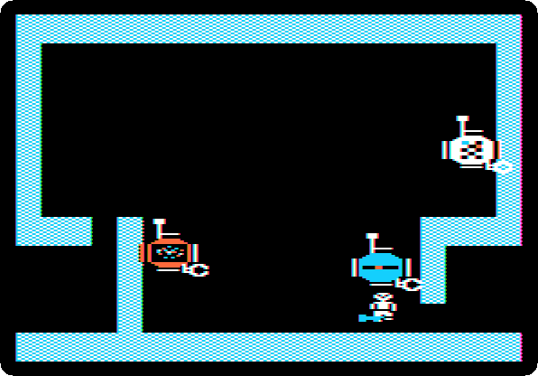

**Put the orange and the blue robots inside the white one**: pick each up,
walk into the white robot with it, and put it down in there. Then **take
the key to the right**, into the City Sewer, and **put it into the lock**,
at the bottom left, a step at a time with Control. The door at the right of
the lock slides open, and stays open when the key comes out.

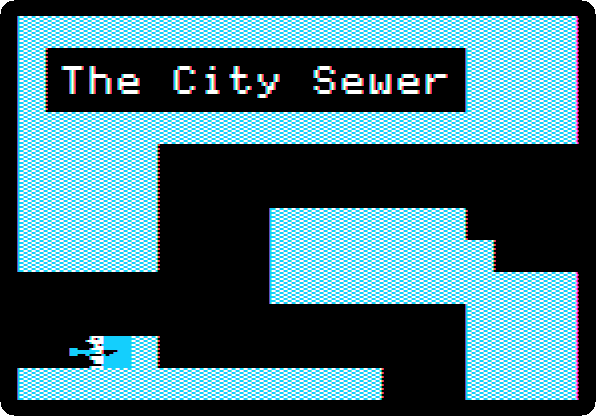

**Put the key into the white robot too.** Everything travels inside it from
now on.

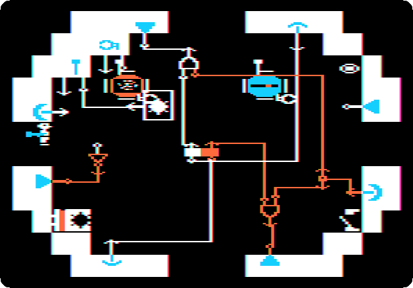

### 4. A chip and a sensor, in the maze

**Carry the white robot** down through the open door and into the maze of
the Sewer, and put it down. The chip is somewhere in the maze. **Pick it
up and take it into the white robot.**

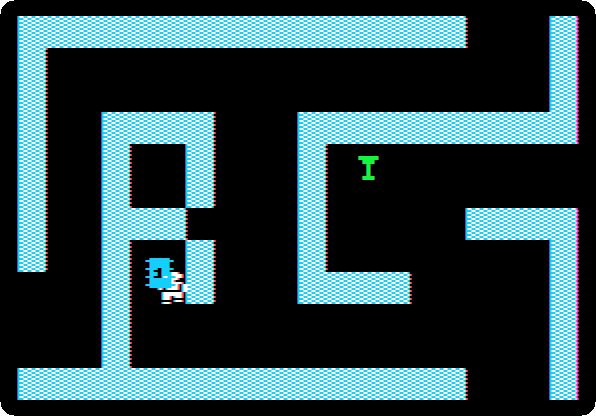

One of the two sensors of the subway token is in the room at the bottom
of the maze, among other parts. **Take it into the white robot too.**

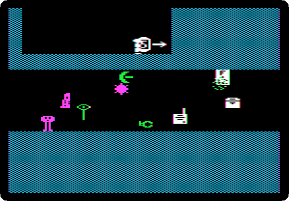

### 5. The orange robot and the first guard

**Carry the white robot east**, out of the maze, to the room before the
two rooms with guards, and **take the orange and the blue robots out of it
there**. Then **carry the white robot on**, up and to the right, to the room that asks
*Do you have EVERYTHING?*:
it has a sensor of crystals, and once it has sensed the energy crystal near
it, it no longer gets through the sewer grate of section 8.

A guard watches the room down from the one on the left: walk in too far and
he sends you back to the door. One of these two rooms has the magnet, the
other the energy crystal. **Carry the orange robot into the first one** and
**put it down at the left**, near the left wall, then **walk into it and
turn it on**.

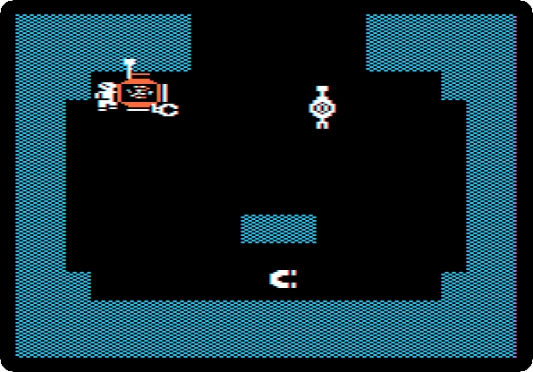

The orange robot follows the walls: round the room, it takes what is there
with its grabber, and goes on up into the room above. The recording is two
times faster than the machine.

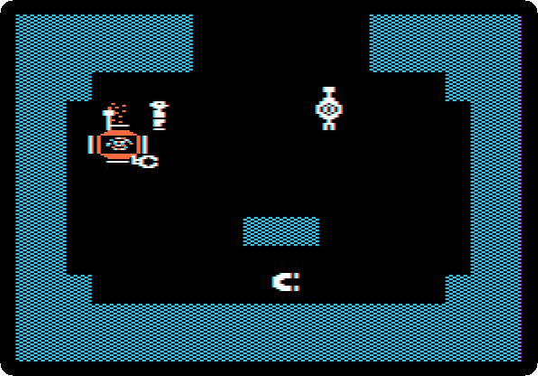

**Stop it with the remote control**, R and Space, and **C** to be yourself
again. A stopped robot can be carried but not gone into: **carry it to the
middle of the room before the guards, put it down, R and Space again**, and
**walk into it at once and turn it off**. Then **carry it into the white
robot.**

### 6. The blue robot and the second guard

**Carry the blue robot into the room of the other guard**, the one to the
right, and **put it down at the left, on the line of what is there**. Walk
into it and turn it on.

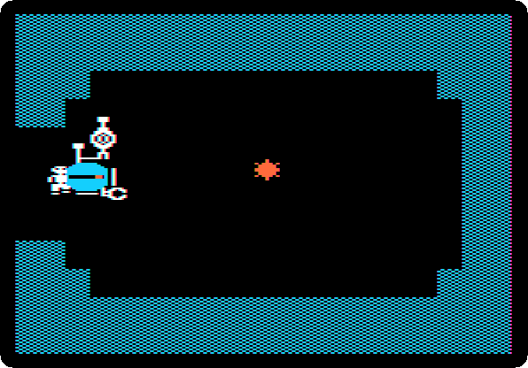

The blue robot goes right until it bumps, and back, and takes what is on
its way. The recording is two times faster than the machine.

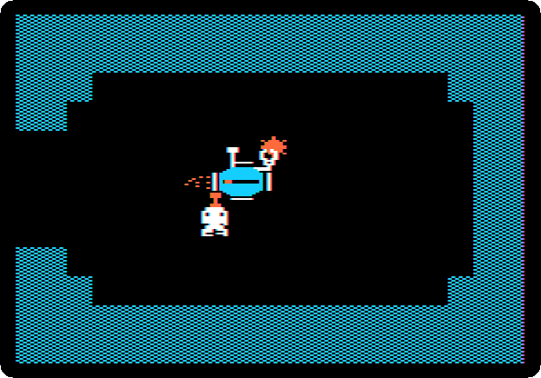

**Stop it with the remote control when it is back in the room on the left,
turn it off, and carry it into the white robot**, as the orange one.

The robots let go of what they hold when they are carried into another.
**Put the magnet down inside the white robot**, if it is not there yet, and
**the energy crystal inside the blue robot**, in the white one, where the
crystal sensor of the white robot does not sense it.

### 7. The sensor of directions

The room under the white robot, *Time to board a 'Bot!*, has the other
sensor of the token, the one with arrows. **Take it into the white robot.**

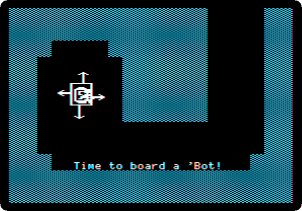

All of it in the white robot: the orange and the blue robots, the key, the
chip, the two sensors and the magnet, with the crystal in the blue one.

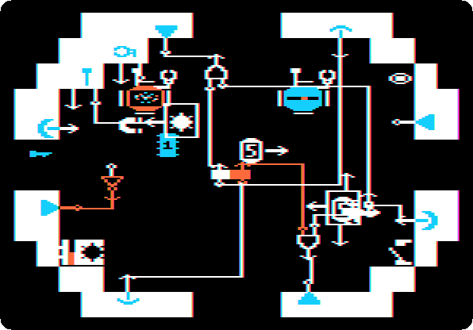

### 8. Through the sewer grate

**Carry the white robot right**, into the room of the *SEWER GRATE*, and
**put it down in the first lane**, against the wall on its right. The
grate lets no one through on foot.

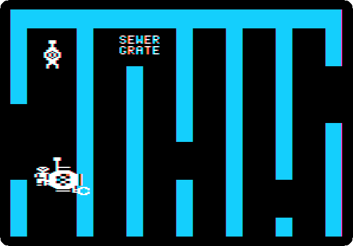

**Walk into the white robot, turn it on, and stand on its eye**, at the
upper right of its inside: from the eye you see the room it is in. It goes
up and down its lane, and right whenever it can, through the grate and the
room under it, *These poor creatures never made it out...*, and out to the
right. The recording is four times faster than the machine: it takes about
a minute and a half.

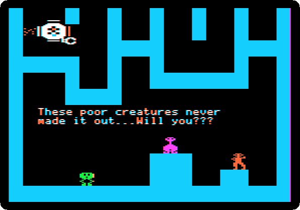

**Turn it off**, in the room past the grate.

### 9. The last door and the transporter

**Take the key out of the white robot**, by its right side, and **put it
into the lock** in the wall in the middle of the room. The wall slides to the
right and opens the way to the top, and stays so when the key comes out.

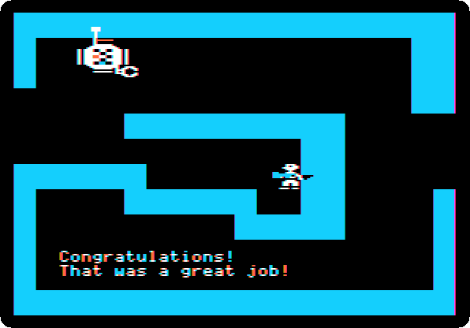

**Put the key back into the white robot, and carry the robot to the
right.** The transporter is the orange square: *You CAN take it with you
(If you hold on tight)*.

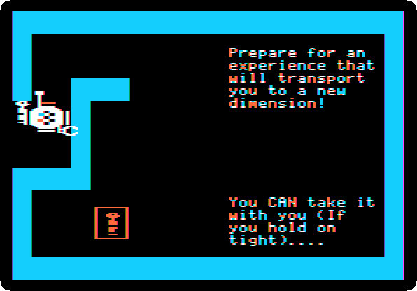

**Step onto the transporter with the robot**, the last of it a step at a
time with Control, until it takes you. The game asks for its disk.

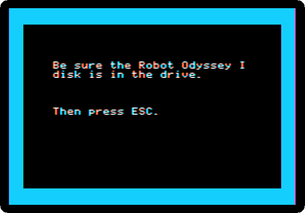

**Press Escape.** The Subway, the second level, with the white robot and
all that is in it.

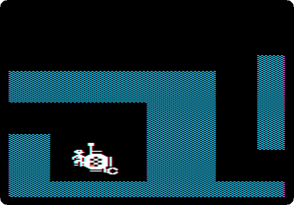

## What next

[Karateka](karateka.md) is another game of 1984 on these pages, all
action where this one is all thought.
