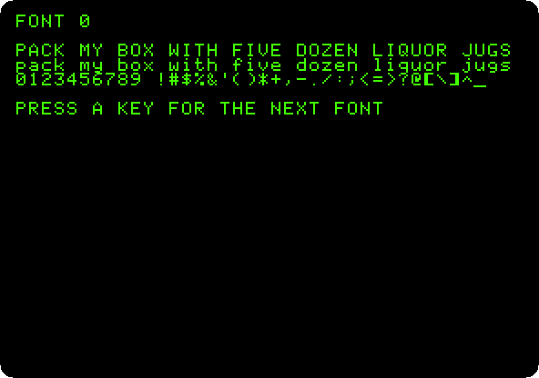
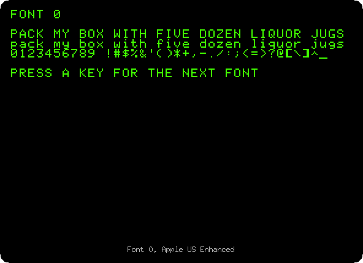
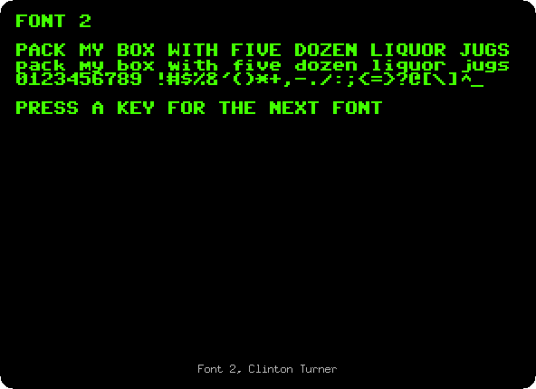
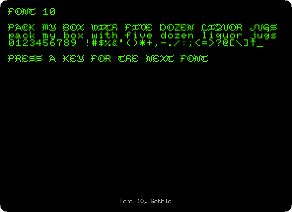
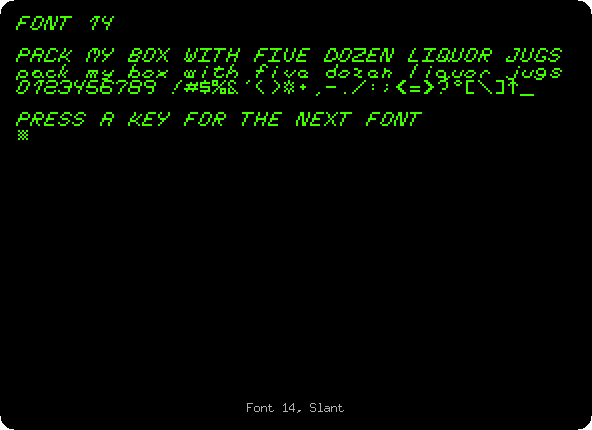

# Sixteen fonts on the //e: the ROMXce

[Back to the activities](../README.md)

The letters on the screen of an Apple //e are drawn by a chip of their own,
the ROM of the characters: a picture of each, dot by dot, which the video
reads 60 times a second. To change them, the chip had to be changed.

**ROMX**, of [The ROM Exchange](https://theromexchange.com/), is a board of
our time, documented by Dean Claxton and Jeff Mazur, that goes in place of
the ROMs of an Apple \]\[, \]\[+, //e or //c and keeps many images of them,
chosen from a menu when the machine starts. The **ROMXce video ROM** goes in
place of the ROM of the characters, with 32 fonts, and a cable to the ROMX
board: from then on, a program can change the font of the screen as it runs.

izapple2 has this part of the ROMXce, the change of the font, with the
first 16 fonts. This page types a program that shows them one after the
other.

## What you need

Only izapple2: the fonts of the ROMXce come inside it. The program of the
page is also in this repository,
[listings/romx-fonts.bas](listings/romx-fonts.bas).

The guides of the ROMX, its *User Guide*, its *API Reference* for programs,
and the *Video ROM Programming Guide* with the list of the fonts, are on
[the documentation page of The ROM Exchange](https://theromexchange.com/documentation/romxce).

## The machine

An enhanced Apple //e with a ROMXce:

- the 65C02 processor at 1 MHz and 128 KB of memory: 64 KB on the board,
  the top 16 KB of it the memory of a language card, which izapple2 puts in
  slot 0, and 64 KB more on the extended 80 column card, in the auxiliary
  slot;
- its ROM, and the ROM of characters of the ROMXce, which takes the place
  of the one named with `-charrom` when `-romx` is given;
- no cards in its slots.

```bash
izapple2 -model none -board 2e -cpu 65c02 -screen green \
    -rom "<internal>/Apple2e_Enhanced.rom" \
    -charrom "<internal>/Apple IIe Video Enhanced.bin" \
    -romx \
    -s0 language
```

## How a program asks for a font

The ROMX board sits where the ROMs are, and sees every address the
processor reads from them. It answers some of those addresses:

- three reads, of `$FACA`, `$FACA` and `$FAFE`, one after the other, bring
  in its own firmware, its bank 0, where it takes commands;
- then a read of `$F810` to `$F81F` chooses the font, `0` to `F`, the last
  digit;
- and a read of `$F851` goes back to the ROM of the //e.

The program TEXT.DEMO, on the utilities disk of the ROMX, does it with a
routine at `$300`, which the *API Reference* shows. This page uses a shorter
one, of five instructions, `BIT` reading each address:

```
0300: BIT $FACA
0303: BIT $FACA
0306: BIT $FAFE
0309: LDA $F815     the font, here 5
030C: BIT $F851
030F: RTS
```

It runs from memory, at `$300`: the processor reads nothing else from the
ROMs between the three reads. From Applesoft, three `PEEK`s don't do it, for
Applesoft reads its own instructions from the ROM in between. The *API
Reference* also says the Monitor can do it, by typing `FACA FACA FAFE`; in
izapple2 that does not work either, the Monitor reading its own ROM between
them.

## The sixteen fonts

1. **Start izapple2** with the command above, and **type the program**:

   ```basic
   10 FOR I = 0 TO 15: READ B: POKE 768 + I,B: NEXT
   20 DATA 44,202,250,44,202,250,44,254,250,173,16,248,44,81,248,96
   30 FOR F = 0 TO 15
   40 HOME : POKE 778,16 + F: CALL 768
   50 PRINT "FONT ";F: PRINT
   60 PRINT "PACK MY BOX WITH FIVE DOZEN LIQUOR JUGS"
   70 PRINT "pack my box with five dozen liquor jugs"
   80 PRINT "0123456789 !#$%&'()*+,-./:;<=>?@[\]^_"
   90 PRINT : PRINT "PRESS A KEY FOR THE NEXT FONT": GET K$
   100 NEXT F
   110 POKE 778,16: CALL 768
   ```

   Lines 10 and 20 put the routine at `$300`, 768, in its 16 bytes. Line 40
   changes the address of the `LDA`, at 778, to `$F810` and the number of
   the font, and calls the routine. Line 110 goes back to font 0 at the end.

2. **`RUN`** it, and **press a key** for each font:

   

   The text on the screen stays the same, the same bytes in memory; only
   the way the video draws them changes, the whole screen at once.

Some of them:

<table><tr>
<td></td>
<td></td>
</tr><tr>
<td></td>
<td></td>
</tr></table>

The *Video ROM Programming Guide* names them:

| Font | Name |
|---|---|
| 0 | Apple US Enhanced, the ROM of the enhanced //e |
| 1 | Apple US Un-Enhanced, the ROM of the //e of 1983, without MouseText |
| 2 | Clinton Turner V1, based on the font of the Commodore 64 |
| 3 | ReActiveMicro, by Henry S. Courbis, with the MouseText of the IIGS |
| 4 | Dan Paymar |
| 5 | Blippo Black |
| 6 | Byte |
| 7 | Colossal |
| 8 | Count |
| 9 | Flow |
| 10, `A` | Gothic |
| 11, `B` | Outline |
| 12, `C` | Pigfont, by Keith Comer |
| 13, `D` | Pinocchio |
| 14, `E` | Slant |
| 15, `F` | Stop |

Those from 5 to 15, but for Pigfont, are adapted from the DOS Toolkit. The
second bank of 16 fonts of the real ROMXce, chosen with a switch, has the ROMs of other countries, the Katakana of the Apple J-Plus,
Cyrillic, Greek, Esperanto; izapple2 has no switch for it.

## What next

[The Apple //e, original and enhanced](apple-iie-models.md) shows fonts 1
and 0 on their own machines, with and without MouseText, and
[Switch on an Apple //e](apple-iie.md) goes on with the //e.
