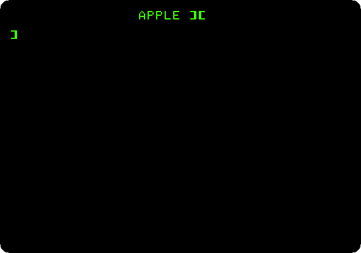
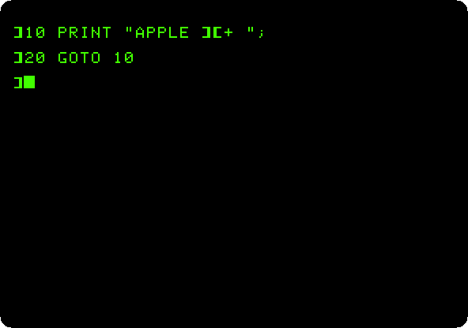

# Switch on an Apple \]\[+

[Back to the activities](../README.md)

The Apple \]\[+ came out in 1979, two years after the Apple \]\[, with Applesoft
BASIC in its ROM in place of the Integer BASIC Steve Wozniak had written for the
first one. Applesoft was Microsoft's BASIC, with the floating point numbers the
first BASIC lacked. Switch the machine on and it is there, waiting for a
command: there is no operating system to load and no program to start. A disk
drive was an extra, and so was the card it needed.

This page switches on an Apple \]\[+ with no disk drive and does
what its owner did first: type commands, write a program, run it, and stop it.

## What you need

Only izapple2. The ROM of the Apple \]\[+ comes inside it, and nothing has to be
downloaded.

## The machine

An Apple \]\[+ with no disk drive:

- the 6502 processor at 1 MHz, 48 KB of memory, and Applesoft BASIC in its ROM;
- the keyboard of the \]\[+, which types only capitals;
- no cards in its slots.

```bash
izapple2 -model none -board 2plus -cpu 6502 -screen green \
    -rom "<internal>/Apple2_Plus.rom" \
    -charrom "<internal>/Apple2rev7CharGen.rom" -forceCaps
```

`<internal>/` names a file inside izapple2: the ROMs, of the machine and of
its characters.

The model `2plus` of izapple2 has this machine, with a Language Card and a
Videx Videoterm 80 column card more:

```bash
izapple2 -model 2plus -screen green -s6 empty
```

## Switch it on

1. **Start izapple2** with the command above. With no disk drive to start
   from, the machine goes straight to BASIC: it beeps, writes `APPLE ][` at
   the top of the screen, and shows the prompt of Applesoft, `]`, with the
   cursor after it.

   ![The Apple \]\[+ switched on](images/switch-on/switched-on.png)

   The screen is green, as on the monochrome monitors many owners used. Press
   F6 in izapple2 to see the other screens it can show, the colour television
   among them.

## Commands

2. **Type `PRINT "HELLO"` and press Return.** A command typed without a line
   number is done at once, and Applesoft writes `HELLO` under it. Try
   `PRINT 2+2` and `PRINT 355/113`, which is close to pi.

   

   The Apple \]\[+ has no lower case: whatever you type comes out in capitals,
   and izapple2 turns your lower case letters into capitals for you.

## A program

3. **Type a program**, a line at a time, each with its number and ended with
   Return. `HOME` first clears the screen.

   ```basic
   HOME
   10 INPUT "WHAT IS YOUR NAME? ";N$
   20 FOR I = 1 TO 10
   30 PRINT I;" HELLO, ";N$
   40 NEXT I
   ```

   A line with a number is not done but kept, in the order of its number:
   this is how a program is written in BASIC. Type a line with the same number
   to change it, or just the number to remove it.

4. **Type `LIST`.** Applesoft shows the program as it keeps it, spaced its own
   way: it reads what you type into its own form and writes it back from that.

   

5. **Type `RUN`**, and answer the question with a name and Return.

   

## Stopping a program

6. **Type `NEW`** to forget the program, and this one, which never ends:

   ```basic
   10 PRINT "APPLE ][+ ";
   20 GOTO 10
   ```

7. **Type `RUN`, and then press Control-C** to stop it. Applesoft says which
   line it stopped at, `BREAK IN 10`, and takes commands again.

   

   Applesoft looks for Control-C between one statement and the next, so it
   stops any program of its own, even one that never reads the keyboard. A
   program in machine code is another matter: the key above the Return key of
   the Apple \]\[+, **Reset**, stops anything; in izapple2 it is Control-F2.
   Applesoft keeps the program in memory through a reset: type `LIST` and it
   is still there.

   Nothing of this is kept when the machine is switched off. To keep a
   program, the Apple \]\[+ needs a cassette recorder or a disk drive.

## What next

[Life with DOS 3.3](dos33.md) adds two disk drives to the same machine, and
keeps a program on a diskette.
