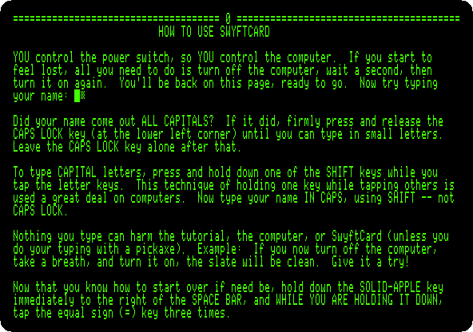
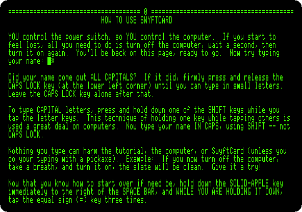
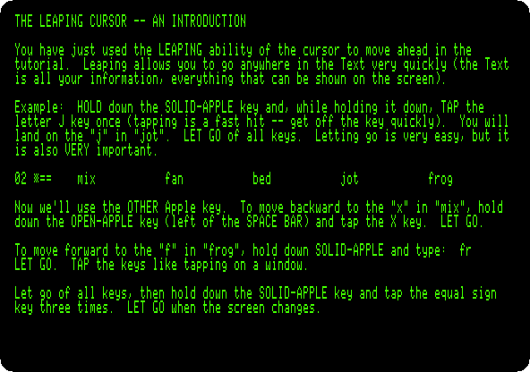
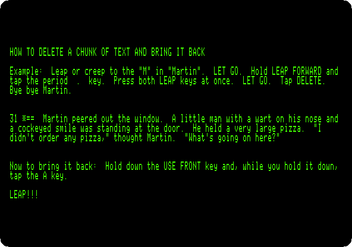
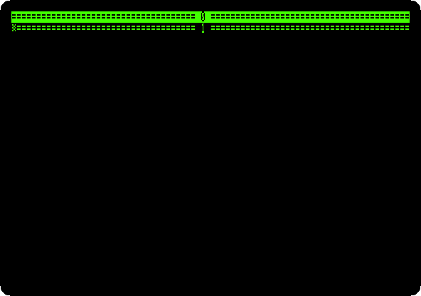
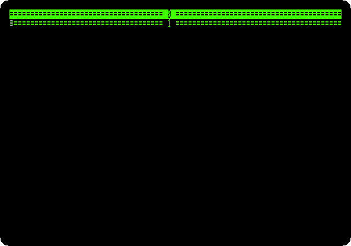
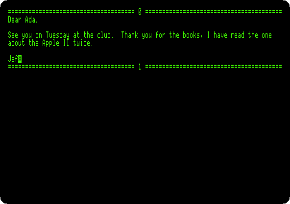

# The SwyftCard

[Back to the activities](../README.md)

Jef Raskin started the Macintosh project at Apple in 1979, and left Apple in
1982 to found Information Appliance, to make a computer simpler still: no
menus, no files to name, no modes, only the text you write and a cursor that
goes where you tell it. In 1985 the company sold the **SwyftCard**, a card
for the Apple //e that takes over the machine when it is switched on and
turns it into that editor. Its ideas went on into the Canon
Cat of 1987.

Its cursor **leaps**: you hold one of two Leap keys and type a few letters,
and the cursor jumps to the next place they are, forward or backward, in a
blink. Everything you have, the whole *Text*, is one long document divided
into pages, and leaping is how you get anywhere in it.

This page follows the SwyftCard's own tutorial through its first leaps and a
chunk of text deleted and brought back, and then writes a letter from
nothing and moves a sentence of it by leaping.

## What you need

**`SwyftWare_-_SwyftCard_Tutorial.woz`**, the tutorial diskette that came
with the card, in the
[SwyftWare collection](https://archive.org/details/swyftware-a2r-woz) of the
Internet Archive. `./fetch-disks.sh` in this repository downloads it into
`disks/` and checks it. The program itself is in the ROM of the card, which
izapple2 carries.

## The machine

An enhanced Apple //e with the SwyftCard and one disk drive:

- the 65C02 processor at 1 MHz and 128 KB of memory: 64 KB on the board,
  the top 16 KB of it the memory of a language card, which izapple2 puts in
  slot 0, and 64 KB more on the extended 80 column card, in the auxiliary
  slot;
- the SwyftCard in slot 3, its program in a ROM of 16 KB that the card puts
  in place of the ROM of the //e;
- a Disk II controller card in slot 6, with the tutorial in drive 1, and
  then with no diskette.

```bash
izapple2 -model none -board 2e -cpu 65c02 -screen green \
    -rom "<internal>/Apple2e_Enhanced.rom" \
    -charrom "<internal>/Apple IIe Video Enhanced.bin" \
    -s0 language \
    -s3 swyftcard \
    -s6 diskii,disk1=disks/SwyftWare_-_SwyftCard_Tutorial.woz
```

For a Text of your own, the same machine with the drive empty:

```bash
izapple2 -model none -board 2e -cpu 65c02 -screen green \
    -rom "<internal>/Apple2e_Enhanced.rom" \
    -charrom "<internal>/Apple IIe Video Enhanced.bin" \
    -s0 language \
    -s3 swyftcard \
    -s6 diskii
```

The model `swyft` of izapple2 has the first machine, with 8 MB more of
memory on a RAMWorks card, a No-Slot Clock, a VidHD card and a Mockingboard
more, and the tutorial diskette that izapple2 carries:

```bash
izapple2 -model swyft -screen green
```

The keys of the SwyftCard are keys of the //e with other names:

| SwyftCard | Apple //e | izapple2 |
|---|---|---|
| Leap Backward | Open Apple | the left Alt or Option key |
| Leap Forward | Solid Apple | the right Alt or Option key |
| Use Front | Control | Control |
| Delete | Delete | Delete |

## The tutorial

1. **Start izapple2** with the first command. The copyright of the card
   shows for a moment while the drive runs, and then the first page of the
   tutorial, in 80 columns.

   

   A line of equal signs with a number, as the one at the top, is the start
   of a page. The tutorial is one Text of 67 pages, and asks you to type in
   it as you read: as it says, nothing you type can harm it, and switched
   off and on again it is as it was.

2. **Hold down Solid Apple, and, while holding it, tap `=` three times.**
   Then let go.

   

   The cursor leaps to the next `===` in the Text, on the next page, and the
   screen shows it there. It searches as you type: the first `=` already
   takes it to the next equal sign, and each one more narrows the search.
   Every page of the tutorial has a line with its number and `===`, so
   leaping to `===` is how you turn its pages.

3. **Leap to `===` again**, to *The leaping cursor -- an introduction*, and
   do what it says: **Solid Apple and `j`**, to the `j` of `jot`; **Open
   Apple and `x`**, back to the `x` of `mix`; and **Solid Apple and `fr`**,
   forward to `frog`.

   

   Solid Apple leaps forward and Open Apple backward, and the cursor lands on
   the first letter of what you typed. A small letter in the pattern finds
   the capital too, and a capital only the capital. Tapped alone, without a
   pattern, a Leap key *creeps*: the cursor moves one character.

4. **Leap on to `===`, page after page**, to page 31, *How to delete a chunk
   of text and bring it back*. The pages on the way teach typing, the
   narrow and the wide cursor, Return, Tab and underlining, each with an
   example to try.

5. **Leap forward to `Mar`**, the `M` of *Martin*; **leap forward to `.`**,
   the full stop at the end of the sentence; and **press both Leap keys at
   once**. Then **press Delete**, and, to bring the sentence back, **hold
   Use Front, Control, and tap `A`**.

   

   Both Leap keys together highlight what the cursor leaped over, the
   sentence, and Delete takes away what is highlighted. Use Front with `A`
   is *Insert*: it puts back the last text deleted, where the cursor is,
   highlighted again. Moving text is the same: delete it, leap to where it
   goes, and insert it.

## A letter of your own

6. **Quit izapple2 and start it with the second command**, with no
   diskette. After the copyright, the Text is empty: the start of page 0
   and of page 1, and the cursor at the start of page 1.

   

7. **Type a letter**, Return only at the end of a paragraph and for a blank
   line between them:

   ```text
   Dear Ada,

   See you on Tuesday at the club.  Thank you for the books, I have read the one about the Apple II twice.

   Jef
   ```

   

   The words that do not fit on a line go on to the next as you type.

8. **Move the thanks before the date.** **Open Apple and `Tha`**, back to
   the `T` of *Thank*; **Solid Apple and `.`**, forward to its full stop;
   **both Leap keys**, and **Delete**. Then **Open Apple and `See`**, back
   to the start of the paragraph, **Control-A**, Insert, and **two spaces**
   after the sentence put back.

   

   No mouse and no menu: the hands stay on the keyboard, and the thumbs on
   the Leap keys.

Two commands of the card do not work in izapple2 yet. *Disk*, Use Front
`L`, saves the whole Text on a blank diskette, and brings it back when the
//e is switched on with that diskette in the drive; izapple2 has no blank
diskette the card can write on, so the letter goes when izapple2 is closed.
*Calc*, Use Front `G`, gives a line like `? 5.6 + 3` to Applesoft and puts
the answer in the Text; in izapple2 Applesoft prints `8.6` and stays at its
prompt. [IZAPPLE2.md](https://github.com/ivanizag/apple2-activities/blob/main/IZAPPLE2.md)
has both.

## What next

[AppleWorks](appleworks.md) is the other way to write a letter on the //e,
with menus and files, and [The Apple //e](apple-iie.md) the machine the
card takes over.
