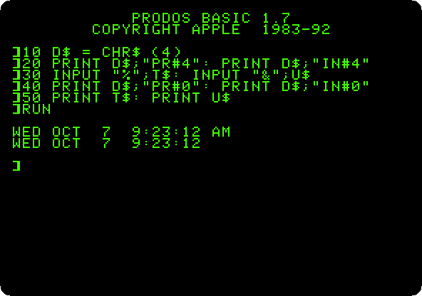
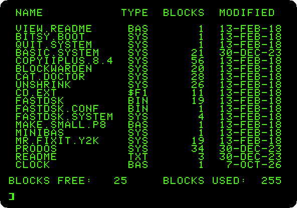

# The time from a ThunderClock

[Back to the activities](../README.md)

An Apple \]\[ did not know what time it was. It counted nothing while it was
off, and when it was on it had no clock to read, so programs asked for the
date, or did without, and the files of a diskette had none. A clock was a
card, as the **ThunderClock Plus**, of Thunderware, Inc., whose manual is
copyrighted 1980 and 1982: a clock chip, an NEC µPD1990AC, with batteries on
the card that kept it running with the Apple off, and firmware in the ROM of
the card to read it from BASIC.

ProDOS, in 1983, looked for a clock card when it started, and when it found
one, it gave every file it saved the date and the time.

This page reads the time from BASIC, as the manual of the card shows, and
saves a program with ProDOS, to see the date in the catalog.

## What you need

**`ProDOS_2_4_3.po`**, ProDOS 2.4.3, from
[its page](https://prodos8.com/releases/prodos-243/). `./fetch-disks.sh` in
this repository downloads it into `disks/` and checks it. The program of the
page is also in this repository, [listings/clock.bas](listings/clock.bas).

## The machine

An Apple \]\[+ with a clock:

- the 6502 processor at 1 MHz and 64 KB of memory: 48 KB on the board, and
  16 KB of a language card, which izapple2 puts in slot 0, and which ProDOS
  needs;
- a ThunderClock Plus in slot 4; izapple2 gives it the time of the computer
  it runs on;
- a Disk II controller card in slot 6, with ProDOS in drive 1.

```bash
izapple2 -model none -board 2plus -cpu 6502 -screen green \
    -rom "<internal>/Apple2_Plus.rom" \
    -charrom "<internal>/Apple2rev7CharGen.rom" -forceCaps \
    -saveDir changes \
    -s0 language \
    -s4 thunderclock \
    -s6 diskii,disk1=disks/ProDOS_2_4_3.po
```

The page saves a program on the diskette of ProDOS. With `-saveDir changes`,
izapple2 keeps what is written in the folder `changes`, and leaves the file
of ProDOS as it was downloaded. Make the folder before starting izapple2:
`mkdir changes`.

## The time in BASIC

1. **Start izapple2** with the command above. ProDOS starts Bitsy Bye;
   **press the down arrow three times**, to `BASIC.SYSTEM`, and **Return**.

2. **Type the program**, from the manual of the card, with its slot, 4, and
   **`RUN`** it:

   ```basic
   10 D$ = CHR$ (4)
   20 PRINT D$;"PR#4": PRINT D$;"IN#4"
   30 INPUT "%";T$: INPUT "&";U$
   40 PRINT D$;"PR#0": PRINT D$;"IN#0"
   50 PRINT T$: PRINT U$
   ```

   

   `PR#4` and `IN#4` send what BASIC prints to the card, and take what it
   reads from it; under ProDOS they are commands given after Control-D,
   `CHR$(4)`. The prompt of `INPUT` goes to the card and tells it how to
   answer: `%` the time with AM or PM, `&` in 24 hours. A space gives it as
   numbers, `10/07 09;21;50.000`, in the format of the Apple Clock of
   Mountain Computer, another clock card, so that the programs written for
   that one worked with this one. `PR#0` and `IN#0` go back to the screen
   and the keyboard.

   The chip keeps the month, the day, the day of the week and the time, and
   not the year.

## The date of a file

3. **Type `SAVE CLOCK`** and **`CAT`**, the catalog of ProDOS that fits in
   40 columns:

   

   `CLOCK`, at the end, has today's date: ProDOS read it from the card, and
   worked out the year itself. The other files have the dates they were
   given when ProDOS 2.4.3 was made. `CATALOG`, wider, has the time of each
   too. Without a clock, as on the page of [ProDOS](prodos.md), the files
   saved have no date.

   The pictures of this page show the day and the time they were made at;
   yours will show yours.

## What next

[ProDOS](prodos.md) goes on with ProDOS on the //e, and
[What is in the slots: Card Cat](card-cat.md) finds a ThunderClock in a slot
among other cards.
