# Time Zone, from the start to the end

[Back to the activities](../README.md)

**Time Zone**, *Hi-Res Adventure #5* of On-Line Systems, came out in 1982 for
the Apple \]\[, written by Ken and Roberta Williams, produced by Bob Davis
and Jeff Stephenson, with graphics by Terry Pierce and Michelle Pritchard. An
adventure of pictures and words, as their *Mystery House* and *Wizard and the
Princess* before it, but far bigger: it came on six diskettes, both sides
used, twelve sides of pictures. A time machine in a field behind your house
takes you to six continents, from 400 million years before Christ to 2082,
and from there to the planet Neburon, whose ruler you have to stop.

You type one or two words, `NORTH`, `GET ROCK`, `GIVE HARE`, and the game
answers under the picture, four lines at a time. In the time machine, the
orange dial sets the year and the blue one the place, and `PULL LEVER` goes
there; the button next to the lever goes home. The game asks for a side of
its disks by its number and letter, `1B` to `6L`, each time it needs another.

This page plays the whole game, all 1,058 commands, with a picture of the
screen after each one, and one for each page of text when the game stops to
let you read: 1,465 pictures. It is long: the game was. The pictures are of
a colour television, with the four lines of text under them drawn white and
sharp, as a monochrome monitor showed them: the television blurred them into
fringes of colour, hard to read.

## What you need

**Time Zone v1.1 (4am and san inc crack)**, from
[its page on the Internet Archive](https://archive.org/details/TimeZone4amCrack):
the zip `Time Zone (4am and san inc crack).zip`, with a file for each side,
from `Time Zone (4am and san inc crack) disk A.dsk` to
`Time Zone (4am and san inc crack) disk L.dsk`. `./fetch-disks.sh` in this
repository downloads them into `disks/` and checks them. The game tells the
sides apart by the volume number of the disk, which a `.dsk` file does not
keep; this crack keeps it inside the disks instead, so the game still knows
when the wrong one is in the drive.

The commands of this page are also in this repository, a line each,
[listings/timezone.txt](listings/timezone.txt). They follow the walkthrough of
[The Sierra Help Pages](https://sierrahelp.com/Walkthroughs/TimeZoneWalkthrough.html),
with what the machine showed it needs: `GO MACHINE` where it says `MACHINE`,
`EAST` where it says `ESAT`, and the `LOOK`s counted where it says to look
until something happens.

The [manual of Time Zone](https://www.mocagh.org/sierra/timezone-manual.pdf)
is on the Museum of Computer Adventure Game History.

## The machine

An Apple \]\[+:

- the 6502 processor at 1 MHz and 48 KB of memory;
- a Disk II controller card in slot 6, with side A in drive 1.

```bash
izapple2 -model none -board 2plus -cpu 6502 -screen color \
    -rom "<internal>/Apple2_Plus.rom" \
    -charrom "<internal>/Apple2rev7CharGen.rom" -forceCaps \
    -s6 'diskii,disk1=disks/Time Zone (4am and san inc crack) disk A.dsk'
```

## Playing it

1. **Start izapple2** with the command above. The title waits for a key;
   **press Return**.

   

2. **Type `1`** to play, and **press Return**.

   

   `2` would make a diskette to save the game on, which this page does not
   need.

3. **Change the disk** each time the game asks for one: drop the file of
   that side on the area of drive 1 of the window of izapple2, and press
   Return. The first is side 1B, to start; the page says each one where it
   comes.

4. **Type the commands**, each followed by Return. When the game stops in
   the middle of an answer to let you read it, **press Return** to go on;
   the pictures of those stops come before the one of the next prompt,
   `ENTER COMMAND?`.

## The walkthrough

<!-- The walkthrough, written by the generator -->


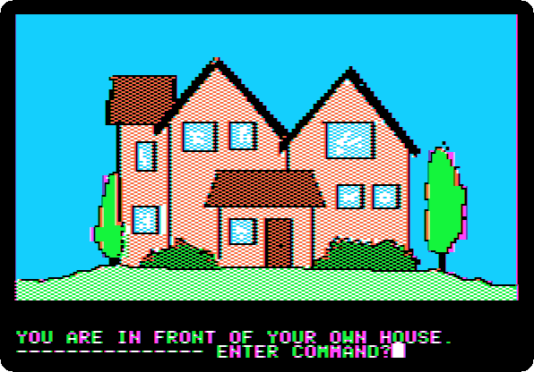

*Side 1B: drop `Time Zone (4am and san inc crack) disk B.dsk` on drive 1, and press Return.*

### Home, 1982

**1.** `NORTH`


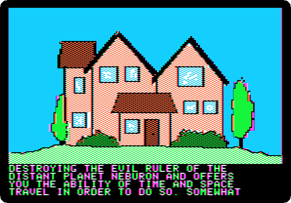
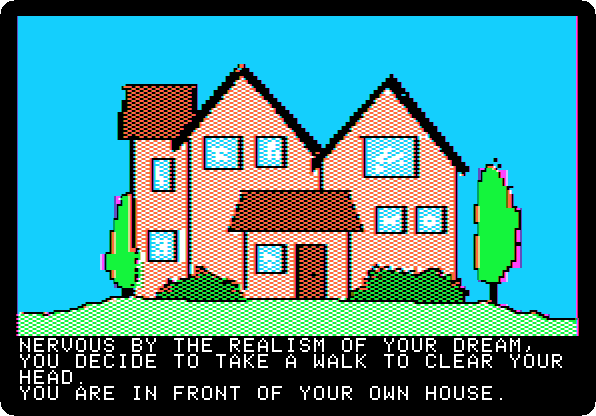


**2.** `NORTH`


**3.** `GO MACHINE`

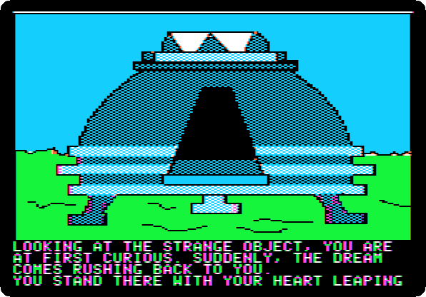
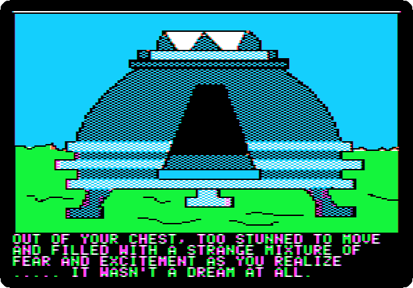
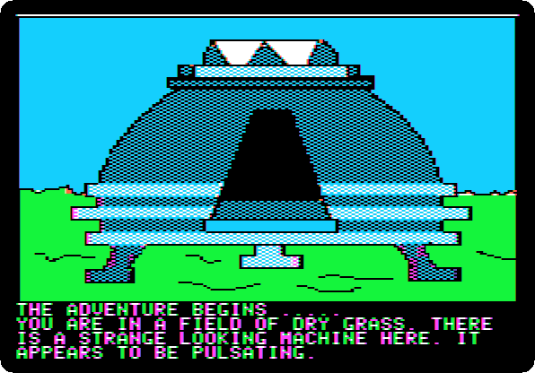


**4.** `GO MACHINE`


**5.** `GET MASK`


**6.** `EXIT MACHINE`


**7.** `DROP MASK`


**8.** `GO MACHINE`


**9.** `SIT`


**10.** `SET ORANGE`


**11.** `400MILBC`


**12.** `SET BLUE`


**13.** `EUROPE`


**14.** `PULL LEVER`


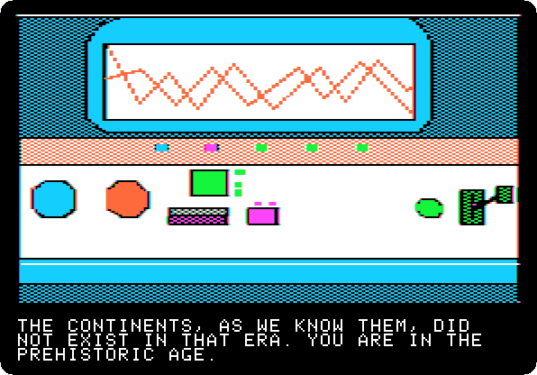
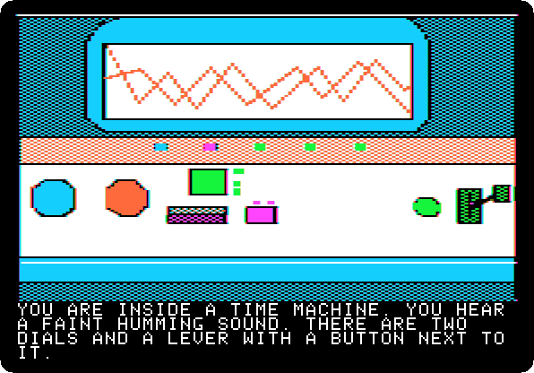


**15.** `EXIT MACHINE`


### Europe, 400 million BC

**16.** `WEST`


**17.** `SOUTH`


**18.** `SOUTH`


**19.** `EAST`


**20.** `EAST`


**21.** `GO CAVE`


**22.** `EXIT CAVE`


**23.** `SOUTH`


**24.** `GET STICK`


**25.** `WEST`


**26.** `NORTH`


**27.** `WEST`


**28.** `NORTH`


**29.** `NORTH`


**30.** `EAST`


**31.** `GO MACHINE`


**32.** `SIT`


**33.** `10000 BC`


**34.** `PULL LEVER`


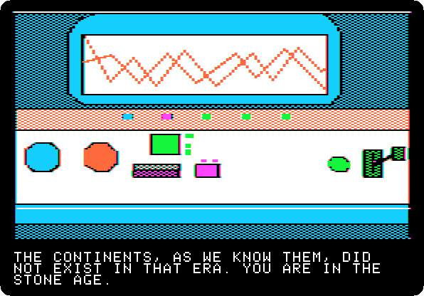


**35.** `EXIT MACHINE`


### Europe, 10,000 BC

**36.** `NORTH`


**37.** `GET ROCK`


**38.** `WEST`


**39.** `WEST`


**40.** `NORTH`


**41.** `NORTH`


**42.** `NORTH`


**43.** `CLIMB TREE`


**44.** `DOWN`


**45.** `NORTH`


**46.** `WEST`


**47.** `NORTH`


**48.** `GET STICKS`


**49.** `SOUTH`


**50.** `EAST`


**51.** `NORTH`


**52.** `THROW STICK`

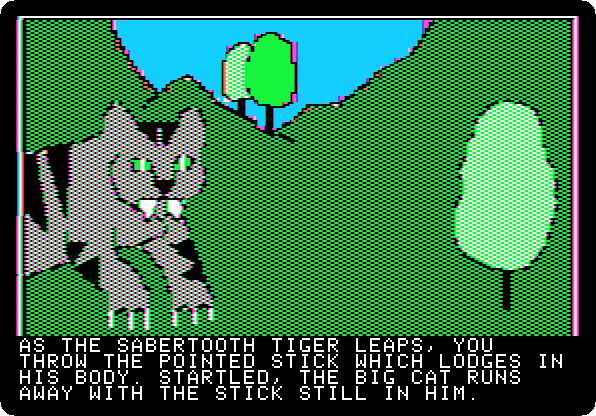


**53.** `NORTH`


**54.** `EAST`


**55.** `SOUTH`


**56.** `SOUTH`


**57.** `WEST`


**58.** `THROW ROCK`


**59.** `GET HARE`


**60.** `EAST`


**61.** `NORTH`


**62.** `NORTH`


**63.** `GO CAVE`


**64.** `MAKE FIRE`


**65.** `GIVE HARE`


**66.** `GET HAMMER`


**67.** `SOUTH`


**68.** `WEST`


**69.** `SOUTH`


**70.** `SOUTH`


**71.** `SOUTH`


**72.** `SOUTH`


**73.** `SOUTH`


**74.** `SOUTH`


**75.** `EAST`


**76.** `DOWN`


**77.** `SOUTH`

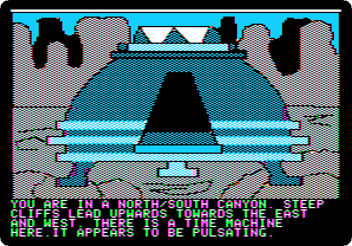


**78.** `GO MACHINE`


**79.** `SIT`


**80.** `SA`


**81.** `1000AD`


**82.** `PULL LEVER`


**83.** `EXIT MACHINE`


*Side 5I: drop `Time Zone (4am and san inc crack) disk I.dsk` on drive 1, and press Return.*

### South America, 1000 AD

**84.** `SOUTH`


**85.** `DOWN`


**86.** `DOWN`


**87.** `DOWN`


**88.** `SOUTH`


**89.** `SOUTH`


**90.** `SOUTH`


**91.** `DROP HAMMER`


**92.** `UP`


**93.** `OPEN DOOR`


**94.** `GO DOOR`


**95.** `DOWN`


**96.** `SOUTH`


**97.** `GET TORCH`


**98.** `NORTH`


**99.** `UP`


**100.** `GO DOOR`


**101.** `THROW TORCH`


**102.** `DOWN`


**103.** `GET TORCH`


**104.** `GET HAMMER`


**105.** `NORTH`


**106.** `NORTH`


**107.** `NORTH`


**108.** `UP`


**109.** `UP`


**110.** `UP`


**111.** `NORTH`


**112.** `GO MACHINE`

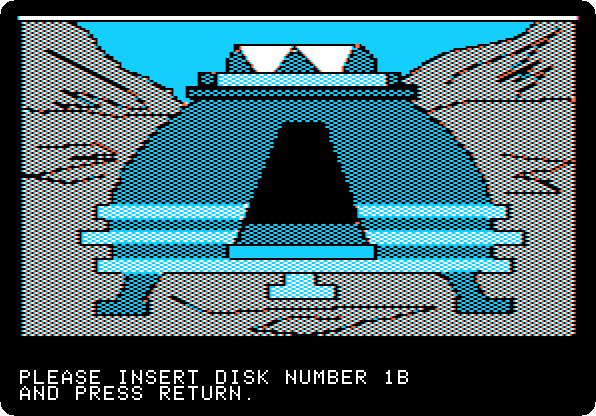


*Side 1B: drop `Time Zone (4am and san inc crack) disk B.dsk` on drive 1, and press Return.*

**113.** `SIT`


**114.** `ASIA`


**115.** `50BC`


**116.** `PULL LEVER`


**117.** `EXIT MACHINE`


*Side 4G: drop `Time Zone (4am and san inc crack) disk G.dsk` on drive 1, and press Return.*

### Asia, 50 BC

**118.** `EAST`


**119.** `EAST`


**120.** `EAST`


**121.** `NORTH`


**122.** `NORTH`


**123.** `GET POLE`


**124.** `SOUTH`


**125.** `SOUTH`


**126.** `SOUTH`


**127.** `SOUTH`


**128.** `GO BOAT`


**129.** `EAST`


**130.** `EXIT BOAT`


**131.** `NORTH`


**132.** `NORTH`


**133.** `NORTH`


**134.** `NORTH`


**135.** `EAST`


**136.** `NORTH`


**137.** `WEST`


**138.** `GET SHOVEL`


**139.** `DIG`

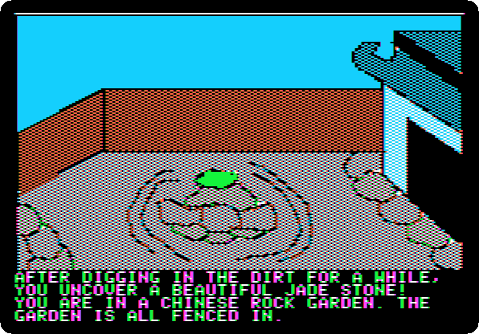


**140.** `GET JADE`


**141.** `DIG`

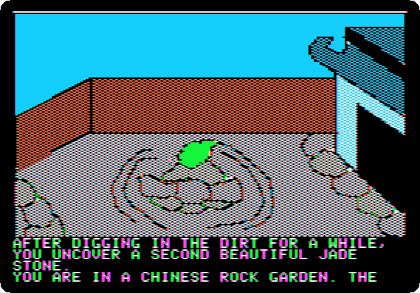


**142.** `GET JADE`


**143.** `DROP SHOVEL`


**144.** `EAST`


**145.** `SOUTH`


**146.** `WEST`


**147.** `SOUTH`


**148.** `SOUTH`


**149.** `SOUTH`


**150.** `SOUTH`


**151.** `SOUTH`


**152.** `EAST`


**153.** `EAST`

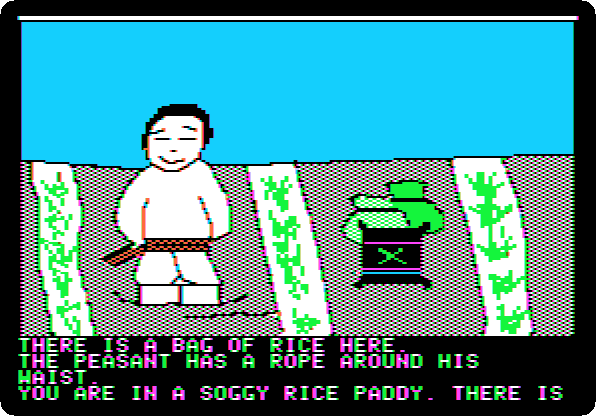


**154.** `BUY ROPE`


**155.** `WITH JADE`


**156.** `BUY RICE`


**157.** `WITH JADE`


**158.** `WEST`


**159.** `WEST`


**160.** `NORTH`


**161.** `GO BOAT`


**162.** `WEST`

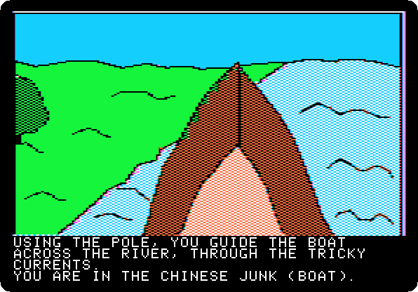


**163.** `EXIT BOAT`


**164.** `NORTH`


**165.** `NORTH`


**166.** `WEST`


**167.** `WEST`


**168.** `WEST`


**169.** `GO MACHINE`

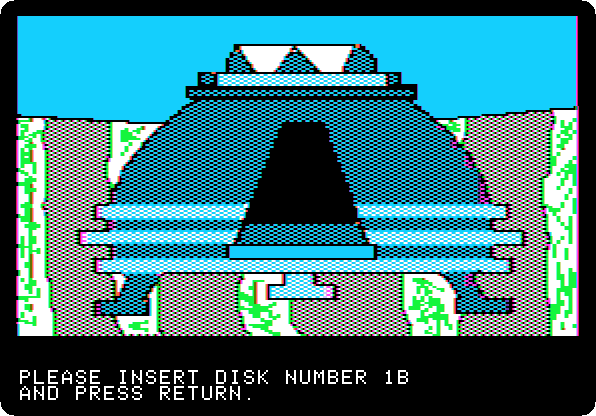


*Side 1B: drop `Time Zone (4am and san inc crack) disk B.dsk` on drive 1, and press Return.*

**170.** `SIT`


**171.** `EUROPE`


**172.** `1400AD`


**173.** `PULL LEVER`


**174.** `EXIT MACHINE`


*Side 2C: drop `Time Zone (4am and san inc crack) disk C.dsk` on drive 1, and press Return.*

### Europe, 1400 AD

**175.** `SOUTH`


**176.** `SOUTH`


**177.** `EAST`


**178.** `OPEN DOOR`


**179.** `GO DOOR`


**180.** `SIGN UP`

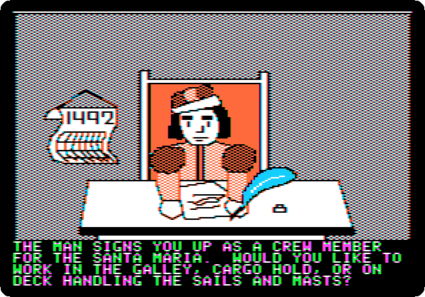


**181.** `ON DECK`


**182.** `SOUTH`


**183.** `WEST`


**184.** `SOUTH`


**185.** `WEST`


**186.** `SHOW PASS`

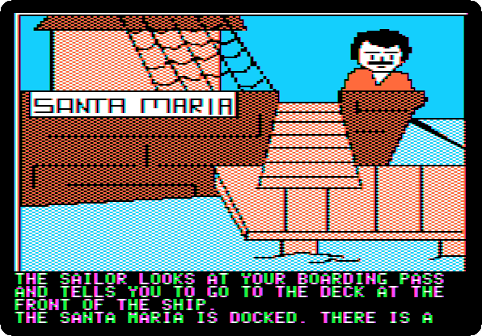


**187.** `NORTH`


**188.** `WEST`


**189.** `WEST`


**190.** `UP`


**191.** `LOOK TELESCOPE`


**192.** `DOWN`


**193.** `EAST`


**194.** `EAST`


**195.** `SOUTH`


**196.** `EAST`


**197.** `EAST`


**198.** `SOUTH`


**199.** `EAST`


**200.** `SOUTH`


**201.** `OPEN DOOR`


**202.** `GO DOOR`


**203.** `GET BAR`


**204.** `WEST`


**205.** `NORTH`


**206.** `WEST`


**207.** `NORTH`


**208.** `WEST`


**209.** `NORTH`


**210.** `NORTH`


**211.** `NORTH`


**212.** `DROP PASS`


**213.** `GO MACHINE`


*Side 1B: drop `Time Zone (4am and san inc crack) disk B.dsk` on drive 1, and press Return.*

**214.** `SIT`


**215.** `AUSTRALIA`


**216.** `1700AD`


**217.** `PULL LEVER`


**218.** `EXIT MACHINE`


*Side 4H: drop `Time Zone (4am and san inc crack) disk H.dsk` on drive 1, and press Return.*

### Australia, 1700 AD

**219.** `NORTH`


**220.** `NORTH`


**221.** `NORTH`


**222.** `NORTH`


**223.** `WEST`


**224.** `BREAK PADLOCK`


**225.** `WITH BAR`

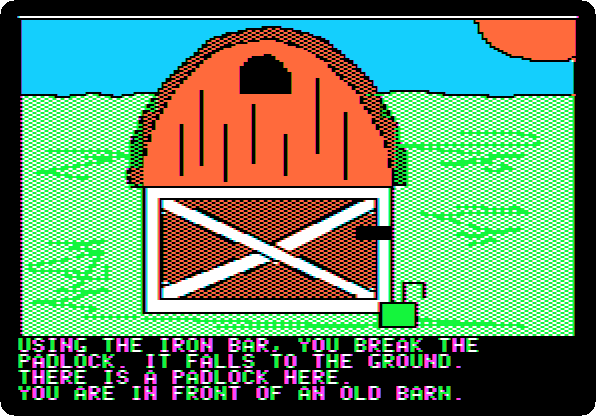


**226.** `OPEN DOOR`


**227.** `NORTH`


**228.** `GET SAW`


**229.** `SOUTH`


**230.** `EAST`


**231.** `SOUTH`


**232.** `SOUTH`


**233.** `SOUTH`


**234.** `SOUTH`


**235.** `GO MACHINE`

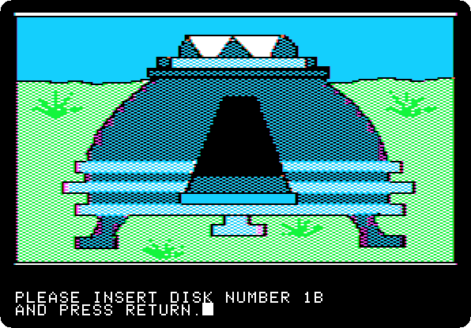


*Side 1B: drop `Time Zone (4am and san inc crack) disk B.dsk` on drive 1, and press Return.*

**236.** `SIT`


**237.** `NA`


**238.** `1700AD`


**239.** `PULL LEVER`


**240.** `EXIT MACHINE`


*Side 5J: drop `Time Zone (4am and san inc crack) disk J.dsk` on drive 1, and press Return.*

### North America, 1700 AD

**241.** `NORTH`


**242.** `NORTH`


**243.** `NORTH`


**244.** `EAST`


**245.** `EAST`


**246.** `BREAK WINDOW`


**247.** `GO WINDOW`


**248.** `NORTH`

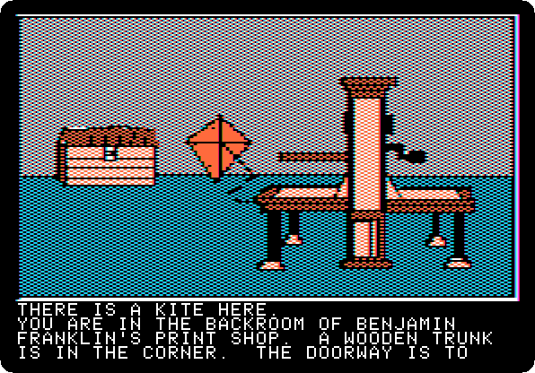


**249.** `USE SAW`


**250.** `LOOK CHEST`


**251.** `GET KEY`


**252.** `SOUTH`


**253.** `GO WINDOW`


**254.** `WEST`


**255.** `WEST`


**256.** `SOUTH`


**257.** `SOUTH`


**258.** `SOUTH`


**259.** `GO MACHINE`

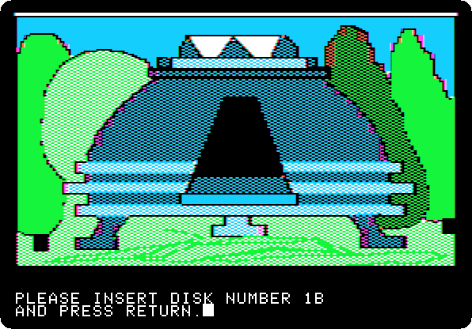


*Side 1B: drop `Time Zone (4am and san inc crack) disk B.dsk` on drive 1, and press Return.*

**260.** `SIT`


**261.** `ASIA`


**262.** `2082AD`


**263.** `PULL LEVER`


**264.** `EXIT MACHINE`


*Side 3F: drop `Time Zone (4am and san inc crack) disk F.dsk` on drive 1, and press Return.*

### Asia, 2082 AD

**265.** `NORTH`


**266.** `DOWN`


**267.** `GO TRAIN`


**268.** `WEST SIDE`


**269.** `LOOK`


**270.** `LEAVE TRAIN`


**271.** `UP`


**272.** `EAST`


**273.** `SOUTH`


**274.** `SOUTH`


**275.** `USE KEY`

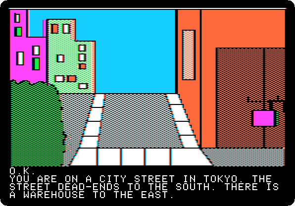


**276.** `GET PADLOCK`


**277.** `DROP PADLOCK`


**278.** `OPEN DOOR`

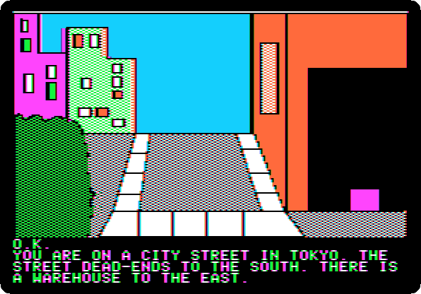


**279.** `EAST`


**280.** `GET YEN`


**281.** `WEST`


**282.** `NORTH`


**283.** `NORTH`


**284.** `WEST`


**285.** `DOWN`


**286.** `GO TRAIN`


**287.** `SIT`

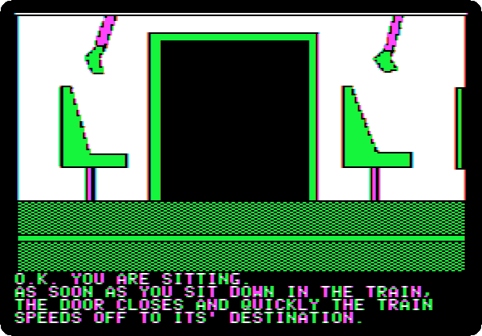


**288.** `LOOK`


**289.** `LEAVE TRAIN`


**290.** `GO TRAIN`


**291.** `SIT`

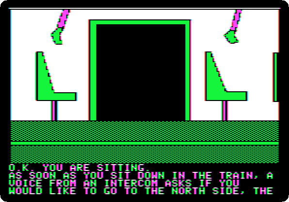


**292.** `NORTH SIDE`


**293.** `LOOK`


**294.** `LEAVE TRAIN`


**295.** `UP`


**296.** `WEST`


**297.** `WEST`


**298.** `NORTH`


**299.** `OPEN DOOR`

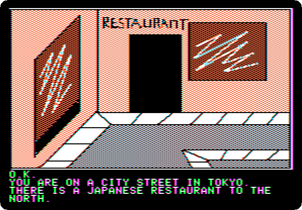


**300.** `NORTH`


**301.** `LOOK`

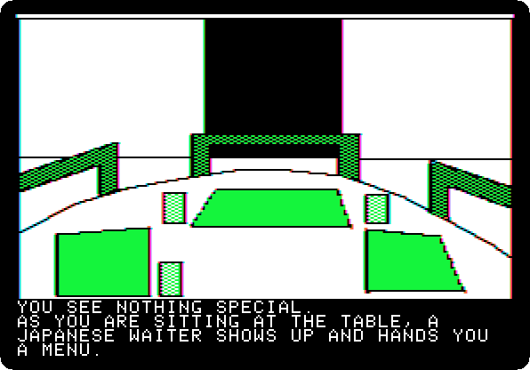


**302.** `READ MENU`


**303.** `LOOK`

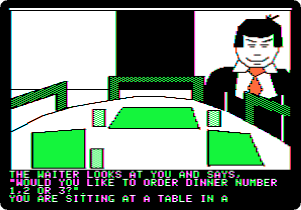


**304.** `2`


**305.** `EAT`


**306.** `NORTH`


**307.** `WASH DISHES`

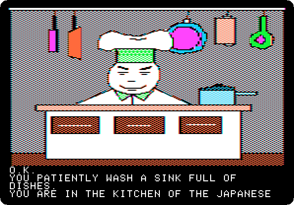


**308.** `OPEN DRAWER`


**309.** `LOOK DRAWER`


**310.** `GET MATCHES`


**311.** `SOUTH`


**312.** `SOUTH`


**313.** `SOUTH`


**314.** `EAST`


**315.** `EAST`


**316.** `DOWN`


**317.** `GO TRAIN`


**318.** `SIT`


**319.** `LOOK`


**320.** `LEAVE TRAIN`


**321.** `UP`


**322.** `SOUTH`

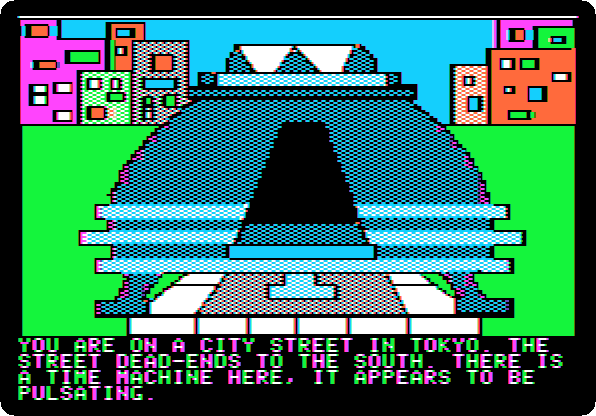


**323.** `GO MACHINE`


*Side 1B: drop `Time Zone (4am and san inc crack) disk B.dsk` on drive 1, and press Return.*

**324.** `SIT`


**325.** `PUSH BUTTON`


**326.** `EXIT MACHINE`


### Home, 1982

**327.** `LIGHT TORCH`


**328.** `DROP MATCHES`


**329.** `DROP BAR`


**330.** `DROP KEY`


**331.** `DROP SAW`


**332.** `GO MACHINE`


**333.** `SIT`


**334.** `EUROPE`


**335.** `1700AD`


**336.** `PULL LEVER`


**337.** `EXIT MACHINE`


*Side 3F: drop `Time Zone (4am and san inc crack) disk F.dsk` on drive 1, and press Return.*

### Europe, 1700 AD

**338.** `NORTH`


**339.** `NORTH`


**340.** `NORTH`


**341.** `NORTH`


**342.** `EAST`


**343.** `NORTH`


**344.** `EAST`


**345.** `CLIMB FENCE`


**346.** `INSIDE`


**347.** `SOUTH`


**348.** `SOUTH`


**349.** `OPEN DOOR`


**350.** `EAST`


**351.** `EAST`


**352.** `UP`


**353.** `EAST`


**354.** `OPEN DOOR`


**355.** `NORTH`


**356.** `GET PERFUME`


**357.** `GET COMB`


**358.** `SOUTH`


**359.** `WEST`


**360.** `DOWN`


**361.** `WEST`


**362.** `WEST`


**363.** `NORTH`


**364.** `NORTH`


**365.** `CLIMB FENCE`


**366.** `OUTSIDE`


**367.** `WEST`


**368.** `SOUTH`


**369.** `WEST`


**370.** `SOUTH`


**371.** `SOUTH`


**372.** `SOUTH`


**373.** `SOUTH`


**374.** `GO MACHINE`

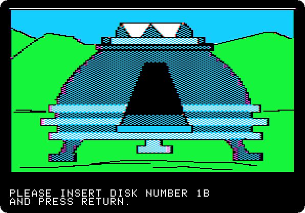


*Side 1B: drop `Time Zone (4am and san inc crack) disk B.dsk` on drive 1, and press Return.*

**375.** `SIT`


**376.** `NA`


**377.** `1400AD`


**378.** `PULL LEVER`


**379.** `EXIT MACHINE`


*Side 2C: drop `Time Zone (4am and san inc crack) disk C.dsk` on drive 1, and press Return.*

### North America, 1400 AD

**380.** `WEST`


**381.** `WEST`


**382.** `SOUTH`

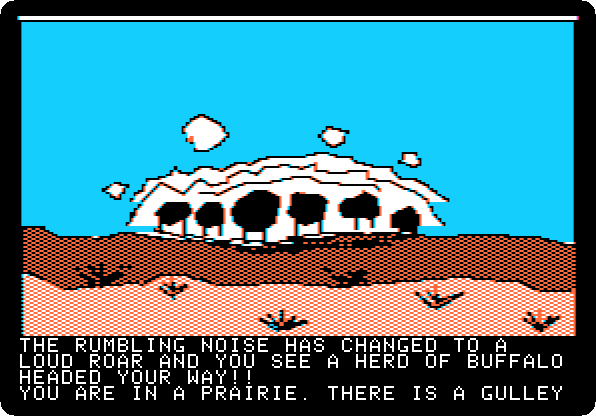


**383.** `GO GULLEY`


**384.** `NORTH`


**385.** `EAST`


**386.** `NORTH`


**387.** `NORTH`


**388.** `NORTH`

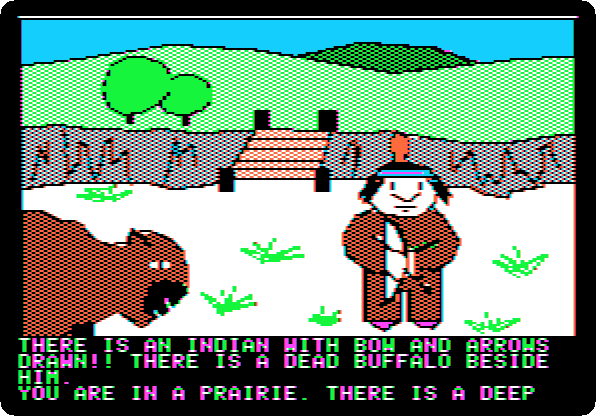


**389.** `NORTH`


**390.** `NORTH`


**391.** `GO TEEPEE`


**392.** `TRADE COMB`

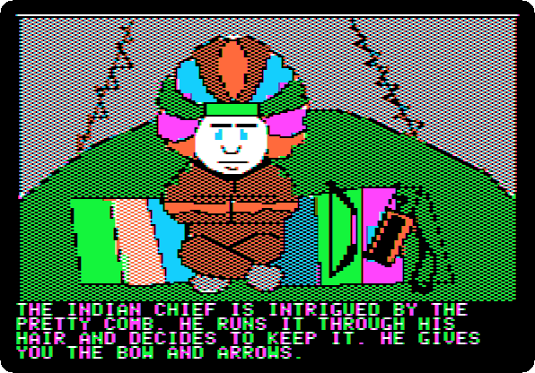


**393.** `SOUTH`


**394.** `SOUTH`


**395.** `SOUTH`


**396.** `SOUTH`


**397.** `SOUTH`


**398.** `SOUTH`


**399.** `EAST`


**400.** `GO MACHINE`

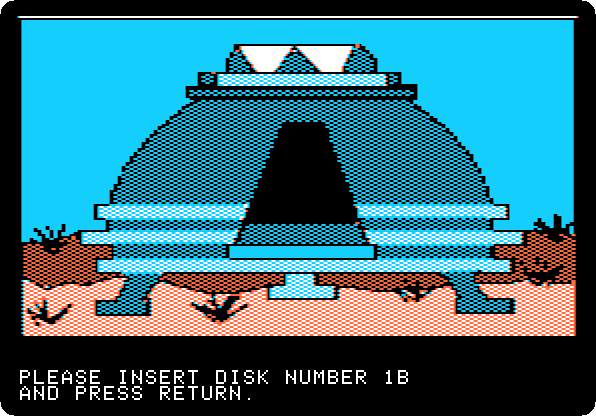


*Side 1B: drop `Time Zone (4am and san inc crack) disk B.dsk` on drive 1, and press Return.*

**401.** `SIT`


**402.** `EUROPE`


**403.** `1000AD`


**404.** `PULL LEVER`


**405.** `EXIT MACHINE`


*Side 3E: drop `Time Zone (4am and san inc crack) disk E.dsk` on drive 1, and press Return.*

### Europe, 1000 AD

**406.** `EAST`


**407.** `EAST`


**408.** `TALK ROBIN`

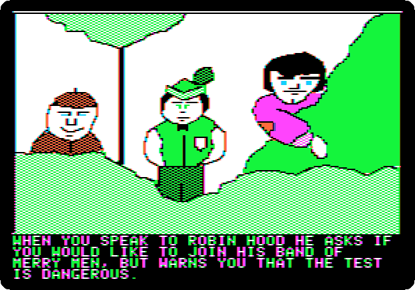


**409.** `YES`


**410.** `SOUTH`


**411.** `SOUTH`


**412.** `EAST`

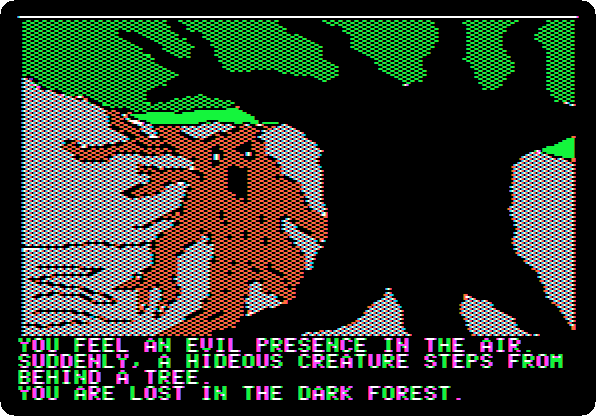


**413.** `USE BOW`


**414.** `SOUTH`


**415.** `NORTH`


**416.** `SOUTH`


**417.** `WEST`

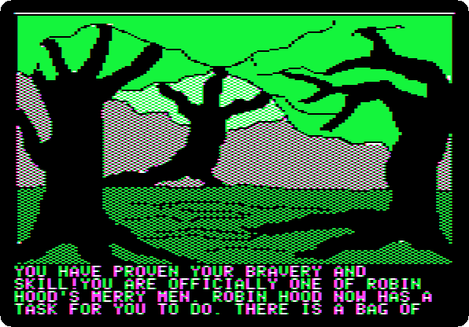
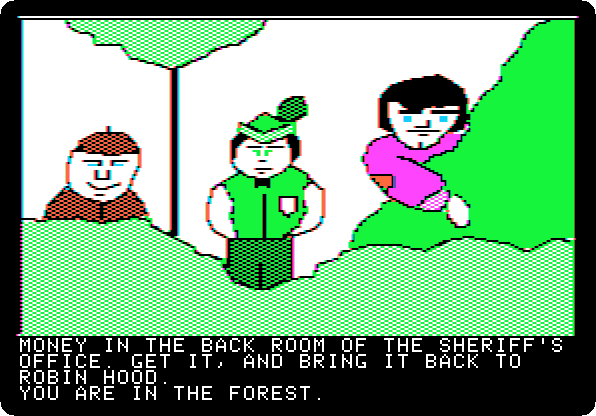


**418.** `WEST`


**419.** `NORTH`


**420.** `NORTH`


**421.** `NORTH`


**422.** `NORTH`


**423.** `NORTH`


**424.** `WEST`


**425.** `WEST`


**426.** `WEST`

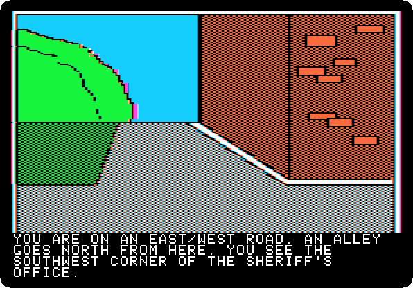


**427.** `WEST`


**428.** `OPEN DOOR`


**429.** `NORTH`


**430.** `GET MIRROR`


**431.** `SOUTH`


**432.** `EAST`


**433.** `NORTH`


**434.** `NORTH`


**435.** `EAST`


**436.** `LOOK WINDOW`


**437.** `TIE ROPE`


**438.** `TO ARROW`


**439.** `SHOOT ARROW`

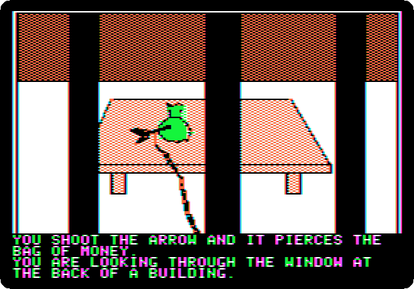


**440.** `PULL ROPE`


**441.** `DROP BOW`


**442.** `EAST`


**443.** `SOUTH`


**444.** `SOUTH`

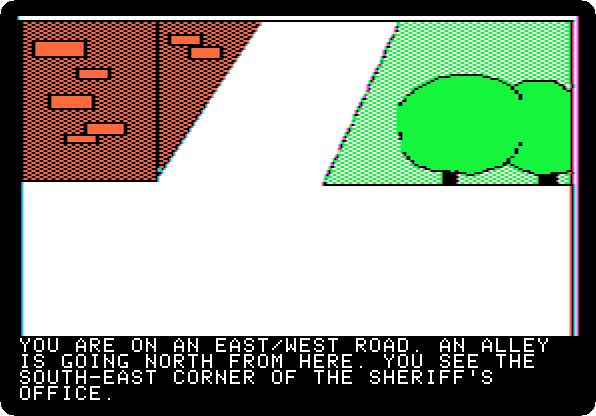


**445.** `EAST`


**446.** `SOUTH`


**447.** `SOUTH`


**448.** `SOUTH`


**449.** `SOUTH`


**450.** `SOUTH`


**451.** `WEST`


**452.** `GO MACHINE`


*Side 1B: drop `Time Zone (4am and san inc crack) disk B.dsk` on drive 1, and press Return.*

**453.** `SIT`


**454.** `AUSTRALIA`


**455.** `PULL LEVER`


**456.** `EXIT MACHINE`


*Side 4H: drop `Time Zone (4am and san inc crack) disk H.dsk` on drive 1, and press Return.*

### Australia, 1000 AD

**457.** `NORTH`


**458.** `WEST`


**459.** `NORTH`


**460.** `EAST`


**461.** `NORTH`


**462.** `NORTH`

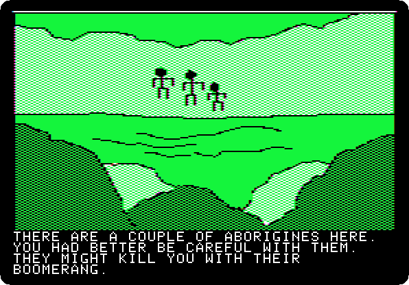


**463.** `GIVE MIRROR`


**464.** `SOUTH`


**465.** `SOUTH`


**466.** `WEST`


**467.** `SOUTH`


**468.** `EAST`


**469.** `SOUTH`


**470.** `GO MACHINE`

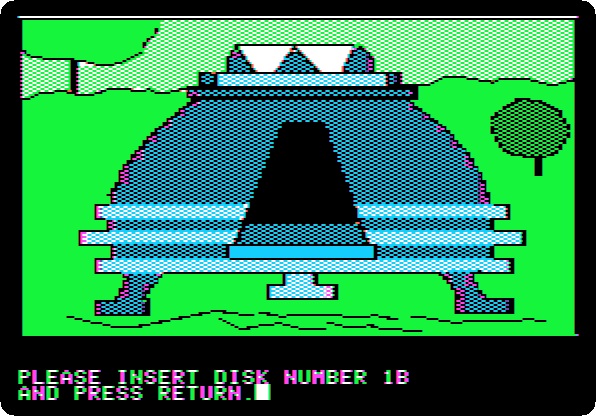


*Side 1B: drop `Time Zone (4am and san inc crack) disk B.dsk` on drive 1, and press Return.*

**471.** `SIT`


**472.** `EUROPE`


**473.** `PULL LEVER`


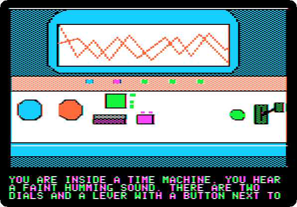


**474.** `EXIT MACHINE`


*Side 3E: drop `Time Zone (4am and san inc crack) disk E.dsk` on drive 1, and press Return.*

### Europe, 1000 AD, again

**475.** `EAST`


**476.** `EAST`


**477.** `GIVE MONEY`

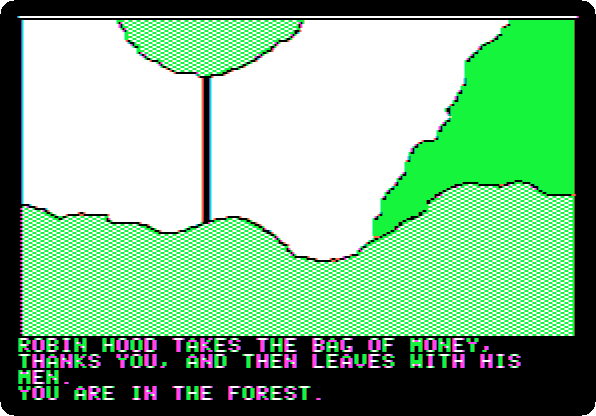


**478.** `WEST`


**479.** `THROW BOOMERANG`

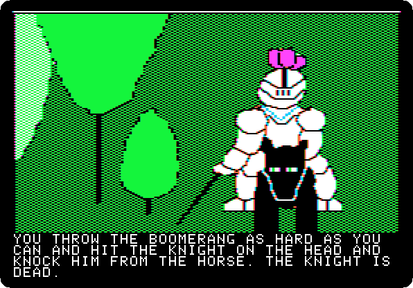


**480.** `GET LANCE`


**481.** `WEST`


**482.** `GO MACHINE`

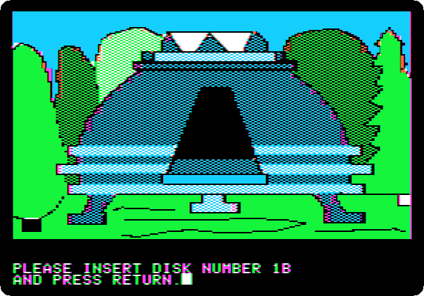


*Side 1B: drop `Time Zone (4am and san inc crack) disk B.dsk` on drive 1, and press Return.*

**483.** `SIT`


**484.** `AFRICA`


**485.** `50BC`


**486.** `PULL LEVER`


**487.** `EXIT MACHINE`


*Side 2D: drop `Time Zone (4am and san inc crack) disk D.dsk` on drive 1, and press Return.*

### Africa, 50 BC

**488.** `SOUTH`


**489.** `SOUTH`


**490.** `SOUTH`


**491.** `SOUTH`


**492.** `WEST`


**493.** `NORTH`


**494.** `WEST`


**495.** `GIVE PERFUME`

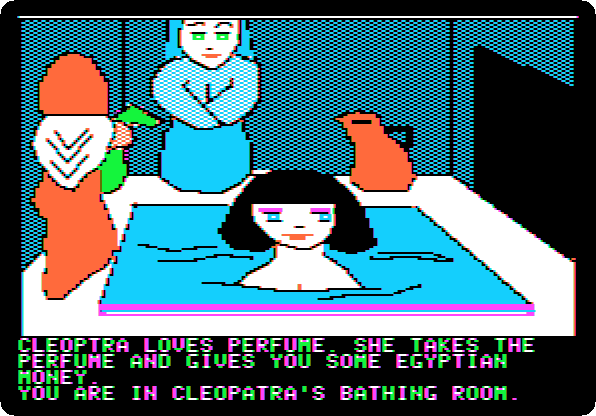


**496.** `EAST`


**497.** `SOUTH`


**498.** `EAST`


**499.** `NORTH`


**500.** `NORTH`


**501.** `WEST`


**502.** `USE MONEY`


**503.** `YES`


**504.** `EAST`


**505.** `NORTH`


**506.** `NORTH`


**507.** `NORTH`


**508.** `DRINK WATER`


**509.** `EAT DATES`


**510.** `WEST`


**511.** `NORTH`


**512.** `NORTH`


**513.** `WEST`


**514.** `NORTH`


**515.** `NORTH`


**516.** `UP`


**517.** `OPEN DOOR`


**518.** `GO DOOR`


**519.** `DOWN`


**520.** `DOWN`


**521.** `DOWN`


**522.** `MOVE STONE`

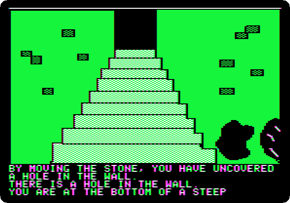


**523.** `GO HOLE`


**524.** `EAST`


**525.** `GET SHIELD`


**526.** `WEST`


**527.** `GO HOLE`


**528.** `UP`


**529.** `UP`


**530.** `UP`

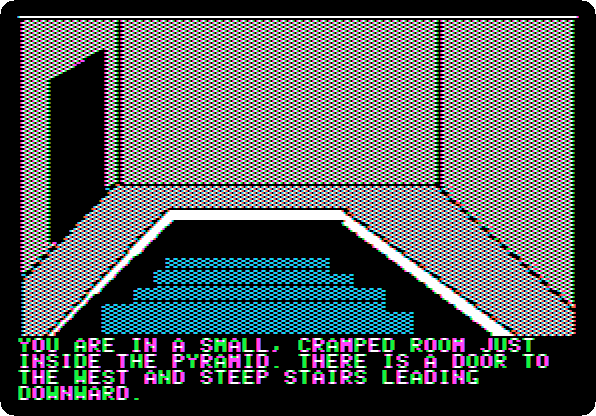


**531.** `GO DOOR`


**532.** `DOWN`


**533.** `SOUTH`


**534.** `SOUTH`


**535.** `EAST`


**536.** `SOUTH`


**537.** `SOUTH`


**538.** `EAST`


**539.** `SOUTH`


**540.** `GO MACHINE`

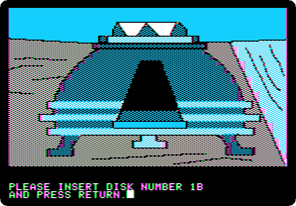


*Side 1B: drop `Time Zone (4am and san inc crack) disk B.dsk` on drive 1, and press Return.*

**541.** `SIT`


**542.** `ASIA`


**543.** `1400AD`


**544.** `PULL LEVER`


**545.** `EXIT MACHINE`


*Side 4G: drop `Time Zone (4am and san inc crack) disk G.dsk` on drive 1, and press Return.*

### Asia, 1400 AD

**546.** `NORTH`


**547.** `NORTH`


**548.** `NORTH`


**549.** `WEST`


**550.** `THROW BOOMERANG`

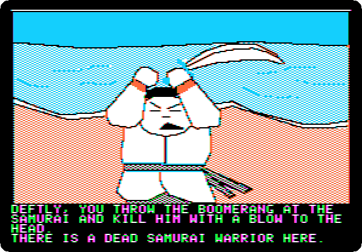


**551.** `GET SWORD`


**552.** `EAST`


**553.** `EAST`


**554.** `EAST`


**555.** `SOUTH`


**556.** `TRADE RICE`

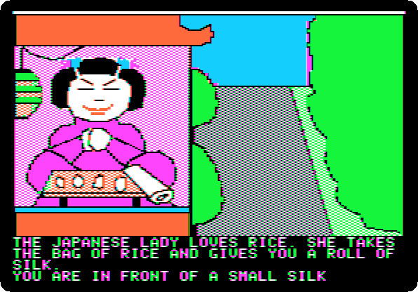


**557.** `WEST`


**558.** `WEST`


**559.** `SOUTH`


**560.** `SOUTH`


**561.** `GO MACHINE`

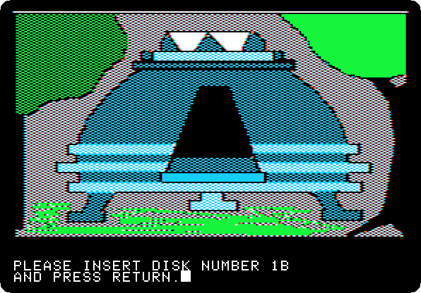


*Side 1B: drop `Time Zone (4am and san inc crack) disk B.dsk` on drive 1, and press Return.*

**562.** `SIT`


**563.** `EUROPE`


**564.** `50BC`


**565.** `PULL LEVER`


**566.** `EXIT MACHINE`


*Side 2C: drop `Time Zone (4am and san inc crack) disk C.dsk` on drive 1, and press Return.*

### Europe, 50 BC

**567.** `EAST`


**568.** `NORTH`


**569.** `NORTH`


**570.** `EAST`


**571.** `NORTH`


**572.** `NORTH`


**573.** `NORTH`


**574.** `NORTH`


**575.** `WEST`


**576.** `NORTH`


**577.** `DOWN`


**578.** `WEST`


**579.** `SOUTH`


**580.** `SOUTH`


**581.** `SOUTH`


**582.** `EAST`


**583.** `SOUTH`


**584.** `GET TWEEZERS`


**585.** `NORTH`


**586.** `NORTH`


**587.** `WEST`


**588.** `NORTH`


**589.** `EAST`


**590.** `UP`


**591.** `EAST`


**592.** `LOOK`


**593.** `USE TWEEZERS`

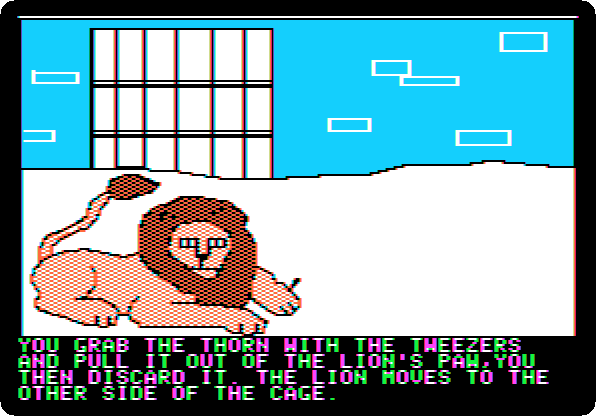


**594.** `OPEN DOOR`


**595.** `WEST`


**596.** `DROP TWEEZERS`


**597.** `SOUTH`


**598.** `WEST`


**599.** `NORTH`


**600.** `EAST`


**601.** `EAST`


**602.** `UP`


**603.** `EAST`


**604.** `LOOK`

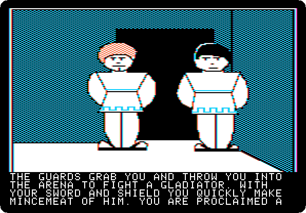
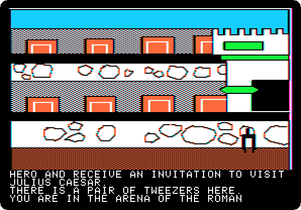


**605.** `SOUTH`


**606.** `SOUTH`


**607.** `EAST`


**608.** `NORTH`


**609.** `WEST`


**610.** `GET LADDER`


**611.** `EAST`


**612.** `SOUTH`


**613.** `WEST`


**614.** `SOUTH`


**615.** `SOUTH`


**616.** `SOUTH`


**617.** `WEST`


**618.** `SOUTH`


**619.** `SOUTH`


**620.** `WEST`


**621.** `GO MACHINE`

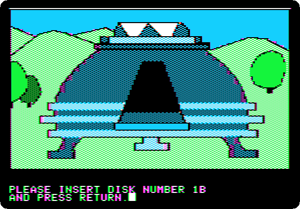


*Side 1B: drop `Time Zone (4am and san inc crack) disk B.dsk` on drive 1, and press Return.*

**622.** `SIT`


**623.** `AFRICA`


**624.** `1000AD`


**625.** `PULL LEVER`


**626.** `EXIT MACHINE`


*Side 2D: drop `Time Zone (4am and san inc crack) disk D.dsk` on drive 1, and press Return.*

### Africa, 1000 AD

**627.** `NORTH`


**628.** `NORTH`


**629.** `WEST`


**630.** `GET LOG`


**631.** `EAST`


**632.** `DROP LOG`


**633.** `EAST`


**634.** `GET LOG`


**635.** `WEST`

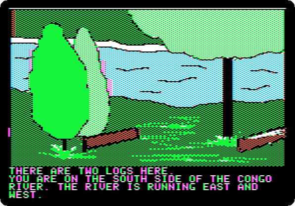


**636.** `DROP LOG`


**637.** `MAKE RAFT`


**638.** `CROSS RIVER`


**639.** `NORTH`


**640.** `EAST`


**641.** `NORTH`


**642.** `NORTH`


**643.** `NORTH`


**644.** `GET TUSKS`


**645.** `WITH HAMMER`


**646.** `USE LADDER`


**647.** `SOUTH`


**648.** `SOUTH`


**649.** `WEST`


**650.** `CROSS RIVER`


**651.** `SOUTH`


**652.** `GET ROPE`

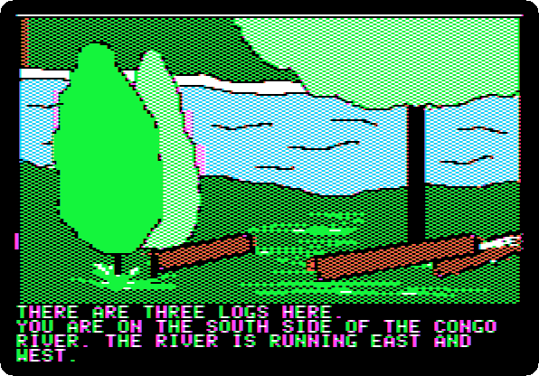


**653.** `SOUTH`


**654.** `SOUTH`


**655.** `GO MACHINE`

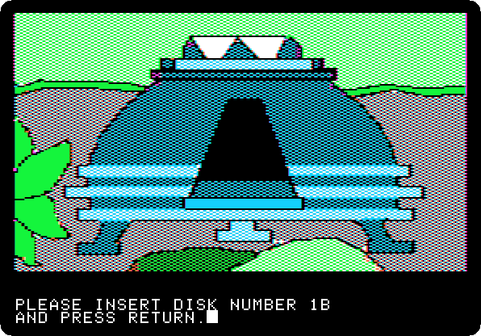


*Side 1B: drop `Time Zone (4am and san inc crack) disk B.dsk` on drive 1, and press Return.*

**656.** `SIT`


**657.** `AFRICA`


**658.** `1400AD`


**659.** `PULL LEVER`


**660.** `EXIT MACHINE`


*Side 2D: drop `Time Zone (4am and san inc crack) disk D.dsk` on drive 1, and press Return.*

### Africa, 1400 AD

**661.** `NORTH`


**662.** `NORTH`


**663.** `NORTH`


**664.** `NORTH`


**665.** `TRADE TUSKS`

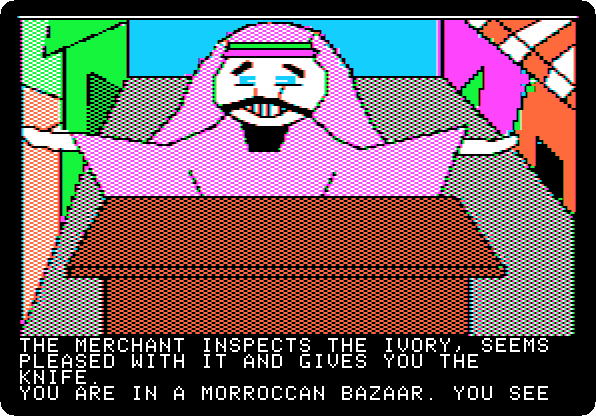


**666.** `NORTH`


**667.** `SOUTH`


**668.** `TRADE SILK`

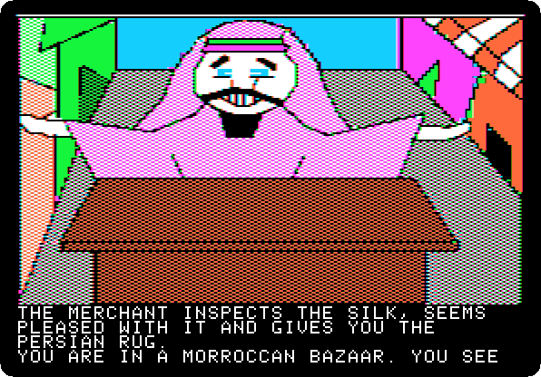


**669.** `SOUTH`


**670.** `SOUTH`


**671.** `SOUTH`


**672.** `SOUTH`

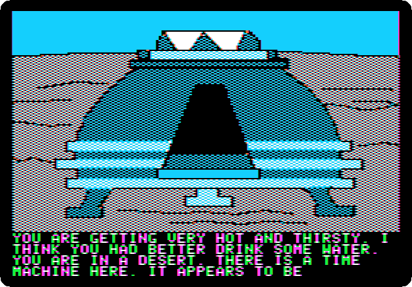


**673.** `GO MACHINE`


*Side 1B: drop `Time Zone (4am and san inc crack) disk B.dsk` on drive 1, and press Return.*

**674.** `SIT`


**675.** `ASIA`


**676.** `1000AD`


**677.** `PULL LEVER`


**678.** `EXIT MACHINE`


*Side 4G: drop `Time Zone (4am and san inc crack) disk G.dsk` on drive 1, and press Return.*

### Asia, 1000 AD

**679.** `EAST`


**680.** `NORTH`


**681.** `NORTH`


**682.** `EAST`


**683.** `TRADE RUG`

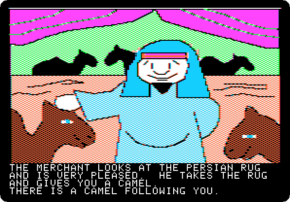


**684.** `RIDE CAMEL`


**685.** `WEST`


**686.** `SOUTH`


**687.** `WEST`


**688.** `WEST`


**689.** `NORTH`


**690.** `NORTH`


**691.** `NORTH`


**692.** `EAST`


**693.** `EAST`


**694.** `NORTH`

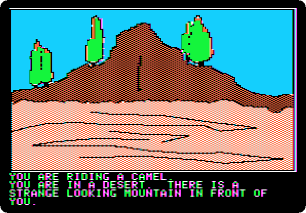


**695.** `DISMOUNT CAMEL`


**696.** `OPEN SESAME`


**697.** `GO CAVE`


**698.** `NORTH`


**699.** `EAST`


**700.** `GET GOLD`


**701.** `WEST`


**702.** `SOUTH`


**703.** `OPEN SESAME`


**704.** `SOUTH`


**705.** `RIDE CAMEL`


**706.** `SOUTH`


**707.** `WEST`


**708.** `WEST`


**709.** `SOUTH`


**710.** `SOUTH`


**711.** `SOUTH`


**712.** `SOUTH`


**713.** `EAST`

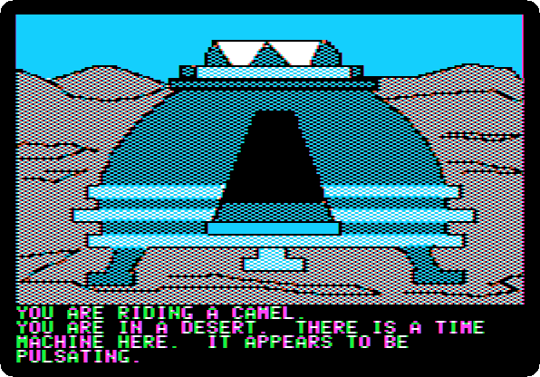


**714.** `DISMOUNT CAMEL`


**715.** `GO MACHINE`


*Side 1B: drop `Time Zone (4am and san inc crack) disk B.dsk` on drive 1, and press Return.*

**716.** `SIT`


**717.** `AUSTRALIA`


**718.** `2082AD`


**719.** `PULL LEVER`


**720.** `EXIT MACHINE`


*Side 3E: drop `Time Zone (4am and san inc crack) disk E.dsk` on drive 1, and press Return.*

### Australia, 2082 AD

**721.** `NORTH`


**722.** `NORTH`


**723.** `BREAK WINDOW`

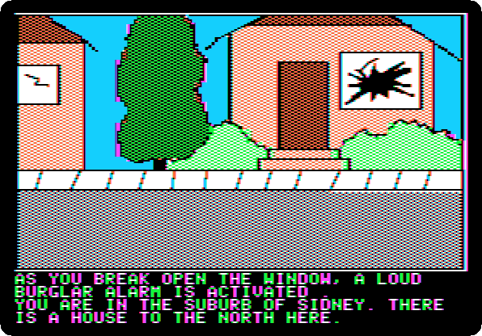


**724.** `GO WINDOW`


**725.** `WEST`


**726.** `OPEN CLOSET`


**727.** `GET COAT`


**728.** `EAST`


**729.** `GO WINDOW`


**730.** `SOUTH`


**731.** `SOUTH`


**732.** `GO MACHINE`

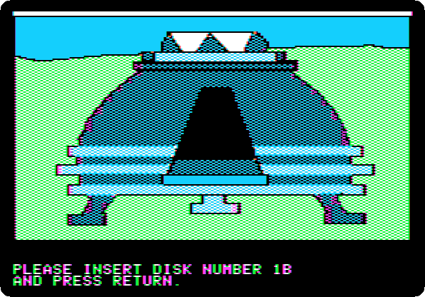


*Side 1B: drop `Time Zone (4am and san inc crack) disk B.dsk` on drive 1, and press Return.*

**733.** `SIT`


**734.** `ASIA`


**735.** `1700AD`


**736.** `PULL LEVER`


**737.** `EXIT MACHINE`


*Side 4H: drop `Time Zone (4am and san inc crack) disk H.dsk` on drive 1, and press Return.*

### Asia, 1700 AD

**738.** `WEAR COAT`


**739.** `SOUTH`


**740.** `SOUTH`


**741.** `SOUTH`


**742.** `SOUTH`


**743.** `SOUTH`


**744.** `EAST`


**745.** `EAST`

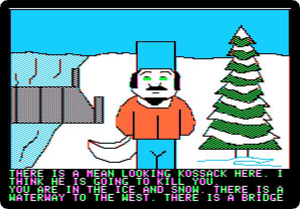


**746.** `KILL KOSSACK`


**747.** `EAST`


**748.** `EAST`


**749.** `NORTH`


**750.** `NORTH`


**751.** `LOOK`


**752.** `LOOK`


**753.** `LOOK`


**754.** `LOOK`


**755.** `LOOK`

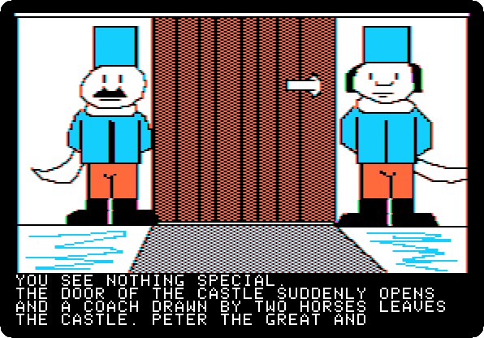
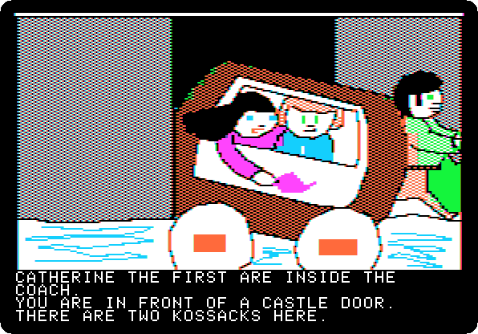


**756.** `LOOK`


**757.** `LOOK`


**758.** `GET PIN`


**759.** `SOUTH`


**760.** `SOUTH`


**761.** `WEST`


**762.** `WEST`


**763.** `WEST`


**764.** `WEST`


**765.** `NORTH`


**766.** `NORTH`


**767.** `NORTH`


**768.** `NORTH`


**769.** `NORTH`


**770.** `GO MACHINE`


*Side 1B: drop `Time Zone (4am and san inc crack) disk B.dsk` on drive 1, and press Return.*

**771.** `SIT`


**772.** `PUSH BUTTON`


**773.** `EXIT MACHINE`


### Home, 1982

**774.** `DROP SWORD`


**775.** `DROP SHIELD`


**776.** `DROP POLE`


**777.** `DROP COAT`


**778.** `GET KEY`


**779.** `GET MASK`


**780.** `GET BAR`


**781.** `GET SAW`


**782.** `GO MACHINE`


**783.** `SIT`


**784.** `NA`


**785.** `2082AD`


**786.** `PULL LEVER`


**787.** `EXIT MACHINE`


*Side 5I: drop `Time Zone (4am and san inc crack) disk I.dsk` on drive 1, and press Return.*

### North America, 2082 AD

**788.** `SOUTH`


**789.** `SOUTH`


**790.** `EAST`


**791.** `SOUTH`


**792.** `WEST`


**793.** `WEST`


**794.** `WEST`


**795.** `NORTH`


**796.** `GET MAT`


**797.** `DROP MAT`


**798.** `GET KEY`


**799.** `SOUTH`


**800.** `UNLOCK TRUNK`

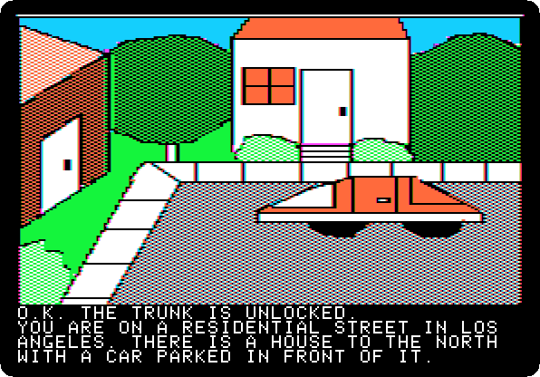


**801.** `OPEN TRUNK`


**802.** `LOOK TRUNK`


**803.** `GET DYNAMITE`


**804.** `EAST`


**805.** `EAST`


**806.** `EAST`


**807.** `NORTH`


**808.** `WEST`


**809.** `NORTH`


**810.** `NORTH`


**811.** `GO MACHINE`

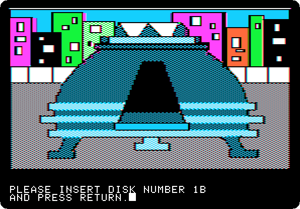
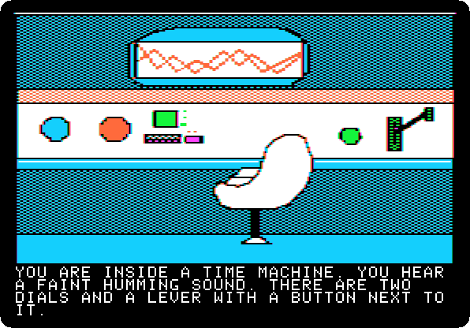


*Side 1B: drop `Time Zone (4am and san inc crack) disk B.dsk` on drive 1, and press Return.*

**812.** `SIT`


**813.** `EUROPE`


**814.** `2082AD`


**815.** `PULL LEVER`


**816.** `EXIT MACHINE`


### Europe, 2082 AD

**817.** `NORTH`


**818.** `WEST`


**819.** `NORTH`


**820.** `NORTH`


**821.** `WEST`


**822.** `WEST`


**823.** `WEST`


**824.** `GET DOG`


**825.** `TIE ROPE`


**826.** `TO DOG`


**827.** `EAST`


**828.** `EAST`


**829.** `EAST`


**830.** `SOUTH`


**831.** `SOUTH`


**832.** `EAST`


**833.** `EAST`


**834.** `EAST`


**835.** `NORTH`

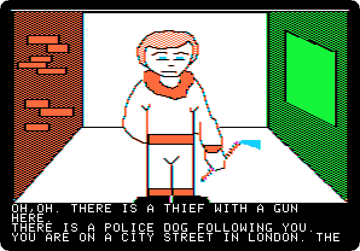


**836.** `UNTIE DOG`


**837.** `GET GUN`


**838.** `SOUTH`


**839.** `WEST`


**840.** `WEST`


**841.** `SOUTH`


**842.** `GO MACHINE`


**843.** `SIT`


**844.** `4082AD`


**845.** `IP`


**846.** `PULL LEVER`


**847.** `WEAR MASK`


**848.** `EXIT MACHINE`


*Side 6K: drop `Time Zone (4am and san inc crack) disk K.dsk` on drive 1, and press Return.*

### Neburon, 4082 AD

**849.** `NORTH`


**850.** `NORTH`


**851.** `NORTH`


**852.** `EAST`


**853.** `EAST`


**854.** `DOWN`


**855.** `EAST`


**856.** `SOUTH`


**857.** `USE HAMMER`

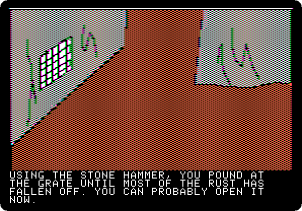


**858.** `DROP HAMMER`


**859.** `OPEN GRATE`


**860.** `WEST`


**861.** `WEST`


**862.** `WEST`


**863.** `NORTH`


**864.** `USE KNIFE`

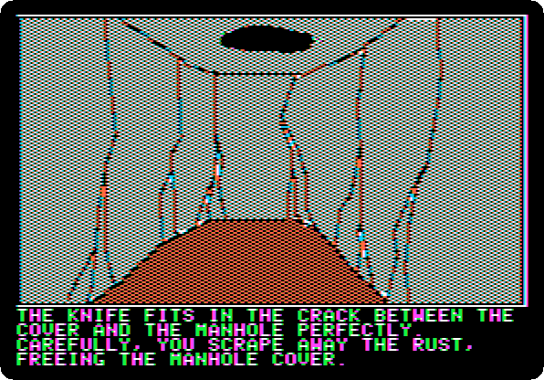


**865.** `DROP KNIFE`


**866.** `OPEN COVER`

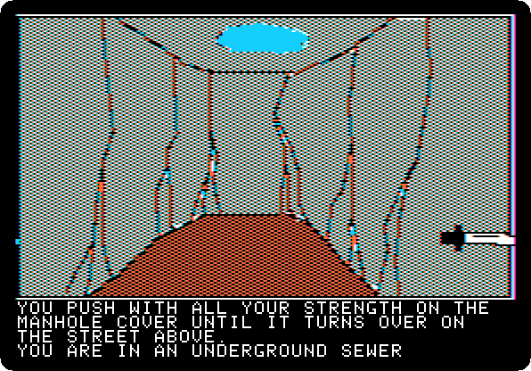


**867.** `UP`


**868.** `GET WALLET`


**869.** `OPEN WALLET`


**870.** `GET ID`


**871.** `DROP WALLET`


**872.** `DOWN`


**873.** `SOUTH`


**874.** `EAST`


**875.** `EAST`


**876.** `TIE ROPE`

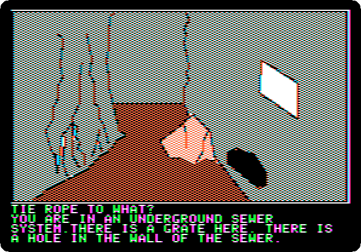


**877.** `TO ROCK`


**878.** `DOWN`


**879.** `WEST`


**880.** `WEST`


**881.** `WEST`


**882.** `UP`


**883.** `WEST`


**884.** `WEST`


**885.** `OPEN GRATE`


**886.** `NORTH`

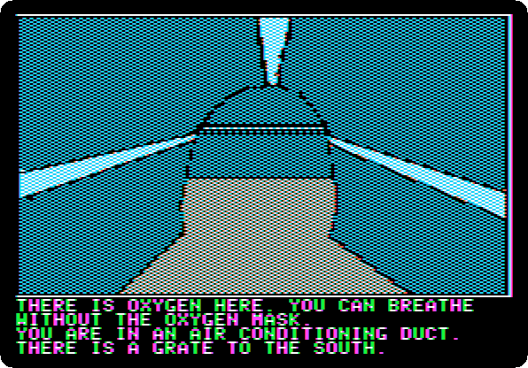


**887.** `REMOVE MASK`


**888.** `EAST`


**889.** `NORTH`


**890.** `OPEN GRATE`


**891.** `DOWN`


**892.** `SOUTH`


**893.** `EAST`


**894.** `CLOSE DOOR`

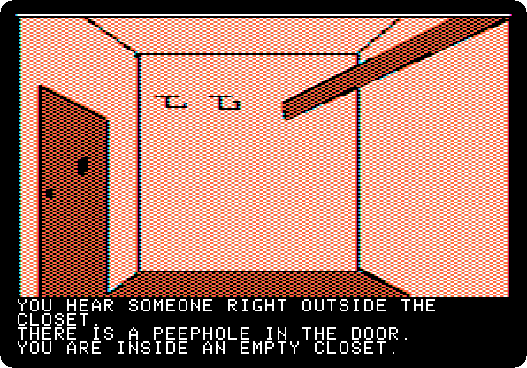


**895.** `LOOK PEEPHOLE`


**896.** `LOOK`


**897.** `OPEN DOOR`


**898.** `WEST`


**899.** `NORTH`


**900.** `NORTH`


**901.** `USE GUN`


**902.** `GET UNIFORM`


**903.** `WEAR UNIFORM`


**904.** `EAST`


**905.** `NORTH`


**906.** `NORTH`

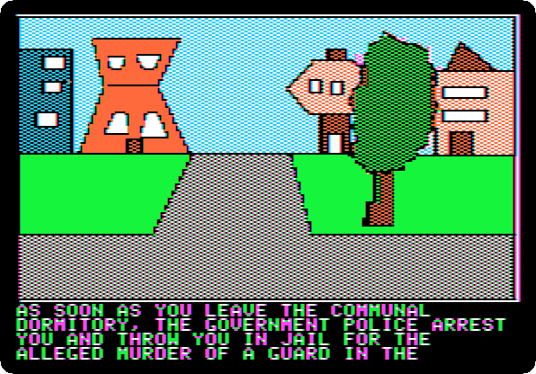


**907.** `USE SAW`


**908.** `GO WINDOW`


**909.** `EAST`

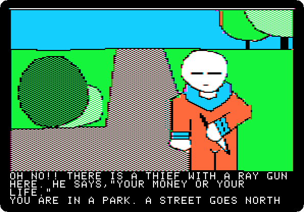


**910.** `GIVE GOLD`


**911.** `NORTH`


**912.** `EAST`


**913.** `EAST`


**914.** `EAST`


**915.** `GET FLOWER`


**916.** `WEST`


**917.** `WEST`


**918.** `WEST`


**919.** `WEST`


**920.** `NORTH`

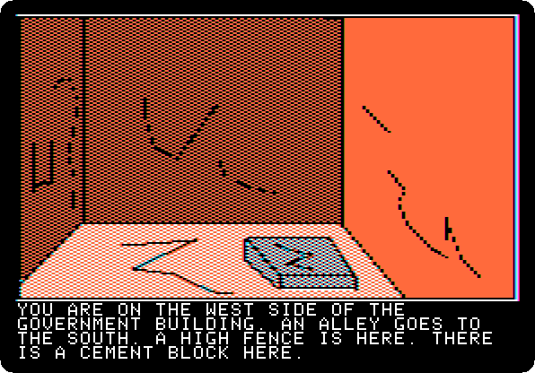


**921.** `USE BAR`


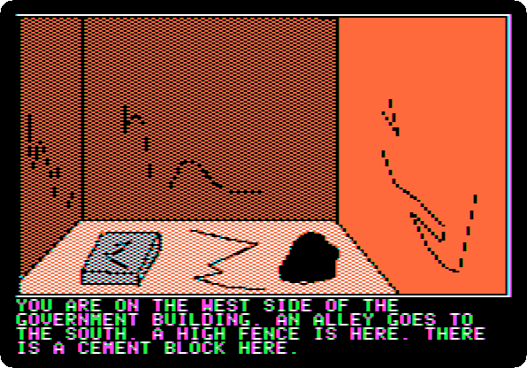


**922.** `WEAR MASK`


**923.** `DOWN`


**924.** `NORTH`


**925.** `EAST`


**926.** `USE LADDER`

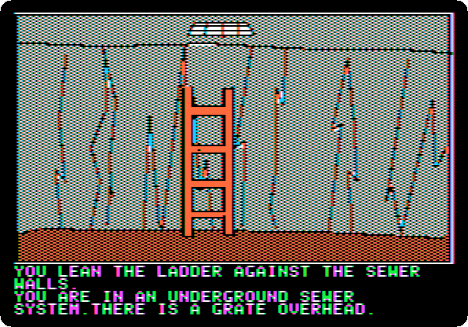


**927.** `OPEN GRATE`


**928.** `UP`

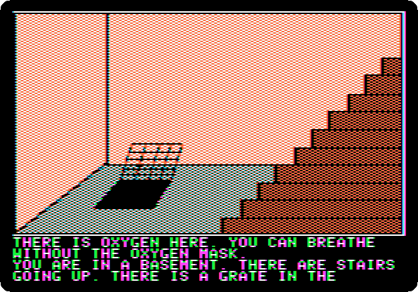


**929.** `REMOVE MASK`


**930.** `UP`


**931.** `OPEN DOOR`


**932.** `EAST`


**933.** `NORTH`


*Side 6L: drop `Time Zone (4am and san inc crack) disk L.dsk` on drive 1, and press Return.*

**934.** `WEST`


**935.** `OPEN DRAWER`


**936.** `LOOK DRAWER`


**937.** `GET MC`


**938.** `EAST`


**939.** `EAST`


**940.** `EAST`


**941.** `SOUTH`


**942.** `USE PIN`

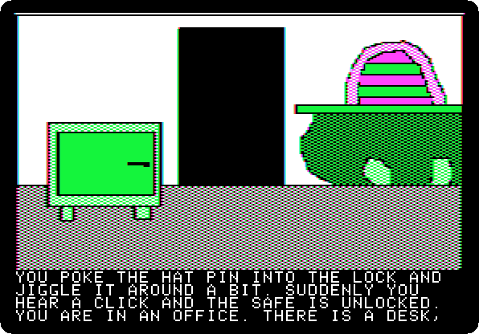


**943.** `OPEN SAFE`


**944.** `LOOK SAFE`


**945.** `GET NOTE`


**946.** `READ NOTE`


**947.** `NORTH`


**948.** `NORTH`


**949.** `OPEN DOOR`


**950.** `EAST`


**951.** `CLOSE DOOR`


**952.** `USE GUN`


**953.** `OPEN DRAWER`


**954.** `LOOK DRAWER`


**955.** `GET MC`


**956.** `LOOK ROOM`


**957.** `DROP GUN`


**958.** `OPEN DOOR`


**959.** `WEST`


**960.** `NORTH`


**961.** `WEST`


**962.** `INSERT MC`

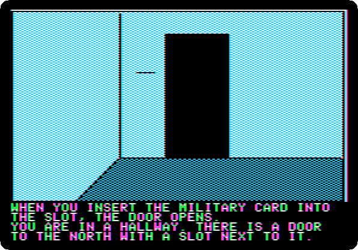


**963.** `NORTH`


**964.** `WEST`


**965.** `OPEN DOOR`


**966.** `GO SHED`


**967.** `CLOSE DOOR`


**968.** `LOOK`


**969.** `LOOK`


**970.** `LOOK`


**971.** `LOOK`


**972.** `LOOK`


**973.** `LOOK`


**974.** `LOOK`


**975.** `LOOK`


**976.** `LOOK`


**977.** `LOOK`


**978.** `LOOK`


**979.** `LOOK`

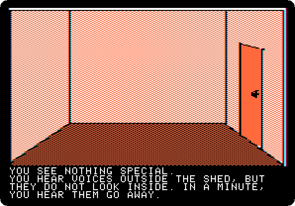


**980.** `OPEN DOOR`


**981.** `EAST`


**982.** `EAST`


**983.** `NORTH`


**984.** `USE KEY`

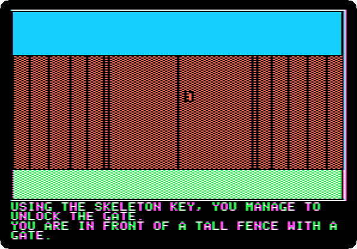


**985.** `OPEN GATE`


**986.** `NORTH`


**987.** `NORTH`


**988.** `LOOK`

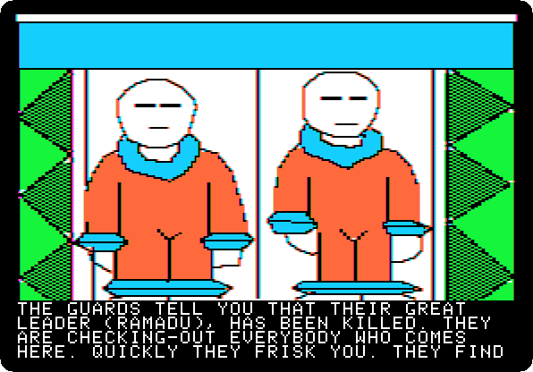


**989.** `ALLEGIANCE`


**990.** `NORTH`


**991.** `NORTH`


**992.** `LOOK`


**993.** `SHOW ID`


**994.** `SHOW MC`


**995.** `WEST`


**996.** `WEST`


**997.** `SOUTH`


**998.** `SOUTH`


**999.** `GIVE FLOWER`

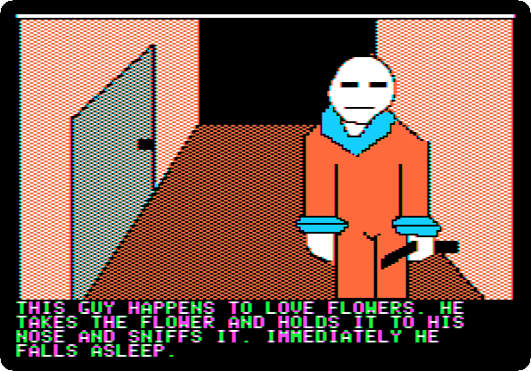


**1000.** `OPEN DOOR`


**1001.** `WEST`


**1002.** `CLOSE DOOR`


**1003.** `USE LANCE`

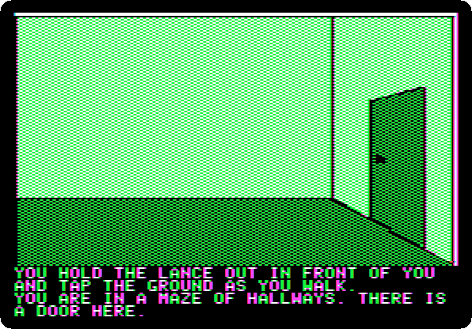


**1004.** `WEST`


**1005.** `WEST`


**1006.** `SOUTH`

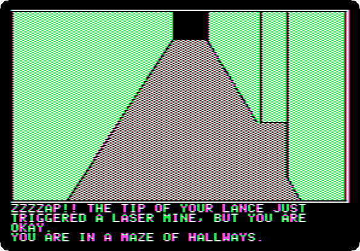


**1007.** `SOUTH`


**1008.** `WEST`


**1009.** `SOUTH`


**1010.** `EAST`


**1011.** `SOUTH`


**1012.** `SOUTH`


**1013.** `SOUTH`


**1014.** `SOUTH`


**1015.** `WEST`


**1016.** `WEST`


**1017.** `WEST`


**1018.** `NORTH`


**1019.** `WEST`


**1020.** `SOUTH`


**1021.** `SOUTH`


**1022.** `WEST`


**1023.** `SOUTH`


**1024.** `INSERT MC`

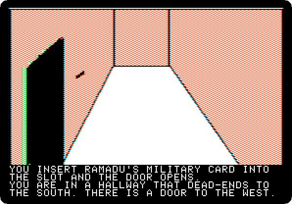


**1025.** `WEST`


**1026.** `DROP DYNAMITE`


**1027.** `LIGHT FUSE`


**1028.** `EAST`


**1029.** `NORTH`


**1030.** `EAST`


**1031.** `NORTH`


**1032.** `NORTH`


**1033.** `EAST`


**1034.** `SOUTH`


**1035.** `EAST`


**1036.** `EAST`


**1037.** `EAST`


**1038.** `NORTH`


**1039.** `NORTH`


**1040.** `NORTH`

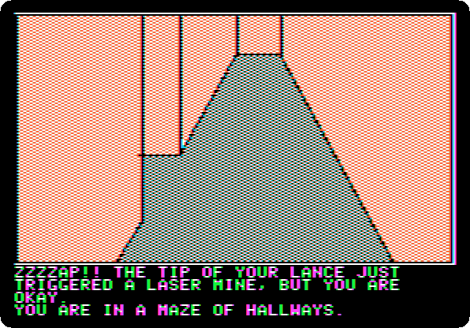


**1041.** `NORTH`


**1042.** `WEST`


**1043.** `NORTH`


**1044.** `NORTH`


**1045.** `WEST`


**1046.** `NORTH`


**1047.** `WEST`


**1048.** `SOUTH`


**1049.** `WEST`

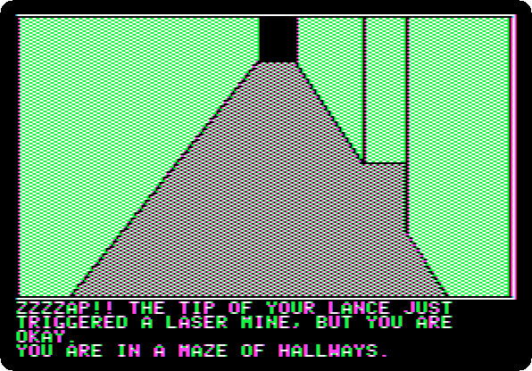


**1050.** `SOUTH`


**1051.** `WEST`


**1052.** `STAND CIRCLE`

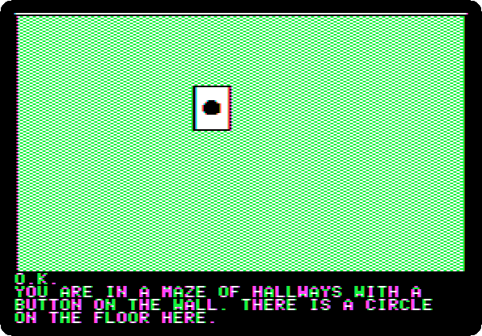


**1053.** `PUSH BUTTON`


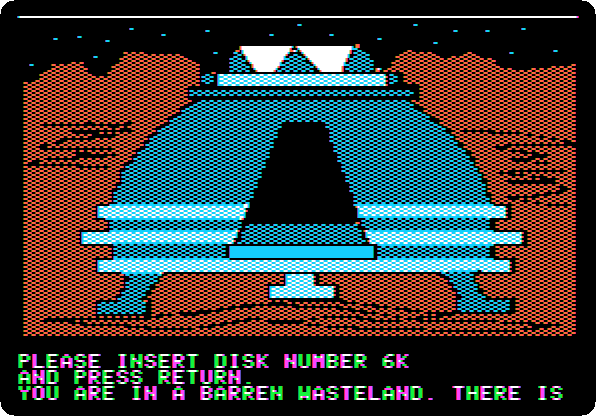


*Side 6K: drop `Time Zone (4am and san inc crack) disk K.dsk` on drive 1, and press Return.*

**1054.** `GO MACHINE`


*Side 1B: drop `Time Zone (4am and san inc crack) disk B.dsk` on drive 1, and press Return.*

**1055.** `SIT`


**1056.** `PUSH BUTTON`


**1057.** `EXIT MACHINE`


**1058.** `SOUTH`

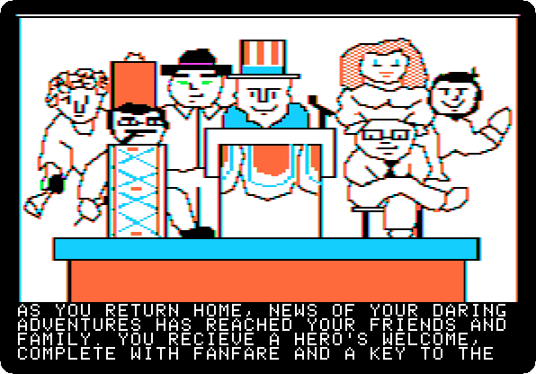
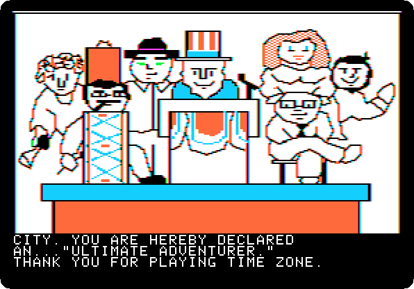


<!-- End of the walkthrough -->

## What next

[Karateka](karateka.md) is another game of the Apple \]\[ played on this
machine, and [Life with DOS 3.3](dos33.md) shows the system the disks of
Time Zone are written in.
