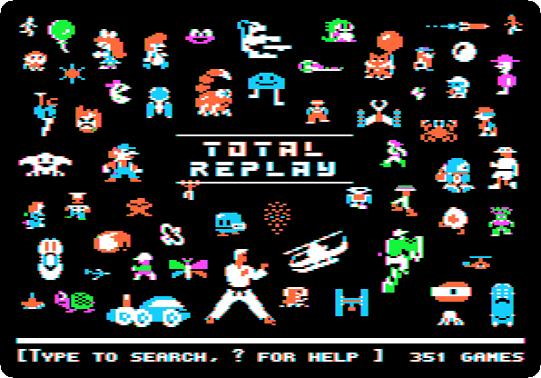
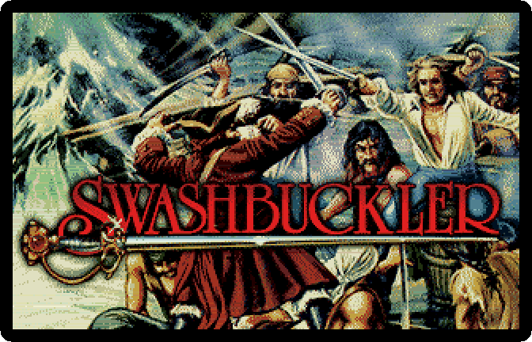
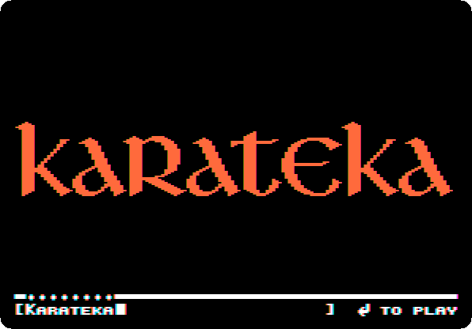
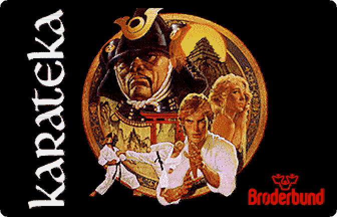
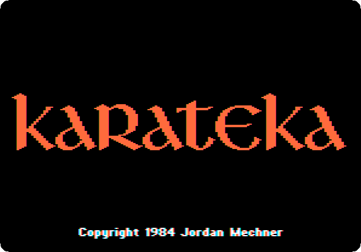

# Total Replay

[Back to the activities](../README.md)

Total Replay is a modern collection, put together by 4am and released for
free: hundreds of Apple II games on one hard disk image, each started from a
single launcher, with the copy protection taken out of every one so that
they run from a hard disk. Its launcher shows the box art of the games in the
Super Hi-Res graphics of the Apple IIgs when it finds a VidHD, a modern card
that gives those graphics to an Apple //e.

This page starts Total Replay on the enhanced //e that izapple2 starts with
when nothing else is asked for, looks at its attract mode, and finds and
starts a game.

## What you need

**`total-replay.hdv`**, Total Replay 6.1, from the
[Internet Archive](https://archive.org/details/TotalReplay): download
*Total Replay v6.1.hdv* and rename it `total-replay.hdv`. It is a 32 MB hard
disk image. `./fetch-disks.sh` in this repository downloads it into `disks/`.

## The machine

The enhanced Apple //e of izapple2, with Total Replay as its hard disk:

- the 65C02 processor at 1 MHz, 128 KB of memory, and a RAMWorks memory card
  with 8 MB more in its auxiliary slot, with the 80 column card;
- a No-Slot Clock under the ROM;
- a VidHD card in slot 2, for the Super Hi-Res graphics;
- a FASTChip accelerator in slot 3, which Total Replay uses to load faster;
- a Mockingboard sound card in slot 4, for the games that have music;
- a Disk II controller card in slot 6, with the DOS 3.3 disk of izapple2;
- a hard disk interface, SmartPort, in slot 7, with Total Replay.

```bash
izapple2 disks/total-replay.hdv
```

## The launcher

1. **Start izapple2** with the command above, and press F6 until the screen
   is in colour. The machine starts from the hard disk in slot 7, and the
   launcher of Total Replay comes up: the characters of its games around
   its name, and the number of games at the bottom.

   

2. **Wait.** Left alone, the launcher shows its games one after the other,
   the box art of some in Super Hi-Res, the title screens of others.

   

   Super Hi-Res is 320 dots across with 16 colours of 4096 for each line,
   the graphics of the Apple IIgs; the //e had nothing like it until the
   VidHD.

## Play a game

3. **Press Escape**, to go back to the launcher, and **type `karateka`**.
   The launcher finds the game as you type, and shows its title.

   

4. **Press Return.** The box art of Karateka, Jordan Mechner's game of 1984,
   and the game itself.

   

   

   Reset, Control-F2 in izapple2, goes back to the launcher from any game.
   Type `?` in the launcher for its help.

## What next

[Lode Runner](lode-runner.md) is one of the games of Total Replay, started
there from a copy of its own disk, protection and all.
