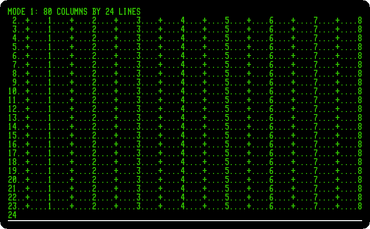
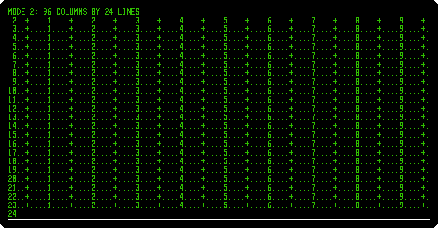
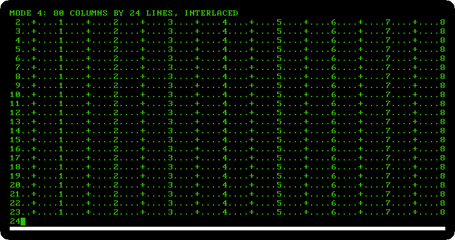
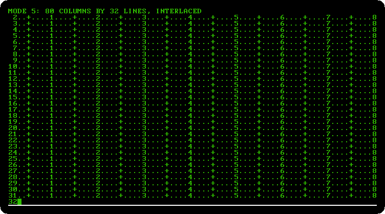
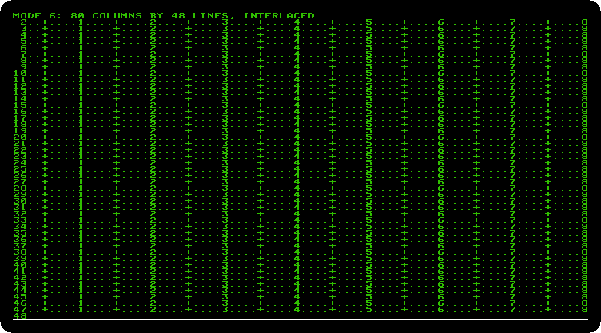
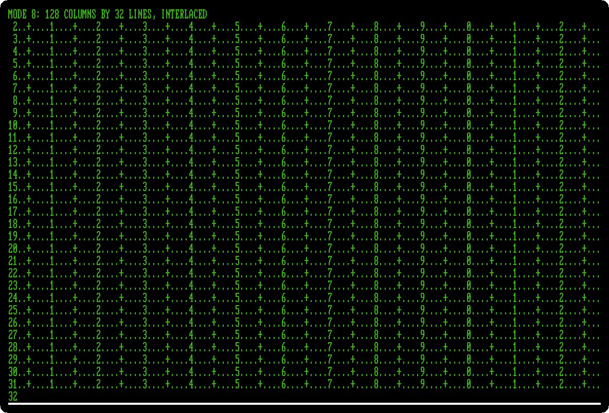

# 160 columns: the Videx Ultraterm

[Back to the activities](../README.md)

An Apple \]\[+ writes 40 columns of capitals, and work with words or numbers
wanted more. Videx of Oregon sold the cards for that: the **Videoterm**, 80
columns with lower case, became the usual one, and the **Ultraterm** came
after it with more columns and more lines than a television could show, up
to 160 across. The card has its own memory and its own character set, and
draws the screen itself: the monitor is plugged into the card, not into the
Apple II.

The Ultraterm came with a disk of utilities that starts with a demonstration
of the card. This page watches it, and then runs a program of its own that
puts the card in each of its modes, one after the other.

## What you need

**`ultraterm-utilities.dsk`**, the disk of utilities of the card, on the
[Asimov
archive](https://mirrors.apple2.org.za/ftp.apple.asimov.net/images/hardware/video/):
download *Videx Ultraterm Utilities disk.dsk* and rename it
`ultraterm-utilities.dsk`. `./fetch-disks.sh` in this repository downloads it
into `disks/` and checks it.

## The machine

An Apple \]\[+ with a Videx Ultraterm:

- the 6502 processor at 1 MHz, 48 KB of memory, and Applesoft BASIC in its ROM;
- the keyboard of the \]\[+, which types only capitals;
- a Videx Ultraterm card in slot 3;
- a Disk II controller card in slot 6, with the disk of the Ultraterm
  utilities in drive 1.

```bash
izapple2 -model _base -board 2plus -cpu 6502 \
    -rom "<internal>/Apple2_Plus.rom" \
    -charrom "<internal>/Apple2rev7CharGen.rom" -forceCaps \
    -s3 videxultraterm \
    -s6 diskii,disk1=disks/ultraterm-utilities.dsk
```

The model `ultraterm` of izapple2 has this machine, with a Language Card
more and the disk of the utilities inside izapple2:

```bash
izapple2 -model ultraterm
```

## Watch the demonstration

1. **Start izapple2** with the command above. The Apple \]\[+ starts DOS
   from the disk on its own screen, and then the card takes over: izapple2
   shows the picture of the Ultraterm instead, and Videx presents its card.

   

2. **Wait for the pages.** The demonstration writes them one after the other,
   each adding to the one before. The second lists the modes of the card,
   chosen by software:

   

   The page itself is in one of them, 80 columns by 24 lines with
   interlaced characters, and the characters are taller and finer than the
   Apple II's own: 8 by 12 dots, where the Apple II has 5 by 7 in a cell of
   7 by 8.

3. **Wait for the firmware page.**

   

   BASIC, Pascal and CP/M used the card through its firmware, and Videx had
   *pre-boot* disks to start Apple Writer \]\[ and VisiCalc with it.

## The modes, one by one

4. **Press Control-F2**, Reset, to stop the demonstration, and type
   `PR#3` to give the screen back to the card, and `NEW`.

5. **Type the program**, each line with Return. It is also in
   [listings/ultraterm-modes.bas](listings/ultraterm-modes.bas).

   ```basic
   10 REM THE EIGHT MODES OF THE ULTRATERM
   20 V$ = CHR$ (22):L$ = CHR$ (12)
   30 FOR M = 1 TO 8
   40 READ C,L,N$
   50 PRINT V$; CHR$ (48 + M);L$;
   60 R$ = ""
   70 FOR X = 3 TO C
   80 D = X - INT (X / 10) * 10:T = INT (X / 10) - INT (X / 100) * 10
   90 C$ = ".": IF D = 5 THEN C$ = "+"
   100 IF D = 0 THEN C$ = STR$ (T)
   110 R$ = R$ + C$
   120 NEXT X
   130 PRINT "MODE ";M;": ";C;" COLUMNS BY ";L;" LINES";N$
   140 FOR Y = 2 TO L
   150 PRINT RIGHT$ (" " + STR$ (Y),2);
   160 IF Y < L THEN PRINT R$;
   170 NEXT Y
   180 GET K$
   190 NEXT M
   200 PRINT V$;"1";L$;
   210 END
   300 DATA 80,24,"",96,24,"",160,24,""
   310 DATA 80,24,", INTERLACED",80,32,", INTERLACED"
   320 DATA 80,48,", INTERLACED",132,24,", INTERLACED"
   330 DATA 128,32,", INTERLACED"
   ```

   A program chooses the mode by printing Control-V, `CHR$(22)`, and its
   number, from 1 to 8; from the keyboard it is Escape and the number.
   Control-L, `CHR$(12)`, clears the screen. For each mode the program
   writes its name, and then a ruler on every line: a `+` every five
   columns, the tens every ten, and the number of the line at the left, so
   that the picture tells how many columns and lines there are.

6. **Type `RUN`**, and press Space for each next mode. The pictures are the
   size of the screen the card draws: wider for more columns, taller for
   more lines.

   Mode 1, 80 columns by 24 lines, as the Videoterm before it:

   

   Mode 2, 96 by 24, the characters closer together:

   

   Mode 3, 160 by 24, twice the dots across:

   

   Mode 4, 80 by 24 interlaced: the odd lines of dots in one frame and the
   even ones in the next, with the finer characters of the card, those of
   the demonstration:

   

   Mode 5, 80 by 32, interlaced:

   

   Mode 6, 80 by 48, interlaced, with the plain characters, half as tall,
   for word processing:

   

   Mode 7 is 132 by 24, interlaced, the width of a printer's line; izapple2
   does not show it right yet, its lines run on across the screen, so it
   has no picture here.

   Mode 8, 128 by 32, interlaced, which the demonstration offered for
   spreadsheets:

   

   After the last one the program sets mode 1 again.

## What next

[CP/M on the Z80 SoftCard](cpm.md) runs on an Apple \]\[+ too, and its
programs were written for terminals of 80 columns.
