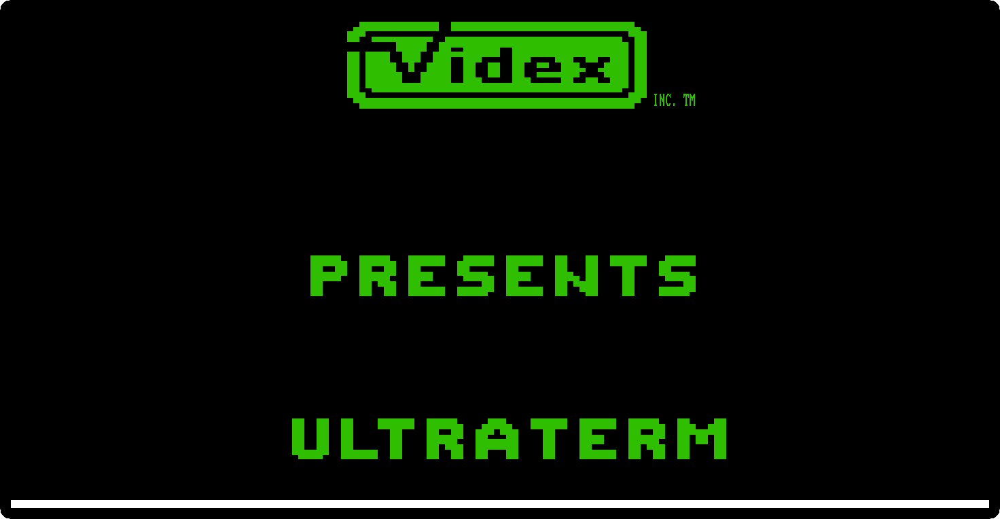
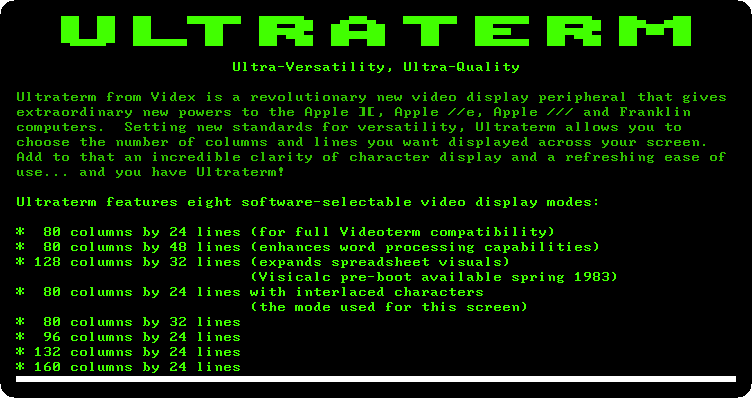
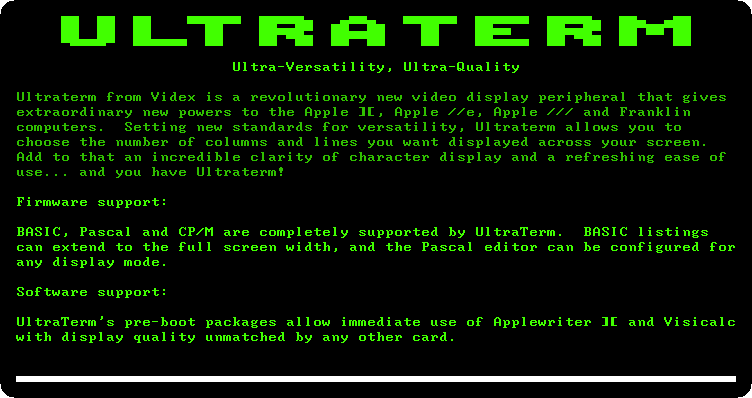

# 160 columns: the Videx Ultraterm

[Back to the activities](../README.md)

An Apple \]\[+ writes 40 columns of capitals, and work with words or numbers
wanted more. Videx of Oregon sold the cards for that: the **Videoterm**, 80
columns with lower case, became the usual one, and the **Ultraterm** came
after it with more columns and more lines than a television could show, up
to 160 across. The card has its own memory and its own character set, and
draws the screen itself: the monitor is plugged into the card, not into the
Apple II.

The Ultraterm came with a disk of utilities that starts with a demonstration
of the card. This page watches it.

## What you need

Only izapple2: the disk of the Ultraterm utilities comes inside it.

## The machine

An Apple \]\[+ with a Videx Ultraterm:

- the 6502 processor at 1 MHz, 48 KB of memory, and Applesoft BASIC in its ROM;
- a 16 KB Language Card in slot 0;
- a Videx Ultraterm card in slot 3;
- a Disk II controller card in slot 6, with the disk of the Ultraterm
  utilities in drive 1.

```bash
izapple2 -model ultraterm
```

## Watch the demonstration

1. **Start izapple2** with the command above. The Apple \]\[+ starts DOS
   from the disk on its own screen, and then the card takes over: izapple2
   shows the picture of the Ultraterm instead, and Videx presents its card.

   

2. **Wait for the pages.** The demonstration writes them one after the other,
   each adding to the one before. The second lists the modes of the card,
   chosen by software:

   

   The page itself is in one of them, 80 columns by 24 lines with
   interlaced characters, and the characters are taller and finer than the
   Apple II's own: 8 by 12 dots, where the Apple II has 5 by 7 in a cell of
   7 by 8.

3. **Wait for the firmware page.**

   

   BASIC, Pascal and CP/M used the card through its firmware, and Videx had
   *pre-boot* disks to start Apple Writer \]\[ and VisiCalc with it.

## What next

[CP/M on the Z80 SoftCard](cpm.md) runs on an Apple \]\[+ too, and its
programs were written for terminals of 80 columns.
