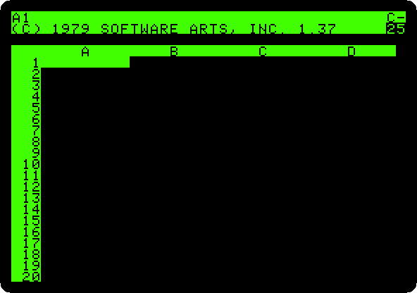
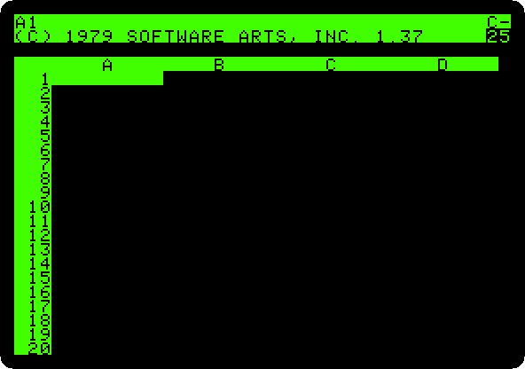
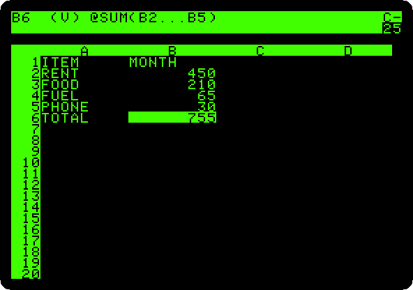
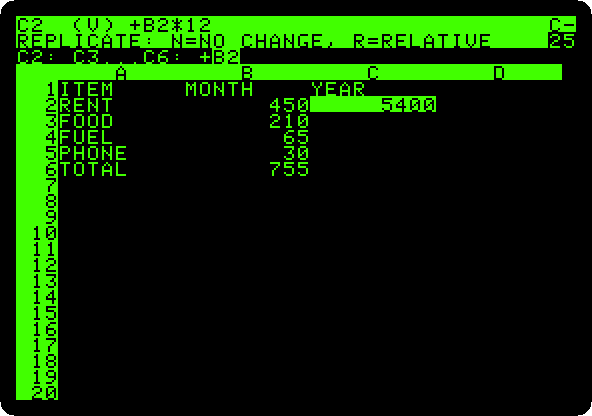
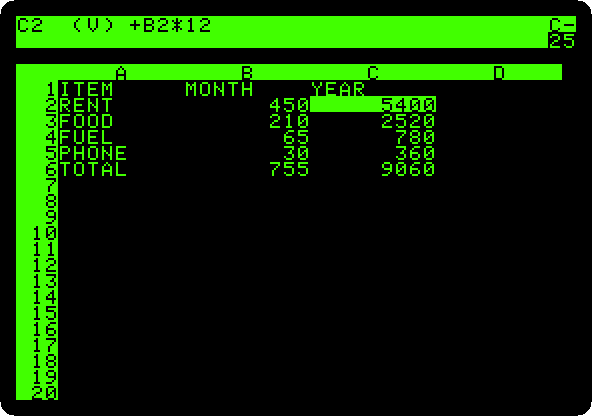
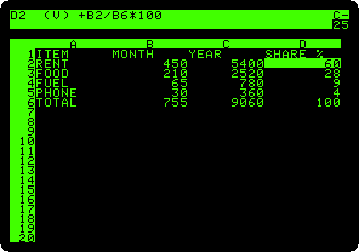
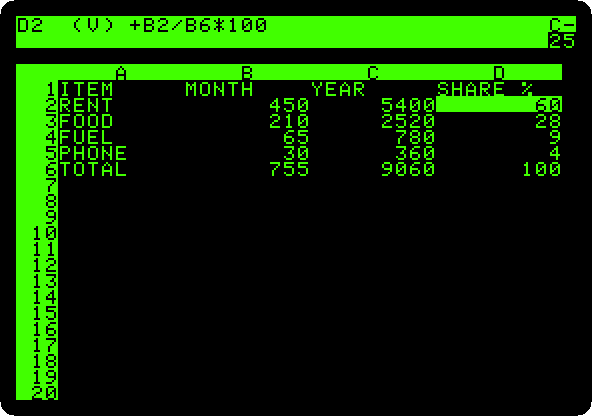

# VisiCalc

[Back to the activities](../README.md)

In 1979 Dan Bricklin and Bob Frankston wrote a program for the Apple II that
did on the screen what accountants did on paper with a pencil and an eraser:
a sheet of rows and columns, numbers in some cells and formulas in others,
and every formula worked out again when a number changes. **VisiCalc**, sold
by Personal Software, was the first spreadsheet, and many bought an Apple II
to run it: a business could try *what if* in seconds instead of in an
afternoon.

This page starts VisiCalc 1.37 from its original disk, types in a household
budget, totals it, makes a column for the year and another for the share of
each item, and changes the rent to see the whole sheet worked out again.

## What you need

**`VisiCalc v1.37.woz`**, VisiCalc 1.37 in the
[woz-a-day collection](https://archive.org/details/wozaday_VisiCalc_v137) of
the Internet Archive: download *VisiCalc v1.37 (woz-a-day collection).zip*
and take it out of it. It is the original disk, copy protection and all, in
the WOZ format that keeps it as it was. `./fetch-disks.sh` in this
repository downloads it into `disks/` and checks it.

## The machine

An Apple \]\[+ with one disk drive of 13 sectors:

- the 6502 processor at 1 MHz, 48 KB of memory, and Applesoft BASIC in its ROM;
- the keyboard of the \]\[+, which types only capitals;
- a Disk II controller card in slot 6 with the ROMs of 13 sectors a track,
  those of 1978, with the VisiCalc disk in drive 1.

```bash
izapple2 -model none -board 2plus -cpu 6502 -screen green \
    -rom "<internal>/Apple2_Plus.rom" \
    -charrom "<internal>/Apple2rev7CharGen.rom" -forceCaps \
    -s6 'diskii,sectors13=true,disk1=disks/VisiCalc v1.37.woz'
```

VisiCalc came on a disk of 13 sectors a track, the format of DOS 3.2 and
before. Apple changed the Disk II to 16 sectors in 1980, with DOS 3.3, and
the disks of before needed the old ROMs of the controller, or a program
that started them on the new ones. izapple2 picks the ROMs of 13 sectors by
itself for a disk of 13 sectors in drive 1, so the model `2plus` of
izapple2 runs it too, with a Language Card and a Videx Videoterm 80 column
card more:

```bash
izapple2 -model 2plus -screen green "disks/VisiCalc v1.37.woz"
```

VisiCalc uses the memory of the Language Card too, and says 35 kilobytes
free there, where this machine has 25.

## The sheet

1. **Start izapple2** with the command above. After the drive, the sheet:
   columns A to D across, rows 1 to 20 down, and the cell A1 highlighted.

   

   The two lines at the top are VisiCalc's own: the first says which cell
   the highlight is on and what is in it, the second is where you type.
   `25` at the right is the memory left, in kilobytes.

2. **Type the budget.** `>` goes to a cell: type `>`, the cell, and Return.
   Then type what goes in it, and Return. A word that starts with a letter
   is a label; one that starts with `"` is a label too, written that way
   for one that would look like something else; a number is a value.

   ```
   >A1  ITEM        >B1  "MONTH
   >A2  RENT        >B2  450
   >A3  FOOD        >B3  210
   >A4  FUEL        >B4  65
   >A5  PHONE       >B5  30
   ```

   

## Formulas

3. **Total the month:** `>A6`, `TOTAL`, and `>B6`, `@SUM(B2.B5)`. `@` starts
   a function, and the `.` between two cells is shown `...`: from B2 to
   B5.

   

   The cell shows the result, 755, and the top line shows the formula
   behind it, with `(V)`, a value.

4. **Make the column of the year:** `>C1`, `"YEAR`, and `>C2`, `+B2*12`. A
   formula starts with `+` or a number, so that VisiCalc does not take `B2`
   for a label. Then **type `/R`**, Replicate, Return for the cell to copy,
   C2, and `C3.C6` and Return for where to copy it. VisiCalc asks what to
   do with `B2` in the copies.

   

5. **Press R**, relative: in each row the formula takes the B of its own
   row, `+B3*12`, `+B4*12`, down to the total.

   

6. **Make the column of the share** of each item in the total:
   `>D1`, `"SHARE %`, `>D2`, `+B2/B6*100`, then `/R`, Return, `D3.D6` and
   Return, and answer **R** for `B2`, which follows the row, and **N**, no
   change, for `B6`, the total, which does not.

   

7. **Type `/GFI`**, a Global Format of Integers: every number on the sheet
   is shown as a whole number.

   

## What if

8. **Change the rent:** `>B2`, `500`, and Return. VisiCalc works out again
   every formula that depends on it, and the screen changes in front of
   you: the year of the rent, the totals, and every share, as each item is
   a smaller part of a bigger total now.

   

   That is what sold VisiCalc: a change, and the whole sheet answers. `/S`
   saves a sheet on a diskette, and `/P` prints it; this page does neither.

## What next

[CP/M on the Z80 SoftCard](cpm.md) is the other way a business used an
Apple II then, with the programs written for CP/M.
